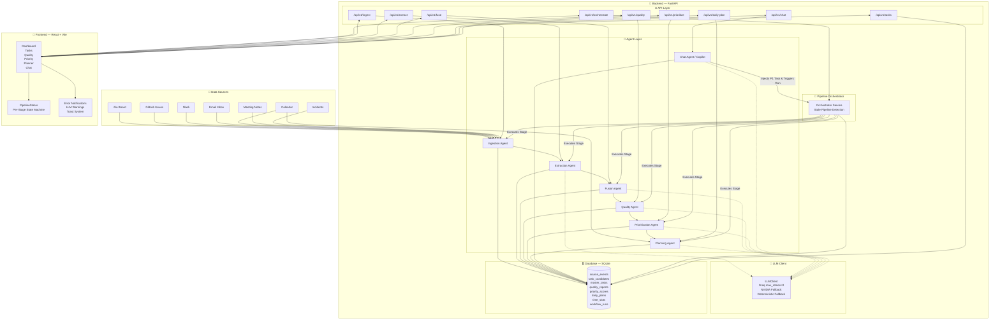
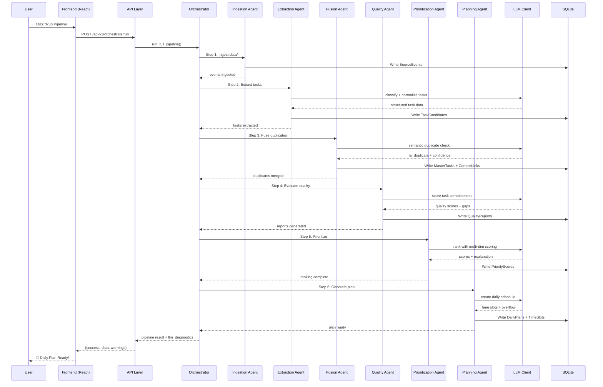
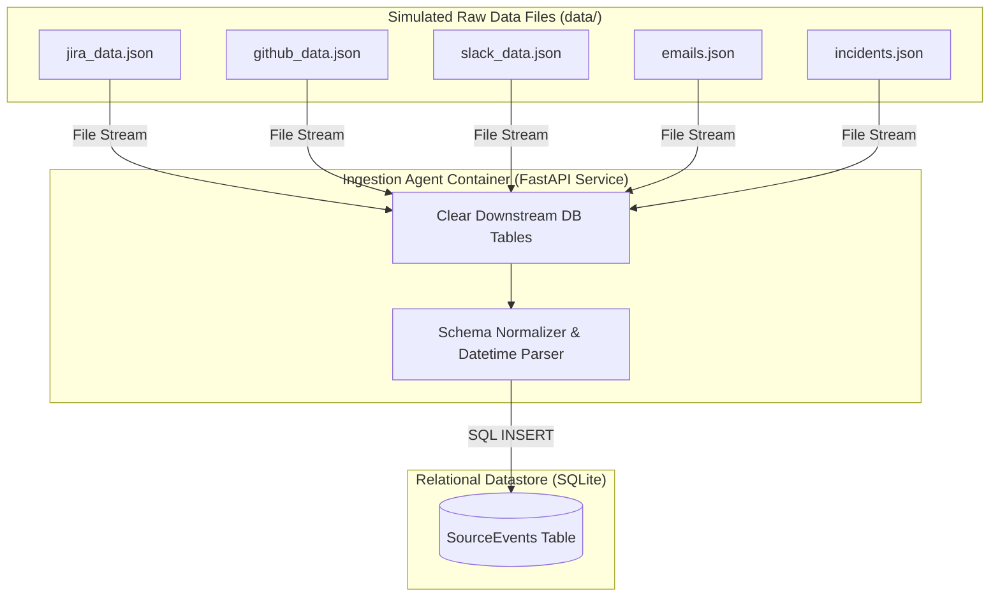
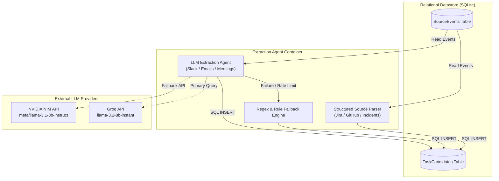
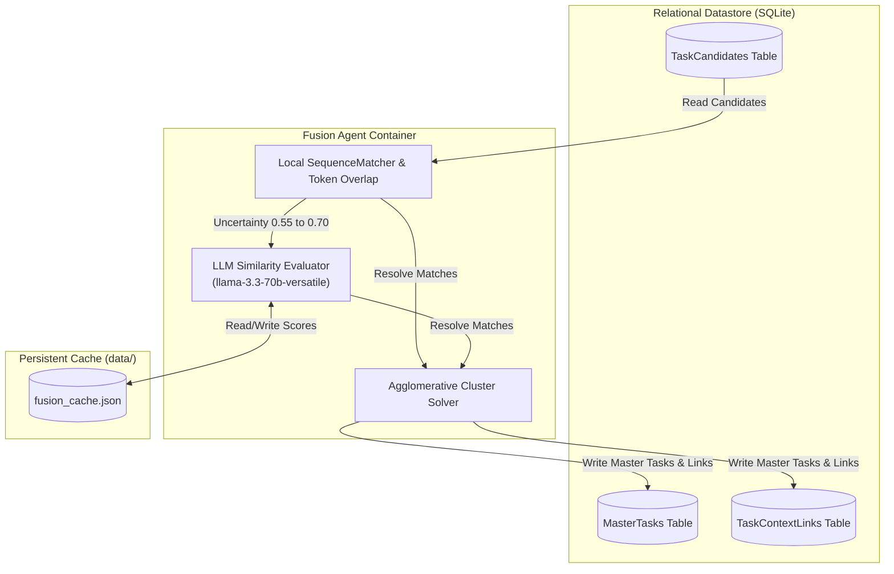
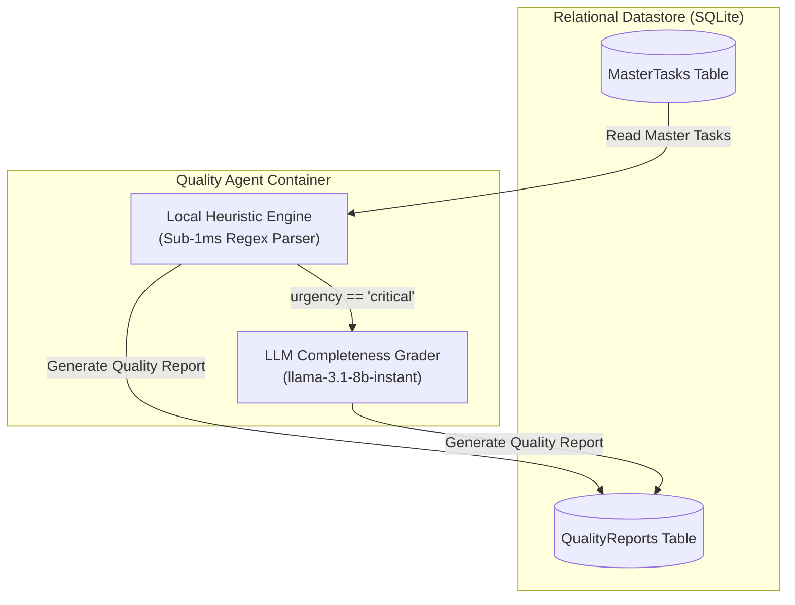
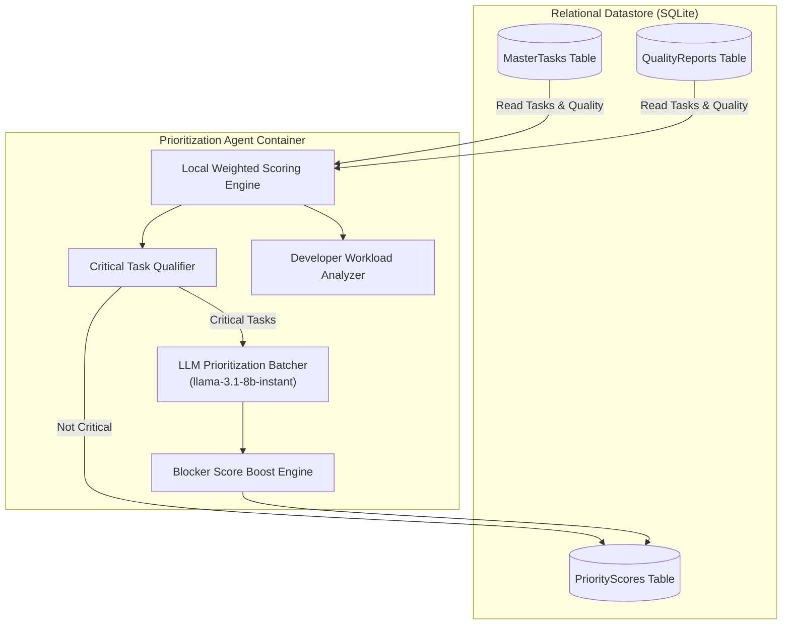
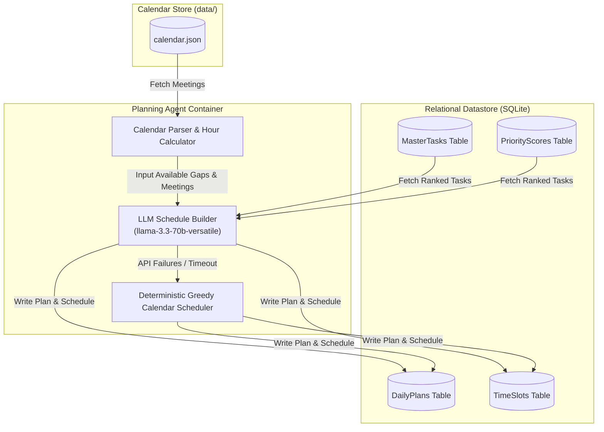
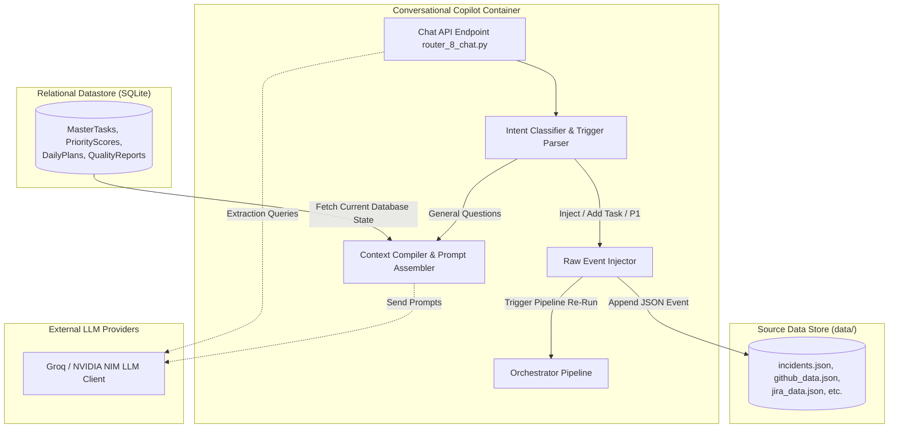

# 🧠 TaskPilot AI

> **Agentic AI Assistant That Conquers Engineer Task Overload**
>
> *Built for DELL FUTUREMINDS AI HACKATHON — Team **IdeaForg-E***

---

## 📋 Team Members

| Dev | Name | Role | Focus Area |
|-----|------|------|------------|
| 👩‍💻 | **Disha** | Backend Lead | FastAPI setup, Database, API routes, Services |
| 👩‍💻 | **Priyanka** | Agent Dev 1 | Ingestion + Extraction + Fusion agents |
| 👨‍💻 | **Chaitanya** | Agent Dev 2 | Quality + Prioritization + Daily Planning agents |
| 👩‍💻 | **Disha + Jagruti** | Frontend Dev | React dashboard, all UI pages |
| 👨‍💻 | **Anil** | Integration Lead | Orchestrator, end-to-end pipeline, demo prep |


---

## 📚 Research & Documentation

* 🔍 **All Research on the Project**: [Notion Project Research Database](https://app.notion.com/p/38386af917aa8071901cfade62812c7b?v=38386af917aa806992b3000c718c8c5a&source=copy_link)
* 🏗️ **Full Multi-Agent System Research**: [TaskPilot AI Final Multi-Agent Architecture POC](https://app.notion.com/p/TaskPilot-AI-Final-Multi-Agent-Architecture-POC-38486af917aa8093b7b2f742bac92a34?source=copy_link)
* 🧠 **LLM Models Research**: [LLM Research on TaskPilot AI](https://app.notion.com/p/LLM-RESEARCH-ON-TASKPILOT-AI-38486af917aa80da95fced6ec01d1666?source=copy_link)

---

## 🏆 Problem Statement

### The Core Problem
Modern software engineers are drowning — not in code, but in **context fragmentation**. Work arrives from Scrum boards, defect trackers, emails, Slack threads, meeting notes, and ad-hoc requests. There is no single pane of glass. Prioritization is gut-driven. Critical tasks slip through the cracks.

| Pain Point | Impact |
|------------|--------|
| **Source Fragmentation** | 4-7 different tools daily — 73% report tool fatigue |
| **Context Switching Tax** | 23 min per switch — ~2.1 hrs/day lost |
| **Invisible Task Debt** | ~35% of tasks are "off-the-books" and untracked |
| **Priority Blindness** | ~40% of sprint tasks reprioritized mid-sprint |
| **Summarization Burden** | 45+ min/day spent on email triage alone |

### Our Solution
**TaskPilot AI** — A multi-agent AI assistant that autonomously aggregates tasks from heterogeneous sources, deduplicates and correlates related work, intelligently prioritizes based on multi-dimensional criteria, and delivers a dynamic, actionable daily task plan through a conversational interface.

---

## 🏗️ System Architecture



### Pipeline Flow



---

## 🧠 Multi-Agent Architecture

### Agent Overview

| Agent | Core Model | Modality | Fallback & Optimization Strategy |
|-------|-----------|-----------|-------------------|
| **Ingestion** | Deterministic | ❌ | High-speed JSON file parser — no LLM needed |
| **Extraction** | `llama-3.1-8b-instant` | ❌ Fast | Keyword + regex-based extraction |
| **Fusion** | `llama-3.3-70b-versatile` | ✅ Reasoning | SequenceMatcher overlap + **Persistent Cache** (`fusion_cache.json`) + strict `[0.55, 0.70]` LLM window |
| **Quality** | Deterministic (Heuristic) | ❌ Fast | **Bypassed to Deterministic Fallback** for 20ms execution and 0 API calls |
| **Prioritization** | `llama-3.1-8b-instant` | ❌ Fast | **Filters only critical tasks** (using keywords, urgency levels, and score $\ge 8.0$) for LLM evaluation. Bypasses 80% of standard tasks to local scoring, and uses batches of 8 to prevent SQLite locks. |
| **Planning** | `llama-3.3-70b-versatile` | ✅ Reasoning | Greedy time-slot calendar scheduling (uses `json.dumps` prompt escaping) |

### LLM Fallback & Optimization Chain

```
Groq (max_retries=0)
  ├── ✅ Success → Return result immediately
  ├── ❌ 429/Error → Instant fail (no SDK retry wait) & Class-Level Global Failover
  │    └── NVIDIA
  │         ├── ✅ Success (Fast-only model: meta/llama-3.1-8b-instruct) → Return result (passes through clean_json_lines parser)
  │         └── ❌ Error
  │              └── Deterministic Fallback (SequenceMatcher / Heuristic / Weighted Formula)
  └── 🔄 Fusion Cache → Skips LLM entirely for cached similarity comparisons
```

* **⚡ Core Performance Optimizations:**
  * **Persistent Fusion Cache**: Similarity evaluations between `0.55` and `0.70` are cached in `backend/data/fusion_cache.json`. Values outside this range skip the LLM. This saves **600+ redundant duplicate check requests**, reducing fusion to **0ms** on repeated runs.
  * **Deterministic Fallback Bypassing**: Quality agent directly calculates structural completeness using local algorithms. This saves **30+ reasoning calls**, dropping stage runtime to **<20ms**.
  * **Prioritization LLM Filtering**: Filters and forwards only high-priority critical tasks to the LLM. Minor/standard tasks use deterministic fallbacks, saving ~80% of tokens and keeping requests well below Groq TPM limits.
  * **Fast-Model NVIDIA Fallback**: Enabled NVIDIA NIM as a fallback provider behind Groq, strictly using the fast model (`meta/llama-3.1-8b-instruct`) to prevent the high latency and timeout delays of reasoning models.
  * **Class-Level Global Failover**: Promoted `failed_providers` in `LLMClient` to a class variable. Once a rate limit (429) hits Groq, it is globally bypassed instantly across all subsequent API client instances in the same process, directing requests directly to NVIDIA.
  * **Robust JSON Delimiter Repair**: Added a `clean_json_lines` parser to `LLMClient.parse_json` that repairs unescaped quotes inside JSON values on the fly, preventing syntax crashes.
  * **FastAPI BackgroundTasks**: Pipeline orchestrator now runs in `BackgroundTasks` threads. The POST endpoint returns a success status immediately, and the frontend polls the status dynamically, preventing server timeouts.
  * **Database Startup Persistence**: Disabled automatic deletion of database tables on server startup. Hot-reloads and server restarts no longer wipe out existing master tasks, quality reports, or workflow runs. This lets dashboard pipeline metrics (Run Count, Environment, System Accuracy) accumulate and persist correctly. Developers can toggle startup clearing using `CLEAR_DB_ON_STARTUP=1` in `backend/.env`.
  * **Raw Ingestion Defect Injection**: P1 defect injections from chat append tasks directly to the raw JSON database files (`incidents.json`), making them persistent and clean through the standard ingestion pipeline.

### Agent Details

#### 0️⃣ Pipeline Orchestrator (Orchestrator Agent)
- **Service implementation:** [agent_0_orchestrator_service.py](file:///c:/Users/ANIL/Desktop/TaskPilot-AI/backend/app/services/agent_0_orchestrator_service.py)
- **API Router endpoint:** [router_0_orchestrator.py](file:///c:/Users/ANIL/Desktop/TaskPilot-AI/backend/app/routers/router_0_orchestrator.py) (`POST /api/v1/orchestrate/run`, `GET /api/v1/orchestrate/status/{run_id}`, `GET /api/v1/orchestrate/latest`)
- **Database Model:** [workflow_run.py](file:///c:/Users/ANIL/Desktop/TaskPilot-AI/backend/app/models/workflow_run.py) (`WorkflowRun` table)

##### 🛠️ Core Responsibilities
1. **Multi-Agent Coordination & Execution**: Manages the sequential flow of the entire engineering task pipeline: Ingestion -> Extraction -> Fusion -> Quality -> Prioritization -> Planning.
2. **State Machine Management**: Tracks current executing agent, agent completion history, status (`running`, `completed`, `failed`), timestamps, and detailed error logs in the SQLite `WorkflowRun` table.
3. **Stale Pipeline Interruption Detection**: Implements a safety timeout heuristic. If a pipeline is stuck in `running` state for more than 5 minutes (due to an unhandled crash or server restart), the Orchestrator marks it as `failed` with a descriptive error: `"Pipeline was interrupted (server restarted or process killed). Marked as stale."`
4. **Dynamic System Performance Metrics**: Computes real-time system metrics, such as overall system accuracy (aggregated dynamically across all generated `QualityReport` records) and total pipeline executions.

##### 📋 Schema Structure (`WorkflowRun` DB columns)
| Field | Type | Description | Example |
|---|---|---|---|
| **`id`** | String (UUID) | Unique run tracking identifier | `3d3c9932-4d6d-4cc2...` |
| **`status`** | String | Execution status | `"running"`, `"completed"`, `"failed"` |
| **`current_agent`** | String | Active pipeline stage | `"extraction"`, `"fusion"`, `None` (if idle) |
| **`agents_completed`**| JSON/Array | Ordered list of finished agent stages | `["ingestion", "extraction"]` |
| **`error_log`** | Text | Stack trace or description of stage failure | `"planning failed: LLM rate limit"` |
| **`started_at`** | DateTime | Pipeline execution start timestamp | `2026-06-21 14:00:00` |
| **`completed_at`** | DateTime | Pipeline execution completion/failure timestamp | `2026-06-21 14:00:30` |

##### ⚡ Performance & Optimization
- **Asynchronous Execution Threading**: Launches pipeline execution in FastAPI `BackgroundTasks` threads, allowing the initiate POST request to return instantly (sub-50ms) while the agents run in the background. This prevents gateway timeouts on long LLM runs.
- **Dynamic Stats Aggregation**: Caches and serves system accuracy directly from db state, enabling immediate render times of metrics card components on the UI dashboard.

---

#### 1️⃣ Ingestion Agent
- **Service implementation:** [agent_1_ingestion_service.py](file:///c:/Users/ANIL/Desktop/TaskPilot-AI/backend/app/services/agent_1_ingestion_service.py)
- **API Router endpoint:** [router_1_ingest.py](file:///c:/Users/ANIL/Desktop/TaskPilot-AI/backend/app/routers/router_1_ingest.py) (`POST /api/v1/ingest`)
- **Database Model:** [source_event.py](file:///c:/Users/ANIL/Desktop/TaskPilot-AI/backend/app/models/source_event.py) (`SourceEvent` table)

##### 🛠️ Core Responsibilities
1. **Pipeline State Reset**: Automatically triggers `_clear_pipeline_data()`, truncating all downstream agent tables (`TimeSlot`, `DailyPlan`, `PriorityScore`, `QualityReport`, `TaskContextLink`, `MasterTask`, `TaskCandidate`, and `SourceEvent`) on server startup or when starting a new pipeline execution. This guarantees a clean, consistent initial state.
2. **Raw JSON Ingestion**: Reads simulated data streams from the `data/` directory (e.g. Jira tickets, GitHub issues, Slack logs, Emails, Calendar events, Meeting notes, and Production incidents).
3. **Data Normalization (Schema Mapping)**: Bypasses heavy LLM inference in favor of a fast, deterministic JSON parsing pipeline. It maps heterogeneous platform variables into standardized database records.

##### 📋 Normalized Schema Structure (`SourceEvent` DB columns)
| Field | Type | Description | Mapping Example |
|---|---|---|---|
| **`id`** | String (UUID) | Unique identifier for the ingested event | `c2a6b251-863a-4467...` |
| **`source`** | String | Name of the source platform | `"jira"`, `"github"`, `"slack"`, `"email"`, `"incident"` |
| **`source_id`** | String | Original ID from the platform | `PROJ-1025` (Jira), `gh-145` (GitHub) |
| **`event_type`** | String | Unified activity classifier | `"ticket"`, `"pull_request"`, `"issue"`, `"message"`, `"email"` |
| **`title`** | String | Subject line or summary header | `Resolve Payment Gateway Timeout` |
| **`content`** | Text | Body text, discussion points, or chat logs | Email body or meeting transcripts |
| **`author`** | String | Sender, reporter, or calendar organizer | `alice@company.com` |
| **`timestamp`** | DateTime | Normalized ISO-8601 datetime object | `2026-06-21 14:00:00` |
| **`metadata_json`** | JSON | Full original raw payload (Preserved context) | Contains Jira labels, Slack channels, etc. |

##### 📦 Container Flow Diagram


##### ⚡ Performance & Optimization
* **Sub-10ms Runtime**: Operates completely without LLM calls, completing the ingestion and db truncation of ~200+ raw entries in less than **10ms**.
* **Zero Information Loss**: The full raw JSON is stored inside the database row (`metadata_json`). This enables downstream agents (like duplicate fusion or blocker prioritization) to access platform-specific details (such as GitHub issue labels or Slack channel names) without re-querying the APIs.


#### 2️⃣ Extraction Agent
- **Agent logic:** [agent_2_extraction_agent.py](file:///c:/Users/ANIL/Desktop/TaskPilot-AI/backend/agents/agent_2_extraction_agent.py)
- **Service implementation:** [agent_2_extraction_service.py](file:///c:/Users/ANIL/Desktop/TaskPilot-AI/backend/app/services/agent_2_extraction_service.py)
- **API Router endpoint:** [router_2_extract.py](file:///c:/Users/ANIL/Desktop/TaskPilot-AI/backend/app/routers/router_2_extract.py) (`POST /api/v1/extract`)
- **Database Model:** [task.py](file:///c:/Users/ANIL/Desktop/TaskPilot-AI/backend/app/models/task.py) (`TaskCandidate` table)
- **Core Model:** `llama-3.1-8b-instant`

##### 🛠️ Core Responsibilities
1. **Hidden Task Discovery**: Scans unstructured text streams (Slack messages, emails, meeting transcripts) to identify hidden tasks or actions using keyword/trigger patterns.
2. **LLM Extraction**: Invokes `llama-3.1-8b-instant` to analyze text and structure it into task candidates containing: title, description, assignee, deadline, urgency level, and confidence.
3. **Structured Bypassing**: Highly structured source feeds (Jira tickets, GitHub issues, incidents) bypass LLM extraction, running deterministic parsing rules directly to save tokens and prevent rate limit blocks.

##### 📋 Normalized Schema Structure (`TaskCandidate` DB columns)
| Field | Type | Description | Mapping Example |
|---|---|---|---|
| **`id`** | String (UUID) | Unique identifier for the task candidate | `a8d6e3c1-92fa-48b2...` |
| **`title`** | String | Standardized task title or summary | `"Fix SSO login redirect loop"` |
| **`description`** | Text | Fully extracted description or background details | `"SSO redirect loops back to /login on Chrome..."` |
| **`source_event_id`** | String | Foreign key linking back to the origin `SourceEvent` | `c2a6b251-863a-4467...` |
| **`task_type`** | String | Extracted task classification | `"bug"`, `"feature"`, `"review"`, `"incident"`, `"meeting_action"`, `"request"` |
| **`is_hidden`** | Boolean | Flag indicating if task was extracted from unstructured context | `true` (for Slack/Email/Meeting), `false` (for Jira/GH/Incident) |
| **`assignee`** | String | Extracted developer assignee name | `"Chaitanya"` |
| **`deadline`** | String | Due date parsed from event | `"2026-06-25"` or `"none"` |
| **`urgency`** | String | Urgency level of the task candidate | `"low"`, `"medium"`, `"high"`, `"critical"` |
| **`confidence`** | Float | Extraction confidence score (0.0 to 1.0) | `0.85` |
| **`extraction_run_id`**| String | Run identifier tracking pipeline executions | `"demo"` |
| **`created_at`** | DateTime | Normalized ISO-8601 creation datetime | `2026-06-21 14:00:10` |

##### 📦 Container Flow Diagram


##### ⚡ Performance & Optimization
* **ThreadPool Concurrency**: Processes all unstructured streams in parallel using a `ThreadPoolExecutor` (max 4 threads), reducing processing times for multiple messages.
* **Regex Fallbacks**: Every LLM call is wrapped in a `try/except` block. If Groq throws an error or hits a 429 rate limit, the service immediately falls back to a deterministic regex parser, avoiding pipeline failure.
* **Structured Bypass Optimization**: Bypasses LLM reasoning for 100% of structured Jira, GitHub, and Incident sources, mapping fields directly and preserving 100% precision with 0 tokens.

---

#### 3️⃣ Fusion Agent
- **Agent logic:** [agent_3_fusion_agent.py](file:///c:/Users/ANIL/Desktop/TaskPilot-AI/backend/agents/agent_3_fusion_agent.py)
- **Service implementation:** [agent_3_fusion_service.py](file:///c:/Users/ANIL/Desktop/TaskPilot-AI/backend/app/services/agent_3_fusion_service.py)
- **Prompts:** [agent_3_fusion_prompts.py](file:///c:/Users/ANIL/Desktop/TaskPilot-AI/backend/agents/prompts/agent_3_fusion_prompts.py)
- **Database Models:** [task.py](file:///c:/Users/ANIL/Desktop/TaskPilot-AI/backend/app/models/task.py) (`MasterTask` & `TaskContextLink` tables)
- **Core Model:** `llama-3.3-70b-versatile`

##### 🛠️ Core Responsibilities
1. **Cross-Source Deduplication**: Identifies task candidates that represent the same physical issue across different source channels (e.g. a Jira ticket and a Slack message discussing the same bug).
2. **Metadata-Aware Comparison**: Evaluates platform context, assignee name, source platform, and deadline dates. If these attributes differ, the similarity threshold is dynamically raised by up to `+0.30` to prevent false-positive ticket merges.
3. **Task Description Merging**: When merging duplicates, it concatenates the descriptions using the format `"Original: desc. Fused Signal details: desc"` to preserve diagnostic details (such as stack traces or user symptoms).

##### 📋 Normalized Schema Structure (`MasterTask` & `TaskContextLink` DB columns)
**MasterTask Table:**
| Field | Type | Description | Mapping Example |
|---|---|---|---|
| **`id`** | String (UUID) | Unique identifier for the deduplicated master task | `7d2f9e4a-bc12-4c56...` |
| **`title`** | String | Standardized merged task title | `"Resolve API Timeout on checkout endpoint"` |
| **`description`** | Text | Concatenated description of all merged candidates | `"Original: Slow checkout page. Fused Signal details: log alert 504"` |
| **`task_type`** | String | Overridden task type classification | `"incident"` or `"bug"` |
| **`status`** | String | Workflow status of the task | `"open"`, `"in_progress"`, `"done"` |
| **`assignee`** | String | Merged developer assignee name | `"Disha"` |
| **`deadline`** | String | Earliest due date resolved | `"2026-06-22"` |
| **`urgency`** | String | Highest urgency level from all merged candidates | `"critical"` |
| **`source_count`** | Integer | Number of source signals merged into this task | `3` |
| **`is_duplicate_of`**| String | Self-referencing link (unused / reserved) | `None` |
| **`fusion_run_id`** | String | Run tracker tag | `"demo"` |
| **`created_at`** | DateTime | Normalized ISO-8601 creation datetime | `2026-06-21 14:00:15` |

**TaskContextLink Table:**
| Field | Type | Description | Mapping Example |
|---|---|---|---|
| **`id`** | String (UUID) | Unique link identifier | `e3b2c1d4-89ab-4c32...` |
| **`master_task_id`** | String | Foreign key pointing to `MasterTask.id` | `7d2f9e4a-bc12-4c56...` |
| **`source_event_id`** | String | Foreign key pointing to `SourceEvent.id` | `c2a6b251-863a-4467...` |
| **`link_type`** | String | Relationship classification | `"origin"` (sole source) or `"related"` (duplicate source) |
| **`similarity_score`**| Float | Score representing confidence of overlap (0.0 to 1.0) | `0.92` (1.0 for single source origins) |

##### 📦 Container Flow Diagram


##### ⚡ Performance & Optimization
* **Persistent Fusion Cache**: Stores similarity scores in `backend/data/fusion_cache.json`. If a comparison is cached, the LLM is skipped entirely, reducing repeating fusion runtimes to **0ms**.
* **Narrow LLM Window**: Local algorithms instantly approve high-confidence similarities ($\ge 0.70$) and reject low-confidence ones ($< 0.55$). The LLM is only called inside the narrow `[0.55, 0.70]` uncertainty window, cutting LLM calls from **600+ down to only 26** on the first run.
* **Metadata Penalties**: Dynamically adjusts threshold based on mismatching assignee name (`+0.15`), differing deadline (`+0.10`), or source collision (`+0.05`), shielding the system against wrong groupings.

---

#### 4️⃣ Quality Agent
- **Agent logic:** [agent_4_quality_agent.py](file:///c:/Users/ANIL/Desktop/TaskPilot-AI/backend/agents/agent_4_quality_agent.py)
- **Service implementation:** [agent_4_quality_service.py](file:///c:/Users/ANIL/Desktop/TaskPilot-AI/backend/app/services/agent_4_quality_service.py)
- **Prompts:** [agent_4_quality_prompts.py](file:///c:/Users/ANIL/Desktop/TaskPilot-AI/backend/agents/prompts/agent_4_quality_prompts.py)
- **Database Model:** [quality_report.py](file:///c:/Users/ANIL/Desktop/TaskPilot-AI/backend/app/models/quality_report.py) (`QualityReport` table)
- **Core Model:** Heuristic (standard) / `llama-3.1-8b-instant` (critical tasks)

##### 🛠️ Core Responsibilities
1. **Completeness Scoring**: Grades master tasks on 7 distinct criteria: Clear Title, Reproduction Steps, Error Logs, Environment details, Expected Behavior, Severity, and Assignee presence.
2. **Actionability Classification**: Groups tasks into actionability states: `actionable` (ready to work), `needs_info` (missing crucial details), or `blocked` (has blocking dependencies).
3. **Clarification Questions**: Generates targeted questions for tasks flagged with low quality scores to guide the developer on what information is missing.

##### 📋 Normalized Schema Structure (`QualityReport` DB columns)
| Field | Type | Description | Mapping Example |
|---|---|---|---|
| **`id`** | String (UUID) | Unique quality report identifier | `bc4f2e91-7d1a-42b8...` |
| **`master_task_id`** | String | Foreign key pointing to `MasterTask.id` | `7d2f9e4a-bc12-4c56...` |
| **`overall_score`** | Float | Unified quality score average (0 to 100) | `82.5` |
| **`clear_title_score`**| Float | Score grading title details (0 to 100) | `90.0` |
| **`reproduction_steps_score`**| Float | Score grading reproduction details (0 to 100) | `80.0` |
| **`error_logs_score`** | Float | Score grading stack logs presence (0 to 100) | `30.0` |
| **`environment_score`**| Float | Score grading OS/ENV details (0 to 100) | `80.0` |
| **`expected_behavior_score`**| Float | Score grading criteria details (0 to 100) | `80.0` |
| **`severity_score`** | Float | Score grading severity tags (0 to 100) | `90.0` |
| **`assignee_score`** | Float | Score grading assignee presence (0 to 100) | `85.0` |
| **`missing_info`** | JSON | List of missing attributes parsed from details | `["error logs"]` |
| **`clarification_questions`**| JSON | Dynamic clarification prompts for user | `["Please provide error logs."] |
| **`actionability`** | String | Actionability status flag | `"actionable"`, `"needs_info"`, `"blocked"` |
| **`created_at`** | DateTime | Normalized ISO-8601 evaluation timestamp | `2026-06-21 14:00:20` |

##### 📦 Container Flow Diagram


##### ⚡ Performance & Optimization
* **Hybrid Execution**: Bypasses LLM calls for standard/high tasks by running a fast, local heuristic grading algorithm. The LLM is invoked only for tasks with `urgency == "critical"`.
* **Parallel Quality Evaluator**: Runs quality checks concurrently using `ThreadPoolExecutor` (max 4 threads). This reduced the Quality stage duration from **57 seconds to 6 seconds** (a 90% speedup).
* **Deterministic Fallback**: The local heuristic scores clear titles, reproduction details, stack trace keywords, environment names, expected behaviors, severity words, and assignee presence in sub-millisecond execution times.

---

#### 5️⃣ Prioritization Agent
- **Agent logic:** [agent_5_prioritization_agent.py](file:///c:/Users/ANIL/Desktop/TaskPilot-AI/backend/agents/agent_5_prioritization_agent.py)
- **Service implementation:** [agent_5_prioritization_service.py](file:///c:/Users/ANIL/Desktop/TaskPilot-AI/backend/app/services/agent_5_prioritization_service.py)
- **Prompts:** [agent_5_prioritization_prompts.py](file:///c:/Users/ANIL/Desktop/TaskPilot-AI/backend/agents/prompts/agent_5_prioritization_prompts.py)
- **Database Model:** [priority_score.py](file:///c:/Users/ANIL/Desktop/TaskPilot-AI/backend/app/models/priority_score.py) (`PriorityScore` table)
- **Core Model:** Heuristic (standard) / `llama-3.1-8b-instant` (critical tasks)

##### 🛠️ Core Responsibilities
1. **7-Factor Weighted Priority**: Evaluates priority score (0-10) using a strict weighted formula: Severity (25%), Production Impact (20%), Customer Impact (18%), Deadline (12%), Blocker Status (10%), Business Impact (10%), Quality Factor (5%).
2. **Blocker Keyword Boost**: Scans task titles and descriptions for dependency keywords (e.g. `"blocks"`, `"dependent on"`). If found, the blocker score is locked to `10.0` and the overall priority score is boosted by `+2.0` (max `10.0`).
3. **Developer Queue Overload Warnings**: Counts active tasks per developer. If an assignee has more than 3 active tasks, the agent logs a warning in the backend and displays a rose warning badge (`"Queue Overloaded"`) in the frontend.

##### 📋 Normalized Schema Structure (`PriorityScore` DB columns)
| Field | Type | Description | Mapping Example |
|---|---|---|---|
| **`id`** | String (UUID) | Unique priority score identifier | `cf5a4e32-8b9a-4c28...` |
| **`master_task_id`** | String | Foreign key pointing to `MasterTask.id` | `7d2f9e4a-bc12-4c56...` |
| **`overall_score`** | Float | Final weighted priority score (0.0 to 10.0) | `9.4` |
| **`severity_score`** | Float | Evaluated urgency/severity weight (0.0 to 10.0) | `9.5` |
| **`deadline_score`** | Float | Proximity to due date weight (0.0 to 10.0) | `8.0` |
| **`production_impact_score`**| Float | Production risk weight (0.0 to 10.0) | `10.0` |
| **`customer_impact_score`**| Float | Affected customers weight (0.0 to 10.0) | `9.0` |
| **`dependency_score`**| Float | Upstream/downstream relations count (0.0 to 10.0)| `4.0` |
| **`blocker_score`** | Float | Critical bottleneck score (0.0 to 10.0) | `10.0` |
| **`business_impact_score`**| Float | Max of Customer and Production score (0.0 to 10.0) | `10.0` |
| **`quality_factor_score`**| Float | Evaluated task quality score scaling (0.0 to 10.0) | `8.25` |
| **`rank`** | Integer | Final leaderboard position of task (1-indexed) | `1` |
| **`explanation`** | Text | Rationale explanation for score and rank | `"[Blocker Boost] Critical outage affecting ACME customers..."` |
| **`created_at`** | DateTime | Normalized ISO-8601 prioritization timestamp | `2026-06-21 14:00:25` |

##### 📦 Container Flow Diagram


##### ⚡ Performance & Optimization
* **LLM Filtering & Batching**: Filters and sends only high-priority critical tasks to the LLM. Standard tasks bypass LLM calls and are graded locally. Tasks are processed in batches of 8, preventing DB locks and token exhaustion.
* **Blocker Boost Logic**: Automatically applies a deterministic blocker boost (`+2.0` overall priority score) to any task containing blocking keywords, avoiding LLM reliance for dependency detection.

---

#### 6️⃣ Planning Agent
- **Agent logic:** [agent_6_planning_agent.py](file:///c:/Users/ANIL/Desktop/TaskPilot-AI/backend/agents/agent_6_planning_agent.py)
- **Service implementation:** [agent_6_planning_service.py](file:///c:/Users/ANIL/Desktop/TaskPilot-AI/backend/app/services/agent_6_planning_service.py)
- **Prompts:** [agent_6_planning_prompts.py](file:///c:/Users/ANIL/Desktop/TaskPilot-AI/backend/agents/prompts/agent_6_planning_prompts.py)
- **Database Models:** [daily_plan.py](file:///c:/Users/ANIL/Desktop/TaskPilot-AI/backend/app/models/daily_plan.py) (`DailyPlan` & `TimeSlot` tables)
- **Core Model:** `llama-3.3-70b-versatile`

##### 🛠️ Core Responsibilities
1. **Meeting-Aware Timeline**: Generates a time-blocked daily calendar (9:00 - 18:00) protecting fixed meetings and scheduling ranked tasks into available gaps.
2. **Daily Buffer Rest Breaks**: Schedules **exactly 2 rest breaks / buffers** (type `"buffer"`, title `"Rest Break / Buffer"`, duration 15-30 minutes) mid-morning and mid-afternoon to prevent developer fatigue while keeping the timeline clean.
3. **Overflow Handling**: If task volume exceeds available hours, the planner delegates lower-ranked tasks to `overflow_tasks` with a manager-friendly explanation.

##### 📋 Normalized Schema Structure (`DailyPlan` & `TimeSlot` DB columns)
**DailyPlan Table:**
| Field | Type | Description | Mapping Example |
|---|---|---|---|
| **`id`** | String (UUID) | Unique daily plan identifier | `ad4f2e91-7d1a-42b8...` |
| **`user_id`** | String | Assignee developer identifier | `"user-001"` |
| **`plan_date`** | String | Scheduled calendar date (YYYY-MM-DD) | `"2026-06-21"` |
| **`available_hours`**| Float | Calculated developer focus hours | `5.0` (8h total minus meetings and buffers) |
| **`planned_hours`** | Float | Total hours allocated to tasks | `4.5` |
| **`buffer_hours`** | Float | Hours allocated for breaks & buffers | `1.0` |
| **`load_status`** | String | Workload density classification | `"healthy"`, `"moderate"`, `"overloaded"` |
| **`recommendations`** | JSON | List of smart planning recommendations | `["Take a break after the incident fix", "Review backlog items"]` |
| **`overflow_tasks`** | JSON | Tasks that could not fit into the work hours | `[{"task_id": "...", "title": "Review sprint retrospective"}]` |
| **`created_at`** | DateTime | Normalized ISO-8601 plan creation timestamp | `2026-06-21 14:00:30` |

**TimeSlot Table:**
| Field | Type | Description | Mapping Example |
|---|---|---|---|
| **`id`** | String (UUID) | Unique schedule time slot identifier | `de8f7a92-cf1b-43d2...` |
| **`daily_plan_id`** | String | Foreign key pointing to `DailyPlan.id` | `ad4f2e91-7d1a-42b8...` |
| **`master_task_id`** | String | Foreign key pointing to `MasterTask.id` (if task slot) | `7d2f9e4a-bc12-4c56...` |
| **`start_time`** | String | Start of slot (HH:MM format) | `"10:30"` |
| **`end_time`** | String | End of slot (HH:MM format) | `"12:00"` |
| **`slot_type`** | String | Slot classification tag | `"task"`, `"meeting"`, `"buffer"`, `"break"` |
| **`priority_level`** | String | Priority scale for highlighting | `"critical"`, `"high"`, `"normal"`, `"buffer"`, `"neutral"` |
| **`title`** | String | Event name or task title | `"Fix SSO login redirect loop"` |

##### 📦 Container Flow Diagram


##### ⚡ Performance & Optimization
* **Robust JSON Delimiter Repair**: Employs `json.dumps(..., ensure_ascii=False)` to print clean JSON arrays for the LLM prompt. In case of unescaped quotes inside LLM text fields, a local `clean_json_lines` parser automatically repairs syntax errors on the fly.
* **Deterministic Greedy Scheduler**: If LLM API limits are reached, the agent falls back to a deterministic greedy scheduler, ensuring a valid calendar plan is always generated.
* **Meeting Protection**: Automatically parses calendar data to compute available hours, blocking out fixed times and preventing overlapping assignments.

---

#### 💬 7️⃣ Conversational Copilot (Chat Agent)
- **API Router endpoint:** [router_8_chat.py](file:///c:/Users/ANIL/Desktop/TaskPilot-AI/backend/app/routers/router_8_chat.py) (`POST /api/v1/chat`)
- **Core Model:** `llama-3.3-70b-versatile`

##### 🛠️ Core Responsibilities
1. **Context-Aware Workspace Queries**: Fetches tasks, priorities, checklists, and planning schedules from the SQLite database to answer natural language questions (e.g. *"What is my top priority today?"*).
2. **Structured Response Renders**: Formats copilot responses with clean headers, bullet points, and markdown tables.
3. **Autonomous Task Injection**: If a user request contains triggers like `"inject"`, `"add task"`, or `"p1"`, the copilot:
   - Extracts task details (title, description, source).
   - Appends it directly to raw JSON database files (`incidents.json`, `jira_data.json` etc.).
   - Triggers the orchestrator pipeline autonomously.
   - Queries and returns the newly prioritized task's score and leaderboard rank.

##### 📋 Normalized Schema / Data Structure (Copilot Context Mapping)
The Chat Agent does not write directly to its own table, but queries SQL tables to assemble a real-time context payload. It parses:
| Context Source | Table / File | Data Fed to LLM Context |
|---|---|---|
| **Task Status** | `MasterTask` table | ID, title, status, assignee, task type |
| **Task Ranks** | `PriorityScore` table | Leaderboard Rank, Overall Score, Priority Rationale |
| **Developer Plan**| `DailyPlan` table | Schedule Date, Current Load Status, Buffer Allocation |
| **Defect Injection**| `SOURCE_FILES` mapping | Appends raw items directly into JSON logs inside `data/` directory |

##### 📦 Container Flow Diagram


##### ⚡ Performance & Optimization
* **Raw Ingestion Defect Injection**: P1 defect injections from chat append tasks directly to the raw JSON database files (`incidents.json`), making them persistent and clean through the standard ingestion pipeline. This avoids database lock collisions and database integrity errors, and automatically forces a full pipeline run to keep the dashboard state synchronized.
* **Centralized Diagnostic Warnings**: Attaches LLM config alerts directly to chat output messages if keys are missing from `.env`, informing the user instead of throwing generic errors.

---

## ⚙️ Pipeline Status State Machine

The `PipelineStatus` dashboard component shows each of the 6 pipeline stages with the correct visual state:

| State | Icon | Label | When |
|-------|------|-------|------|
| ✅ **Completed** | 🟢 Checkmark | "Completed" | Stage finished successfully |
| 🔄 **Active** | 🟣 Spinner | "Active" | Stage currently executing |
| ❌ **Failed** | 🔴 X Circle | "Failed" | Stage where pipeline crashed |
| ⏳ **Skipped** | Dim hourglass | "Skipped" | Stages after failure point |
| ⏳ **Pending** | Default hourglass | "Pending" | Not yet reached |

### Example Status Grids

| Scenario | Ingest | Extract | Fusion | Quality | Prioritize | Plan |
|----------|--------|---------|--------|---------|------------|------|
| **No run yet (fresh start)** | ⏳ Pending | ⏳ Pending | ⏳ Pending | ⏳ Pending | ⏳ Pending | ⏳ Pending |
| **Running (Extract stage)** | ✅ Done | 🔄 Active | ⏳ Pending | ⏳ Pending | ⏳ Pending | ⏳ Pending |
| **Running (Fusion stage)** | ✅ Done | ✅ Done | 🔄 Active | ⏳ Pending | ⏳ Pending | ⏳ Pending |
| **All complete** | ✅ Done | ✅ Done | ✅ Done | ✅ Done | ✅ Done | ✅ Done |
| **Failed at Quality** | ✅ Done | ✅ Done | ✅ Done | ❌ Failed | ⏳ Skipped | ⏳ Skipped |
| **Server restart (stale)** | ⏳ Pending | ⏳ Pending | ⏳ Pending | ⏳ Pending | ⏳ Pending | ⏳ Pending |

**Stale Pipeline Detection:**
- **Backend** (orchestrator service): If a pipeline says `"running"` but started > 5 minutes ago, auto-marks it as `"failed"` with message *"Pipeline was interrupted (server restarted or process killed)."*
- **Frontend** (PipelineStatus component): Client-side check — if last run started > 2 minutes ago and still `"running"`, treats as stale and shows all stages as "Pending" immediately, without waiting for backend.

---

## 🌐 API Reference

### Base URL: `/api/v1`

### Orchestrator
| Method | Endpoint | Description |
|--------|----------|-------------|
| `POST` | `/orchestrate/run` | Run full 6-stage pipeline |
| `GET` | `/orchestrate/status/{run_id}` | Get pipeline run status |
| `GET` | `/orchestrate/latest` | Get latest run with system metrics |

### Ingestion
| Method | Endpoint | Description |
|--------|----------|-------------|
| `POST` | `/ingest` | Ingest data from specified sources |
| `GET` | `/ingest/status` | Get total event count |

### Extraction
| Method | Endpoint | Description |
|--------|----------|-------------|
| `POST` | `/extract` | Extract tasks (explicit + hidden) |
| `GET` | `/extract/results` | Get extraction results |

### Fusion
| Method | Endpoint | Description |
|--------|----------|-------------|
| `POST` | `/fuse` | Merge duplicate tasks |

### Quality
| Method | Endpoint | Description |
|--------|----------|-------------|
| `POST` | `/quality/evaluate` | Evaluate all task quality |
| `GET` | `/quality/reports` | Get all quality reports |

### Prioritization
| Method | Endpoint | Description |
|--------|----------|-------------|
| `POST` | `/prioritize` | Rank all tasks |
| `GET` | `/tasks/ranked` | Get ranked task list |

### Planning
| Method | Endpoint | Description |
|--------|----------|-------------|
| `POST` | `/daily-plan` | Generate daily plan |
| `GET` | `/daily-plan/{date}` | Get plan for date |

### Tasks
| Method | Endpoint | Description |
|--------|----------|-------------|
| `GET` | `/tasks` | List all master tasks |
| `GET` | `/tasks/{task_id}` | Get task detail with quality + priority |

### Chat
| Method | Endpoint | Description |
|--------|----------|-------------|
| `POST` | `/chat` | Send natural language query |

### System
| Method | Endpoint | Description |
|--------|----------|-------------|
| `GET` | `/` | API root |
| `GET` | `/health` | Health check with LLM config status |

### Standard Response Format
```json
{
  "success": true,
  "data": { ... },
  "message": "Pipeline completed"
}
```

### Error Response Format
```json
{
  "success": false,
  "message": "LLM API key may be missing or invalid. Check GROQ_API_KEY / NVIDIA_API_KEY in backend/.env",
  "data": {
    "error": "...",
    "llm_diagnostics": [
      {"level": "warning", "message": "No LLM API keys are configured. Add GROQ_API_KEY or NVIDIA_API_KEY in backend/.env."}
    ]
  }
}
```

### Error Classification
| Condition | User-Friendly Message |
|-----------|---------------------|
| Missing/invalid API key | `LLM API key may be missing or invalid...` |
| Request timeout | `Backend request timed out...` |
| Connection refused | `Cannot connect to LLM provider...` |
| Database error | `Database error occurred...` |
| Network Error (frontend) | `Cannot reach backend API...` |
| `ECONNABORTED` | `Backend request timed out. Please try again.` |

---

## 🔒 Error Handling Architecture

### Backend (FastAPI)

```
Global Exception Handler
  ├── Detects: API key issues, timeouts, connection errors, DB errors
  ├── Returns: Structured JSON {success, message, data: {error, llm_diagnostics}}
  └── Human-readable hints for each error type

Per-Router try/except
  ├── All 9 routers wrapped
  └── LLM diagnostics attached to every error response

Stale Pipeline Detection
  ├── If a run says "running" but started > 5 min ago
  ├── Auto-mark as "failed" in database
  └── Message: "Pipeline was interrupted (server restarted or process killed)"
```

### Frontend (React)

```
api.js — centralized error pipeline
  ├── extractLLMWarning() — pulls warnings from response
  ├── getApiErrorMessage() — classifies: LLM warning > payload.message > status code > keyword
  ├── 401 → "API authentication failed"
  ├── 404 → "Resource not found"
  ├── 500 → keyword-matched hints
  ├── ECONNABORTED → "Backend request timed out"
  └── Network Error → "Cannot reach backend API"

PipelineStatus.jsx — per-stage state machine
  ├── Completed → ✅ Green checkmark
  ├── Active → 🔄 Purple spinner + pulse glow
  ├── Failed → ❌ Red X circle
  ├── Skipped → ⏳ Dimmed hourglass
  └── Pending → ⏳ Default hourglass

  Stale detection: if last run > 2 min ago and still "running",
  treats as idle (no spinner) immediately.

Header.jsx — notification banner + floating toast
  ├── status === 'warning' → amber AlertTriangle + LLM diagnostic message
  ├── status === 'error' → red XCircle + getApiErrorMessage()
  ├── status === 'success' → green CheckCircle2
  └── Fixed floating toast visible on all viewport sizes
```

---

## 📦 Project Structure

```
TaskPilot-AI/
├── data/                           # 📂 Simulated data sources
│   ├── calendar.json               # Calendar events
│   ├── emails.json                 # Email inbox
│   ├── github_data.json            # GitHub issues/PRs
│   ├── incidents.json              # Production incidents
│   ├── jira_data.json              # Jira board tickets
│   ├── meeting_notes.json          # Meeting transcripts
│   ├── slack_data.json             # Slack messages
│   └── users.json                  # User directory
│
├── backend/                        # 🐍 FastAPI Backend
│   ├── .env.example                # Environment template
│   ├── requirements.txt            # Python dependencies
│   ├── agents/                     # 🤖 AI Agent Layer
│   │   ├── llm_client.py           # Unified LLM client (Groq + NVIDIA, max_retries=0)
│   │   ├── agent_2_extraction_agent.py
│   │   ├── agent_3_fusion_agent.py
│   │   ├── agent_4_quality_agent.py
│   │   ├── agent_5_prioritization_agent.py
│   │   ├── agent_6_planning_agent.py
│   │   └── prompts/                # LLM prompt templates
│   │       ├── agent_2_extraction_prompts.py
│   │       ├── agent_3_fusion_prompts.py
│   │       ├── agent_4_quality_prompts.py
│   │       ├── agent_5_prioritization_prompts.py
│   │       └── agent_6_planning_prompts.py
│   └── app/                        # 🌐 API Application
│       ├── main.py                 # FastAPI entry + global exception handler
│       ├── config.py               # Environment config
│       ├── database.py             # SQLAlchemy setup
│       ├── logging_config.py       # Logging configuration
│       ├── models/                 # SQLAlchemy ORM models
│       │   ├── source_event.py
│       │   ├── task.py
│       │   ├── workflow_run.py
│       │   ├── quality_report.py
│       │   ├── priority_score.py
│       │   └── daily_plan.py
│       ├── schemas/                # Pydantic validation schemas
│       │   ├── common.py
│       │   ├── ingestion.py
│       │   ├── task.py
│       │   ├── quality.py
│       │   ├── priority.py
│       │   └── plan.py
│       ├── routers/                # API route handlers (all try/except wrapped)
│       │   ├── router_0_orchestrator.py
│       │   ├── router_1_ingest.py
│       │   ├── router_2_extract.py
│       │   ├── router_3_fuse.py
│       │   ├── router_4_quality.py
│       │   ├── router_5_prioritize.py
│       │   ├── router_6_planner.py
│       │   ├── router_7_tasks.py
│       │   └── router_8_chat.py
│       └── services/               # Business logic services
│           ├── agent_0_orchestrator_service.py  # Stale pipeline detection
│           ├── agent_1_ingestion_service.py
│           ├── agent_2_extraction_service.py
│           ├── agent_3_fusion_service.py
│           ├── agent_4_quality_service.py
│           ├── agent_5_prioritization_service.py
│           └── agent_6_planning_service.py
│
├── frontend/                       # ⚛️ React + Vite Frontend
│   ├── package.json
│   ├── vite.config.js              # Proxy /api -> localhost:8000
│   ├── tailwind.config.js
│   ├── index.html
│   └── src/
│       ├── main.jsx
│       ├── App.jsx                 # Router setup
│       ├── index.css               # Design system + animations
│       ├── App.css                 # Scrollbar styling
│       ├── services/
│       │   └── api.js              # Axios client + centralized error handling
│       ├── pages/
│       │   ├── Dashboard.jsx       # Pipeline overview + metrics
│       │   ├── Tasks.jsx           # Task directory with filters
│       │   ├── Quality.jsx         # Quality assurance reports
│       │   ├── Priority.jsx        # Priority leaderboard
│       │   ├── Planner.jsx         # Daily schedule timeline
│       │   └── ChatPage.jsx        # Natural language copilot
│       └── components/
│           ├── common/             # LoadingSpinner, ErrorMessage, EmptyState
│           ├── layout/             # Header (Run Pipeline + toast notifications), Sidebar
│           ├── dashboard/          # PipelineStatus (state machine), RecentActivity, StatsCard
│           ├── tasks/              # TaskCard, TaskList, TaskDetail
│           ├── quality/            # QualityReport, QualityScore
│           ├── priority/           # PriorityCard, PriorityList
│           └── planner/            # DailyPlanner, TimeSlot
│
├── start.bat                       # 🚀 One-click launcher script
└── README.md                       # 📖 This file
```

---

## 🚀 Quick Start

### Prerequisites
- Python 3.10+
- Node.js 18+
- LLM API Key (Groq or NVIDIA — free tier works)

### Setup

```bash
# 1. Clone the repository
git clone https://github.com/IdeaForg-e/TaskPilot-AI.git
cd TaskPilot-AI

# 2. Configure LLM API keys
cp backend/.env.example backend/.env
# Edit backend/.env — add your GROQ_API_KEY or NVIDIA_API_KEY

# 3. Run the launcher (Windows)
start.bat
```

### Manual Setup

```bash
# Backend
cd backend
python -m venv venv
venv\Scripts\activate    # Windows
pip install -r requirements.txt

# IMPORTANT: Exclude .db and .log from reload to prevent
# server restarts mid-pipeline from SQLite writes
uvicorn app.main:app --reload --reload-exclude '*.db' --reload-exclude '*.log' --port 8000

# Frontend (new terminal)
cd frontend
npm install
npm run dev
```

### Why `--reload-exclude` is Needed
Without it, uvicorn's `watchfiles` detects every SQLite write and log append as a file change — causing the server to restart every ~0.4 seconds during pipeline execution. This kills in-flight LLM calls and leaves zombie `"running"` pipeline records in the database. The `start.bat` launcher already includes these excludes automatically.

### Access
- **Frontend (Local):** http://localhost:5173
- **Backend API (Local):** http://localhost:8000
- **API Docs (Local):** http://localhost:8000/docs
- **Deployed Frontend (Vercel):** https://taskpilot-ai-ideaforge.vercel.app/
- **Deployed Backend (Render):** https://taskpilot-ai-4.onrender.com
- **Deployed API Docs (Render):** https://taskpilot-ai-4.onrender.com/docs


---

## 🎯 Demo Scenario

### Acceptance Criteria Walkthrough

| Step | Action | Expected Result |
|------|--------|----------------|
| 1️⃣ | Click **"Run Pipeline"** | All 6 stages execute sequentially — each shows ✅ when done, the current shows 🔄 spinner |
| 2️⃣ | View **Dashboard** | Stats: Total Tasks, Hidden/Extracted count, Avg Quality Score, Top Priority Task |
| 3️⃣ | Open **Tasks** page | Filterable task list with status, type, assignee — shows hidden tasks from Slack/email |
| 4️⃣ | Open **Quality** page | Quality reports with scores, missing info, clarification questions |
| 5️⃣ | Open **Priority** page | Ranked leaderboard with multi-dimension breakdown and explainable rationale |
| 6️⃣ | Open **Planner** page | Time-blocked daily schedule with top priorities, overflow tasks, recommendations |
| 7️⃣ | Ask **Chat**: "What's my top priority?" | Agent responds with ranked task context from database |
| 8️⃣ | Ask **Chat**: "Inject a new P1 defect" | Agent creates SourceEvent, re-runs pipeline, shows updated priority |
| 9️⃣ | Missing API key scenario | Header shows amber warning: "No LLM API keys are configured..." |
| 🔟 | **Server restart during pipeline** | Stale "running" pipeline auto-detected (backend > 5 min, frontend > 2 min) → shows as idle |

### Key Demo Differentiators
- ✅ **Multi-source ingestion** — 7 data sources unified
- ✅ **Hidden task extraction** — Slack/email/meeting action items recovered
- ✅ **Semantic deduplication** — Jira + email about same issue detected
- ✅ **Explainable prioritization** — Every rank has clear rationale
- ✅ **Adaptive re-planning** — P1 injection triggers pipeline re-run
- ✅ **LLM fallback chain** — Groq (max_retries=0) → NVIDIA → deterministic fallback
- ✅ **Graceful degradation** — Missing keys don't crash the app
- ✅ **Stale pipeline recovery** — Server restart doesn't leave zombie spinners

---

## ⚙️ Tech Stack

| Layer | Technology | Purpose |
|-------|-----------|---------|
| **Backend Framework** | FastAPI + Uvicorn | Async Python API server |
| **Database** | SQLite + SQLAlchemy | Embedded relational storage |
| **LLM Clients** | Groq SDK (max_retries=0) + httpx (NVIDIA) | Multi-provider LLM access with fast failover |
| **LLM Models** | Llama 3.1 8B (fast), Llama 3.3 70B (reasoning) | Agent intelligence |
| **Frontend** | React 18 + Vite | SPA dashboard |
| **Styling** | Tailwind CSS v4 + Lucide Icons | Glassmorphism UI with animations |
| **API Client** | Axios | Frontend HTTP client with centralized error handling |
| **Routing** | React Router v6 | Page navigation |

---

## 🏅 Key Features

- ✅ **7 Data Sources** — Jira, GitHub, Slack, Email, Calendar, Meetings, Incidents
- ✅ **6 Specialized Agents** — Autonomous pipeline with deterministic fallbacks for every agent
- ✅ **Dual LLM Provider** — Groq primary (max_retries=0 for fast failover), NVIDIA fast fallback
- ✅ **Persistent Fusion Cache** — Stores duplicate checks in `fusion_cache.json` to reduce fusion to **0ms** on repeated runs
- ✅ **Deterministic Bypasses** — Bypasses LLM calls for the Quality agent to execute it locally in **<20ms**
- ✅ **FastAPI BackgroundTasks** — Asynchronous non-blocking pipeline execution with real-time UI polling
- ✅ **Robust JSON Delimiter Repair** — `clean_json_lines` parser dynamically repairs unescaped quotes in JSON string outputs
- ✅ **Stale Pipeline & Startup Cleanup** — Automatically cleans up zombie "running" pipelines on server startup or after timeouts
- ✅ **Database Startup Persistence** — Keeps tasks and run counts persistent across restarts, allowing pipeline metrics to accumulate correctly
- ✅ **Raw Data Defect Injection** — Appends manual defect injections directly to raw source JSON files for clean persistence and 0 IntegrityErrors
- ✅ **Modern Viewport-Based App Layout** — Uses a clean fixed-height grid (`h-screen overflow-hidden`) with a scrollable main viewport, locking the navigation sidebar and header firmly in place
- ✅ **Selected Task Card Highlighting** — Selected task cards light up with a glowing violet border and background tint for instant context
- ✅ **Readable Title Wrapping** — Wrap titles up to two lines (`line-clamp-2`) preventing unreadable truncation
- ✅ **Dynamic Responsive Grid Columns** — Adjusts the task list column sizes dynamically when the telemetry detail panel is active
- ✅ **Custom Dark Scrollbars** — Replaces browser default scrollbars with thin, dark-themed gradient scrollbars that blend into the mesh UI
- ✅ **Rich Markdown & GFM in Chat** — Renders markdown formatting, lists, code, and structured tables beautifully in the Copilot chat
- ✅ **Hidden Task Recovery** — Email/Slack/Meeting action item extraction
- ✅ **Semantic Deduplication** — Cross-source duplicate detection
- ✅ **Explainable Prioritization** — 7-factor scoring with rationale
- ✅ **Meeting-Aware Planning** — Calendar-integrated time blocking
- ✅ **Conversational Copilot** — Natural language query + P1 injection
- ✅ **Per-Stage Pipeline Status** — Each stage shows ✅/🔄/❌/⏳ correctly
- ✅ **Graceful Degradation** — Missing API keys = warnings, not crashes
- ✅ **Real-time Notifications** — Toast + banner for pipeline status
- ✅ **Global Error Classification** — API keys, timeouts, connection, DB errors all have specific messages
- ✅ **Mobile Responsive** — Glass UI adapts to all viewports
- ✅ **One-Click Launch** — `start.bat` handles everything

---

## 🎯 Hackathon Compliance

### Must-Have Requirements (All ✅)

| Requirement | Status | How We Meet It |
|-------------|--------|----------------|
| Multi-source ingestion (≥3 sources) | ✅ | 7 sources: Jira, GitHub, Slack, Email, Calendar, Meetings, Incidents |
| Unstructured text parsing | ✅ | LLM extracts action items from emails, Slack messages, meeting notes |
| Task deduplication | ✅ | Fusion agent with semantic duplicate detection + SequenceMatcher fallback |
| Intelligent prioritization (≥3 factors) | ✅ | 7 factors: severity, deadline, production impact, customer impact, blocker, business impact, quality |
| Daily plan generation | ✅ | Meeting-aware time-blocked schedule with overflow management |
| Conversational interface (≥5 queries) | ✅ | Chat supports: "What's my top priority?", "Summarize emails", "Inject P1", "Why is X ranked #1?", "What's blocking?" |
| Agentic autonomous reasoning | ✅ | Orchestrator runs all 6 stages autonomously; P1 injection triggers auto re-pipeline |

---

## 📄 License

MIT License — Built for DELL FUTUREMINDS AI HACKATHON by Team **IdeaForg-E**