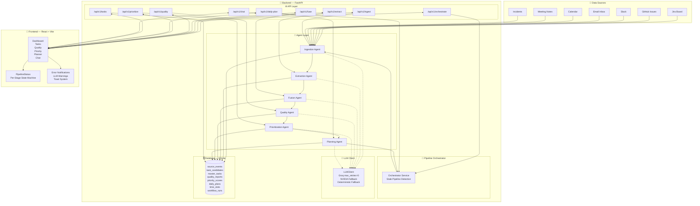
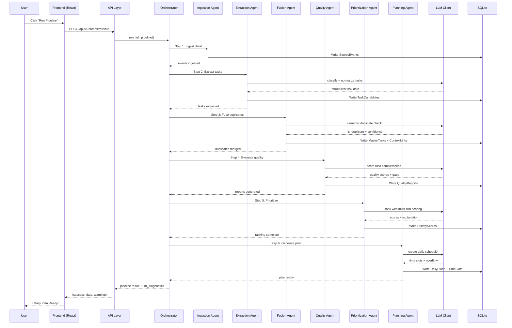

# 🧠 TaskPilot AI

> **Agentic AI Assistant That Conquers Engineer Task Overload**
>
> *Built for DELL FUTUREMINDS AI HACKATHON — Team **IdeaForg-E***

---

## 📋 Team Members

| Dev | Name | Role | Focus Area |
|-----|------|------|------------|
| 👩‍💻 | **Disha** | Backend Lead | FastAPI setup, Database, API routes, Services |
| 👩‍💻 | **Priyanka** | Agent Dev 1 | Ingestion + Extraction + Fusion agents |
| 👨‍💻 | **Chaitanya** | Agent Dev 2 | Quality + Prioritization + Daily Planning agents |
| 👩‍💻 | **Disha + Jagruti** | Frontend Dev | React dashboard, all UI pages |
| 👨‍💻 | **Anil** | Integration Lead | Orchestrator, end-to-end pipeline, demo prep |

---

## 🏆 Problem Statement

### The Core Problem
Modern software engineers are drowning — not in code, but in **context fragmentation**. Work arrives from Scrum boards, defect trackers, emails, Slack threads, meeting notes, and ad-hoc requests. There is no single pane of glass. Prioritization is gut-driven. Critical tasks slip through the cracks.

| Pain Point | Impact |
|------------|--------|
| **Source Fragmentation** | 4-7 different tools daily — 73% report tool fatigue |
| **Context Switching Tax** | 23 min per switch — ~2.1 hrs/day lost |
| **Invisible Task Debt** | ~35% of tasks are "off-the-books" and untracked |
| **Priority Blindness** | ~40% of sprint tasks reprioritized mid-sprint |
| **Summarization Burden** | 45+ min/day spent on email triage alone |

### Our Solution
**TaskPilot AI** — A multi-agent AI assistant that autonomously aggregates tasks from heterogeneous sources, deduplicates and correlates related work, intelligently prioritizes based on multi-dimensional criteria, and delivers a dynamic, actionable daily task plan through a conversational interface.

---

## 🏗️ System Architecture



### Pipeline Flow



---

## 🧠 Multi-Agent Architecture

### Agent Overview

| Agent | Core Model | Modality | Fallback & Optimization Strategy |
|-------|-----------|-----------|-------------------|
| **Ingestion** | Deterministic | ❌ | High-speed JSON file parser — no LLM needed |
| **Extraction** | `llama-3.1-8b-instant` | ❌ Fast | Keyword + regex-based extraction |
| **Fusion** | `llama-3.3-70b-versatile` | ✅ Reasoning | SequenceMatcher overlap + **Persistent Cache** (`fusion_cache.json`) + strict `[0.55, 0.70]` LLM window |
| **Quality** | Deterministic (Heuristic) | ❌ Fast | **Bypassed to Deterministic Fallback** for 20ms execution and 0 API calls |
| **Prioritization** | `llama-3.1-8b-instant` | ❌ Fast | **Scored in batches of 10** to optimize execution and avoid SQLite locks, with a deterministic local fallback |
| **Planning** | `llama-3.3-70b-versatile` | ✅ Reasoning | Greedy time-slot calendar scheduling (uses `json.dumps` prompt escaping) |

### LLM Fallback & Optimization Chain

```
Groq (max_retries=0)
  ├── ✅ Success → Return result immediately
  ├── ❌ 429/Error → Instant fail (no SDK retry wait) & Class-Level Global Failover
  │    └── NVIDIA
  │         ├── ✅ Success → Return result (passes through clean_json_lines parser)
  │         └── ❌ Error
  │              └── Deterministic Fallback (SequenceMatcher / Heuristic / Weighted Formula)
  └── 🔄 Fusion Cache → Skips LLM entirely for cached similarity comparisons
```

* **⚡ Core Performance Optimizations:**
  * **Persistent Fusion Cache**: Similarity evaluations between `0.55` and `0.70` are cached in `backend/data/fusion_cache.json`. Values outside this range skip the LLM. This saves **600+ redundant duplicate check requests**, reducing fusion to **0ms** on repeated runs.
  * **Deterministic Fallback Bypassing**: Quality agent directly calculates structural completeness using local algorithms. This saves **30+ reasoning calls**, dropping stage runtime to **<20ms**.
  * **Class-Level Global Failover**: Promoted `failed_providers` in `LLMClient` to a class variable. Once a rate limit (429) hits Groq, it is globally bypassed instantly across all subsequent API client instances in the same process, directing requests directly to NVIDIA.
  * **Robust JSON Delimiter Repair**: Added a `clean_json_lines` parser to `LLMClient.parse_json` that repairs unescaped quotes inside JSON values on the fly, preventing syntax crashes.
  * **FastAPI BackgroundTasks**: Pipeline orchestrator now runs in `BackgroundTasks` threads. The POST endpoint returns a success status immediately, and the frontend polls the status dynamically, preventing server timeouts.
  * **Raw Ingestion Defect Injection**: P1 defect injections from chat append tasks directly to the raw JSON database files (`incidents.json`), making them persistent and clean through the standard ingestion pipeline.

### Agent Details

#### 1️⃣ Ingestion Agent
- **Service:** `backend/app/services/agent_1_ingestion_service.py`
- Reads JSON files from `data/` folder via `settings.DATA_DIR`
- Normalizes heterogeneous schemas into unified `SourceEvent` records
- Clears previous pipeline data before fresh ingestion (clears stale runs on server boot)
- No LLM needed — purely deterministic

#### 2️⃣ Extraction Agent
- **File:** `backend/agents/agent_2_extraction_agent.py`
- **Prompts:** `backend/agents/prompts/agent_2_extraction_prompts.py`
- Two extraction modes:
  - **Explicit** (Jira/GitHub/Incidents): Normalizes structured data via LLM
  - **Hidden** (Slack/Email/Meetings): Recovers buried action items using keyword markers
- Extracts: title, description, assignee, deadline, urgency, confidence

#### 3️⃣ Fusion Agent
- **File:** `backend/agents/agent_3_fusion_agent.py`
- **Prompts:** `backend/agents/prompts/agent_3_fusion_prompts.py`
- Semantic duplicate detection across sources with preserved context
- Uses a **persistent JSON cache** to skip the LLM on repeated duplicate checks
- Only queries the LLM for confidence scores in the narrow `[0.55, 0.70]` window
- Creates `TaskContextLink` for traceability

#### 4️⃣ Quality Agent
- **File:** `backend/agents/agent_4_quality_agent.py`
- Bypasses LLM reasoning calls for ultra-high speed execution (completed in under 20ms)
- Scores tasks on 7 completeness dimensions: Clear Title, Reproduction Steps, Error Logs, Environment, Expected Behavior, Severity, Assignee
- Classifies actionability: `actionable` / `needs_info` / `blocked`

#### 5️⃣ Prioritization Agent
- **File:** `backend/agents/agent_5_prioritization_agent.py`
- **Prompts:** `backend/agents/prompts/agent_5_prioritization_prompts.py`
- Evaluates task priorities in batches of 10 using `llama-3.1-8b-instant` (or NVIDIA fallback) based on a 7-factor scoring system:
  - Severity (25%), Production Impact (20%), Customer Impact (18%), Deadline (12%), Blocker (10%), Business Impact (10%), Quality Factor (5%)
- Automatically falls back to the deterministic local scoring formula if LLM limits or errors occur.

#### 6️⃣ Planning Agent
- **File:** `backend/agents/agent_6_planning_agent.py`
- **Prompts:** `backend/agents/prompts/agent_6_planning_prompts.py`
- Meeting-aware time blocking (9:00–18:00) using double-quote escaped JSON structures
- Greedy scheduling: critical tasks scheduled first, 60–120 min blocks
- Overflow management with manager-friendly reasons
- Load status: `healthy` / `moderate` / `overloaded`

---

## ⚙️ Pipeline Status State Machine

The `PipelineStatus` dashboard component shows each of the 6 pipeline stages with the correct visual state:

| State | Icon | Label | When |
|-------|------|-------|------|
| ✅ **Completed** | 🟢 Checkmark | "Completed" | Stage finished successfully |
| 🔄 **Active** | 🟣 Spinner | "Active" | Stage currently executing |
| ❌ **Failed** | 🔴 X Circle | "Failed" | Stage where pipeline crashed |
| ⏳ **Skipped** | Dim hourglass | "Skipped" | Stages after failure point |
| ⏳ **Pending** | Default hourglass | "Pending" | Not yet reached |

### Example Status Grids

| Scenario | Ingest | Extract | Fusion | Quality | Prioritize | Plan |
|----------|--------|---------|--------|---------|------------|------|
| **No run yet (fresh start)** | ⏳ Pending | ⏳ Pending | ⏳ Pending | ⏳ Pending | ⏳ Pending | ⏳ Pending |
| **Running (Extract stage)** | ✅ Done | 🔄 Active | ⏳ Pending | ⏳ Pending | ⏳ Pending | ⏳ Pending |
| **Running (Fusion stage)** | ✅ Done | ✅ Done | 🔄 Active | ⏳ Pending | ⏳ Pending | ⏳ Pending |
| **All complete** | ✅ Done | ✅ Done | ✅ Done | ✅ Done | ✅ Done | ✅ Done |
| **Failed at Quality** | ✅ Done | ✅ Done | ✅ Done | ❌ Failed | ⏳ Skipped | ⏳ Skipped |
| **Server restart (stale)** | ⏳ Pending | ⏳ Pending | ⏳ Pending | ⏳ Pending | ⏳ Pending | ⏳ Pending |

**Stale Pipeline Detection:**
- **Backend** (orchestrator service): If a pipeline says `"running"` but started > 5 minutes ago, auto-marks it as `"failed"` with message *"Pipeline was interrupted (server restarted or process killed)."*
- **Frontend** (PipelineStatus component): Client-side check — if last run started > 2 minutes ago and still `"running"`, treats as stale and shows all stages as "Pending" immediately, without waiting for backend.

---

## 🌐 API Reference

### Base URL: `/api/v1`

### Orchestrator
| Method | Endpoint | Description |
|--------|----------|-------------|
| `POST` | `/orchestrate/run` | Run full 6-stage pipeline |
| `GET` | `/orchestrate/status/{run_id}` | Get pipeline run status |
| `GET` | `/orchestrate/latest` | Get latest run with system metrics |

### Ingestion
| Method | Endpoint | Description |
|--------|----------|-------------|
| `POST` | `/ingest` | Ingest data from specified sources |
| `GET` | `/ingest/status` | Get total event count |

### Extraction
| Method | Endpoint | Description |
|--------|----------|-------------|
| `POST` | `/extract` | Extract tasks (explicit + hidden) |
| `GET` | `/extract/results` | Get extraction results |

### Fusion
| Method | Endpoint | Description |
|--------|----------|-------------|
| `POST` | `/fuse` | Merge duplicate tasks |

### Quality
| Method | Endpoint | Description |
|--------|----------|-------------|
| `POST` | `/quality/evaluate` | Evaluate all task quality |
| `GET` | `/quality/reports` | Get all quality reports |

### Prioritization
| Method | Endpoint | Description |
|--------|----------|-------------|
| `POST` | `/prioritize` | Rank all tasks |
| `GET` | `/tasks/ranked` | Get ranked task list |

### Planning
| Method | Endpoint | Description |
|--------|----------|-------------|
| `POST` | `/daily-plan` | Generate daily plan |
| `GET` | `/daily-plan/{date}` | Get plan for date |

### Tasks
| Method | Endpoint | Description |
|--------|----------|-------------|
| `GET` | `/tasks` | List all master tasks |
| `GET` | `/tasks/{task_id}` | Get task detail with quality + priority |

### Chat
| Method | Endpoint | Description |
|--------|----------|-------------|
| `POST` | `/chat` | Send natural language query |

### System
| Method | Endpoint | Description |
|--------|----------|-------------|
| `GET` | `/` | API root |
| `GET` | `/health` | Health check with LLM config status |

### Standard Response Format
```json
{
  "success": true,
  "data": { ... },
  "message": "Pipeline completed"
}
```

### Error Response Format
```json
{
  "success": false,
  "message": "LLM API key may be missing or invalid. Check GROQ_API_KEY / NVIDIA_API_KEY in backend/.env",
  "data": {
    "error": "...",
    "llm_diagnostics": [
      {"level": "warning", "message": "No LLM API keys are configured. Add GROQ_API_KEY or NVIDIA_API_KEY in backend/.env."}
    ]
  }
}
```

### Error Classification
| Condition | User-Friendly Message |
|-----------|---------------------|
| Missing/invalid API key | `LLM API key may be missing or invalid...` |
| Request timeout | `Backend request timed out...` |
| Connection refused | `Cannot connect to LLM provider...` |
| Database error | `Database error occurred...` |
| Network Error (frontend) | `Cannot reach backend API...` |
| `ECONNABORTED` | `Backend request timed out. Please try again.` |

---

## 🔒 Error Handling Architecture

### Backend (FastAPI)

```
Global Exception Handler
  ├── Detects: API key issues, timeouts, connection errors, DB errors
  ├── Returns: Structured JSON {success, message, data: {error, llm_diagnostics}}
  └── Human-readable hints for each error type

Per-Router try/except
  ├── All 9 routers wrapped
  └── LLM diagnostics attached to every error response

Stale Pipeline Detection
  ├── If a run says "running" but started > 5 min ago
  ├── Auto-mark as "failed" in database
  └── Message: "Pipeline was interrupted (server restarted or process killed)"
```

### Frontend (React)

```
api.js — centralized error pipeline
  ├── extractLLMWarning() — pulls warnings from response
  ├── getApiErrorMessage() — classifies: LLM warning > payload.message > status code > keyword
  ├── 401 → "API authentication failed"
  ├── 404 → "Resource not found"
  ├── 500 → keyword-matched hints
  ├── ECONNABORTED → "Backend request timed out"
  └── Network Error → "Cannot reach backend API"

PipelineStatus.jsx — per-stage state machine
  ├── Completed → ✅ Green checkmark
  ├── Active → 🔄 Purple spinner + pulse glow
  ├── Failed → ❌ Red X circle
  ├── Skipped → ⏳ Dimmed hourglass
  └── Pending → ⏳ Default hourglass

  Stale detection: if last run > 2 min ago and still "running",
  treats as idle (no spinner) immediately.

Header.jsx — notification banner + floating toast
  ├── status === 'warning' → amber AlertTriangle + LLM diagnostic message
  ├── status === 'error' → red XCircle + getApiErrorMessage()
  ├── status === 'success' → green CheckCircle2
  └── Fixed floating toast visible on all viewport sizes
```

---

## 📦 Project Structure

```
TaskPilot-AI/
├── data/                           # 📂 Simulated data sources
│   ├── calendar.json               # Calendar events
│   ├── emails.json                 # Email inbox
│   ├── github_data.json            # GitHub issues/PRs
│   ├── incidents.json              # Production incidents
│   ├── jira_data.json              # Jira board tickets
│   ├── meeting_notes.json          # Meeting transcripts
│   ├── slack_data.json             # Slack messages
│   └── users.json                  # User directory
│
├── backend/                        # 🐍 FastAPI Backend
│   ├── .env.example                # Environment template
│   ├── requirements.txt            # Python dependencies
│   ├── agents/                     # 🤖 AI Agent Layer
│   │   ├── llm_client.py           # Unified LLM client (Groq + NVIDIA, max_retries=0)
│   │   ├── agent_2_extraction_agent.py
│   │   ├── agent_3_fusion_agent.py
│   │   ├── agent_4_quality_agent.py
│   │   ├── agent_5_prioritization_agent.py
│   │   ├── agent_6_planning_agent.py
│   │   └── prompts/                # LLM prompt templates
│   │       ├── agent_2_extraction_prompts.py
│   │       ├── agent_3_fusion_prompts.py
│   │       ├── agent_4_quality_prompts.py
│   │       ├── agent_5_prioritization_prompts.py
│   │       └── agent_6_planning_prompts.py
│   └── app/                        # 🌐 API Application
│       ├── main.py                 # FastAPI entry + global exception handler
│       ├── config.py               # Environment config
│       ├── database.py             # SQLAlchemy setup
│       ├── logging_config.py       # Logging configuration
│       ├── models/                 # SQLAlchemy ORM models
│       │   ├── source_event.py
│       │   ├── task.py
│       │   ├── workflow_run.py
│       │   ├── quality_report.py
│       │   ├── priority_score.py
│       │   └── daily_plan.py
│       ├── schemas/                # Pydantic validation schemas
│       │   ├── common.py
│       │   ├── ingestion.py
│       │   ├── task.py
│       │   ├── quality.py
│       │   ├── priority.py
│       │   └── plan.py
│       ├── routers/                # API route handlers (all try/except wrapped)
│       │   ├── router_0_orchestrator.py
│       │   ├── router_1_ingest.py
│       │   ├── router_2_extract.py
│       │   ├── router_3_fuse.py
│       │   ├── router_4_quality.py
│       │   ├── router_5_prioritize.py
│       │   ├── router_6_planner.py
│       │   ├── router_7_tasks.py
│       │   └── router_8_chat.py
│       └── services/               # Business logic services
│           ├── agent_0_orchestrator_service.py  # Stale pipeline detection
│           ├── agent_1_ingestion_service.py
│           ├── agent_2_extraction_service.py
│           ├── agent_3_fusion_service.py
│           ├── agent_4_quality_service.py
│           ├── agent_5_prioritization_service.py
│           └── agent_6_planning_service.py
│
├── frontend/                       # ⚛️ React + Vite Frontend
│   ├── package.json
│   ├── vite.config.js              # Proxy /api -> localhost:8000
│   ├── tailwind.config.js
│   ├── index.html
│   └── src/
│       ├── main.jsx
│       ├── App.jsx                 # Router setup
│       ├── index.css               # Design system + animations
│       ├── App.css                 # Scrollbar styling
│       ├── services/
│       │   └── api.js              # Axios client + centralized error handling
│       ├── pages/
│       │   ├── Dashboard.jsx       # Pipeline overview + metrics
│       │   ├── Tasks.jsx           # Task directory with filters
│       │   ├── Quality.jsx         # Quality assurance reports
│       │   ├── Priority.jsx        # Priority leaderboard
│       │   ├── Planner.jsx         # Daily schedule timeline
│       │   └── ChatPage.jsx        # Natural language copilot
│       └── components/
│           ├── common/             # LoadingSpinner, ErrorMessage, EmptyState
│           ├── layout/             # Header (Run Pipeline + toast notifications), Sidebar
│           ├── dashboard/          # PipelineStatus (state machine), RecentActivity, StatsCard
│           ├── tasks/              # TaskCard, TaskList, TaskDetail
│           ├── quality/            # QualityReport, QualityScore
│           ├── priority/           # PriorityCard, PriorityList
│           └── planner/            # DailyPlanner, TimeSlot
│
├── start.bat                       # 🚀 One-click launcher script
└── README.md                       # 📖 This file
```

---

## 🚀 Quick Start

### Prerequisites
- Python 3.10+
- Node.js 18+
- LLM API Key (Groq or NVIDIA — free tier works)

### Setup

```bash
# 1. Clone the repository
git clone https://github.com/IdeaForg-e/TaskPilot-AI.git
cd TaskPilot-AI

# 2. Configure LLM API keys
cp backend/.env.example backend/.env
# Edit backend/.env — add your GROQ_API_KEY or NVIDIA_API_KEY

# 3. Run the launcher (Windows)
start.bat
```

### Manual Setup

```bash
# Backend
cd backend
python -m venv venv
venv\Scripts\activate    # Windows
pip install -r requirements.txt

# IMPORTANT: Exclude .db and .log from reload to prevent
# server restarts mid-pipeline from SQLite writes
uvicorn app.main:app --reload --reload-exclude '*.db' --reload-exclude '*.log' --port 8000

# Frontend (new terminal)
cd frontend
npm install
npm run dev
```

### Why `--reload-exclude` is Needed
Without it, uvicorn's `watchfiles` detects every SQLite write and log append as a file change — causing the server to restart every ~0.4 seconds during pipeline execution. This kills in-flight LLM calls and leaves zombie `"running"` pipeline records in the database. The `start.bat` launcher already includes these excludes automatically.

### Access
- **Frontend:** http://localhost:5173
- **Backend API:** http://localhost:8000
- **API Docs:** http://localhost:8000/docs

---

## 🎯 Demo Scenario

### Acceptance Criteria Walkthrough

| Step | Action | Expected Result |
|------|--------|----------------|
| 1️⃣ | Click **"Run Pipeline"** | All 6 stages execute sequentially — each shows ✅ when done, the current shows 🔄 spinner |
| 2️⃣ | View **Dashboard** | Stats: Total Tasks, Hidden/Extracted count, Avg Quality Score, Top Priority Task |
| 3️⃣ | Open **Tasks** page | Filterable task list with status, type, assignee — shows hidden tasks from Slack/email |
| 4️⃣ | Open **Quality** page | Quality reports with scores, missing info, clarification questions |
| 5️⃣ | Open **Priority** page | Ranked leaderboard with multi-dimension breakdown and explainable rationale |
| 6️⃣ | Open **Planner** page | Time-blocked daily schedule with top priorities, overflow tasks, recommendations |
| 7️⃣ | Ask **Chat**: "What's my top priority?" | Agent responds with ranked task context from database |
| 8️⃣ | Ask **Chat**: "Inject a new P1 defect" | Agent creates SourceEvent, re-runs pipeline, shows updated priority |
| 9️⃣ | Missing API key scenario | Header shows amber warning: "No LLM API keys are configured..." |
| 🔟 | **Server restart during pipeline** | Stale "running" pipeline auto-detected (backend > 5 min, frontend > 2 min) → shows as idle |

### Key Demo Differentiators
- ✅ **Multi-source ingestion** — 7 data sources unified
- ✅ **Hidden task extraction** — Slack/email/meeting action items recovered
- ✅ **Semantic deduplication** — Jira + email about same issue detected
- ✅ **Explainable prioritization** — Every rank has clear rationale
- ✅ **Adaptive re-planning** — P1 injection triggers pipeline re-run
- ✅ **LLM fallback chain** — Groq (max_retries=0) → NVIDIA → deterministic fallback
- ✅ **Graceful degradation** — Missing keys don't crash the app
- ✅ **Stale pipeline recovery** — Server restart doesn't leave zombie spinners

---

## ⚙️ Tech Stack

| Layer | Technology | Purpose |
|-------|-----------|---------|
| **Backend Framework** | FastAPI + Uvicorn | Async Python API server |
| **Database** | SQLite + SQLAlchemy | Embedded relational storage |
| **LLM Clients** | Groq SDK (max_retries=0) + httpx (NVIDIA) | Multi-provider LLM access with fast failover |
| **LLM Models** | Llama 3.1 8B (fast), Llama 3.3 70B (reasoning) | Agent intelligence |
| **Frontend** | React 18 + Vite | SPA dashboard |
| **Styling** | Tailwind CSS v4 + Lucide Icons | Glassmorphism UI with animations |
| **API Client** | Axios | Frontend HTTP client with centralized error handling |
| **Routing** | React Router v6 | Page navigation |

---

## 🏅 Key Features

- ✅ **7 Data Sources** — Jira, GitHub, Slack, Email, Calendar, Meetings, Incidents
- ✅ **6 Specialized Agents** — Autonomous pipeline with deterministic fallbacks for every agent
- ✅ **Dual LLM Provider** — Groq primary (max_retries=0 for fast failover), NVIDIA fallback
- ✅ **Persistent Fusion Cache** — Stores duplicate checks in `fusion_cache.json` to reduce fusion to **0ms** on repeated runs
- ✅ **Deterministic Bypasses** — Bypasses LLM calls for the Quality agent to execute it locally in **<20ms**
- ✅ **FastAPI BackgroundTasks** — Asynchronous non-blocking pipeline execution with real-time UI polling
- ✅ **Robust JSON Delimiter Repair** — `clean_json_lines` parser dynamically repairs unescaped quotes in JSON string outputs
- ✅ **Stale Pipeline & Startup Cleanup** — Automatically cleans up zombie "running" pipelines on server startup or after timeouts
- ✅ **Raw Data Defect Injection** — Appends manual defect injections directly to raw source JSON files for clean persistence and 0 IntegrityErrors
- ✅ **Hidden Task Recovery** — Email/Slack/Meeting action item extraction
- ✅ **Semantic Deduplication** — Cross-source duplicate detection
- ✅ **Explainable Prioritization** — 7-factor scoring with rationale
- ✅ **Meeting-Aware Planning** — Calendar-integrated time blocking
- ✅ **Conversational Copilot** — Natural language query + P1 injection
- ✅ **Per-Stage Pipeline Status** — Each stage shows ✅/🔄/❌/⏳ correctly
- ✅ **Graceful Degradation** — Missing API keys = warnings, not crashes
- ✅ **Real-time Notifications** — Toast + banner for pipeline status
- ✅ **Global Error Classification** — API keys, timeouts, connection, DB errors all have specific messages
- ✅ **Mobile Responsive** — Glass UI adapts to all viewports
- ✅ **One-Click Launch** — `start.bat` handles everything

---

## 🎯 Hackathon Compliance

### Must-Have Requirements (All ✅)

| Requirement | Status | How We Meet It |
|-------------|--------|----------------|
| Multi-source ingestion (≥3 sources) | ✅ | 7 sources: Jira, GitHub, Slack, Email, Calendar, Meetings, Incidents |
| Unstructured text parsing | ✅ | LLM extracts action items from emails, Slack messages, meeting notes |
| Task deduplication | ✅ | Fusion agent with semantic duplicate detection + SequenceMatcher fallback |
| Intelligent prioritization (≥3 factors) | ✅ | 7 factors: severity, deadline, production impact, customer impact, blocker, business impact, quality |
| Daily plan generation | ✅ | Meeting-aware time-blocked schedule with overflow management |
| Conversational interface (≥5 queries) | ✅ | Chat supports: "What's my top priority?", "Summarize emails", "Inject P1", "Why is X ranked #1?", "What's blocking?" |
| Agentic autonomous reasoning | ✅ | Orchestrator runs all 6 stages autonomously; P1 injection triggers auto re-pipeline |

---

## 📄 License

MIT License — Built for DELL FUTUREMINDS AI HACKATHON by Team **IdeaForg-E**