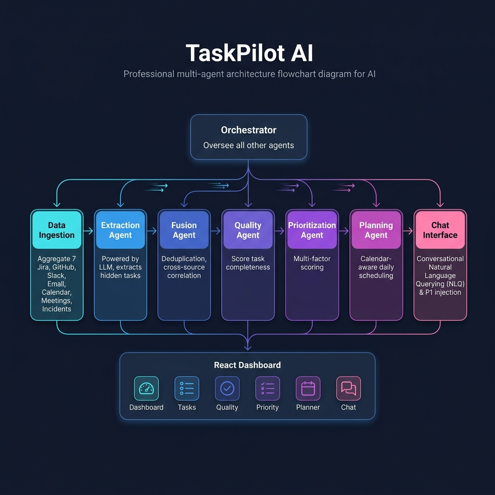
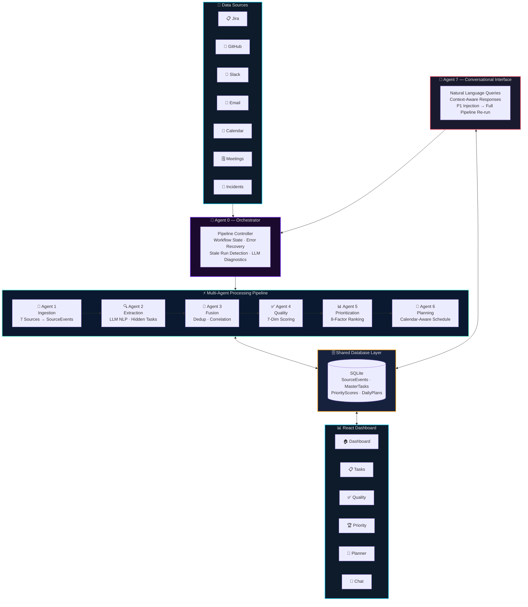
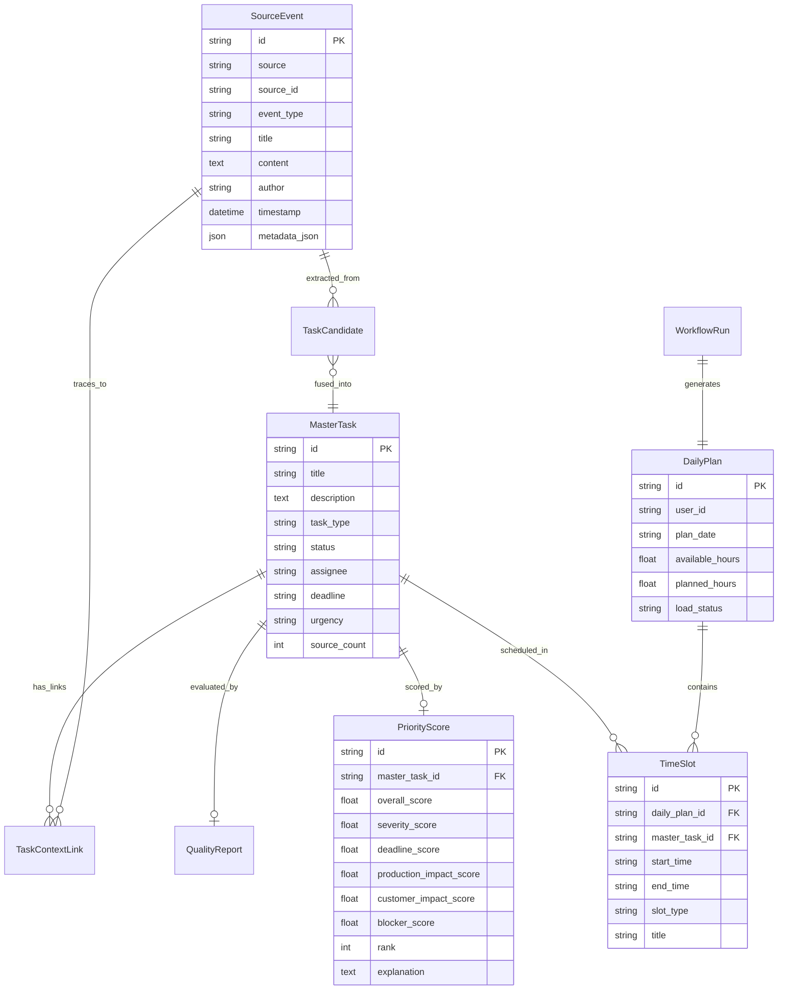
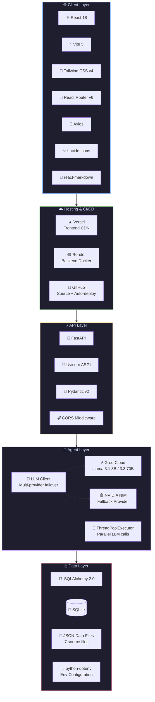

<p align="center">
  
</p>

<h1 align="center">🚀 TaskPilot AI</h1>

<p align="center">
  <strong>Your Personal AI Chief of Staff — Conquering Engineer Task Overload with Autonomous Multi-Agent Intelligence</strong>
</p>

<p align="center">
  <a href="#-live-demo"></a>
  <a href="#-api-endpoint"></a>
  <a href="LICENSE"></a>
  <a href="#-tech-stack"></a>
  <a href="#-tech-stack"></a>
</p>

<p align="center">
  <em>Built for the <strong>DELL FutureMind AI Hackathon</strong> by Team <strong>IdeaForg-E</strong></em>
</p>

---

## 📋 Table of Contents

- [Problem Statement](#-the-problem)
- [Our Solution](#-our-solution)
- [System Architecture](#-system-architecture)
- [Multi-Agent Pipeline](#-multi-agent-pipeline-deep-dive)
- [Frontend Dashboard](#-frontend-dashboard)
- [Tech Stack & Tools](#-tech-stack--tools)
- [Getting Started](#-getting-started)
- [Live Demo & Deployment](#-live-demo)
- [Demo Walkthrough](#-demo-walkthrough)
- [Team](#-team-ideaforg-e)

---

## 🔥 The Problem

Modern software engineers are **drowning in context fragmentation**. Work arrives from Scrum boards, defect trackers, emails, Slack threads, meeting notes, and ad-hoc requests — there's no single pane of glass.

| Pain Point | Impact | Data |
|:---|:---|:---|
| 🔀 **Source Fragmentation** | Engineers juggle 4–7 tools daily | 73% report tool fatigue *(Stack Overflow 2024)* |
| 🧠 **Context Switching Tax** | Every switch costs 23 min to regain focus | ~2.1 hours/day lost to switching |
| 👻 **Invisible Task Debt** | Action items buried in emails & chat | ~35% of tasks are untracked |
| 🎯 **Priority Blindness** | Engineers optimize locally, not globally | ~40% of sprint tasks are reprioritized |
| 📧 **Summarization Burden** | Manual email/meeting triage daily | 45+ min/day on email triage alone |

> **The result?** Engineers spend their first 45 minutes each morning just figuring out *what to work on*. Critical P1 defects get buried in Friday emails and aren't discovered until Monday. Sprint commitments slip. Manager escalations follow.

---

## 💡 Our Solution

**TaskPilot AI** is an autonomous multi-agent system that acts as a **personal chief of staff** for every software engineer. It:

- 🔄 **Autonomously aggregates** tasks from 7 heterogeneous data sources
- 🔍 **Extracts hidden action items** from unstructured emails, Slack messages, and meeting transcripts using LLM-powered NLP
- 🔗 **Deduplicates and correlates** related work across systems via semantic similarity
- 📊 **Intelligently prioritizes** using 8-dimensional scoring with explainable, auditable rationale
- 📅 **Generates dynamic daily plans** that are calendar-aware and adapt in real-time
- 💬 **Supports natural language interaction** — ask questions, inject P1 incidents mid-day, get instant re-prioritization
- 🚨 **Proactively detects** overloaded developers, approaching deadlines, and blocked pipelines

### Before vs After

| | Before TaskPilot | After TaskPilot |
|:---|:---|:---|
| **Morning Routine** | Open 5+ tools, manually scan, mentally prioritize | Open TaskPilot → see unified, ranked daily plan |
| **Hidden Tasks** | Buried in emails, 35% untracked | Auto-extracted by LLM agents, 0% missed |
| **Prioritization** | Gut-feel, loudest wins | 8-factor algorithmic scoring with explanations |
| **Mid-day Changes** | Manually re-triage everything | Say "Inject P1" → pipeline auto re-runs |
| **Time Saved** | 0 | **45+ minutes/day** |

---

## 🏗 System Architecture

<p align="center">
  
</p>

TaskPilot AI employs a **cooperative multi-agent architecture** where 6 specialized AI agents work in a sequential pipeline, orchestrated by a central controller. Each agent has a single responsibility, communicates through a shared SQLite database, and uses LLM-powered reasoning for complex decisions.

### High-Level System Flow



### Data Flow & Agent Communication

```mermaid
flowchart LR
    subgraph INPUT["Raw Data"]
        RAW["7 JSON Files\n~80+ raw events"]
    end

    subgraph STAGE1["Stage 1"]
        ING["Ingestion Agent\nNormalize to SourceEvent schema"]
    end

    subgraph STAGE2["Stage 2"]
        EXT["Extraction Agent\nExplicit + Hidden tasks\nThreadPoolExecutor x4"]
    end

    subgraph STAGE3["Stage 3"]
        FUS["Fusion Agent\nSemantic dedup via LLM\nDynamic confidence thresholds"]
    end

    subgraph STAGE4["Stage 4"]
        QUA["Quality Agent\n7-dimension scoring\nActionability classification"]
    end

    subgraph STAGE5["Stage 5"]
        PRI["Priority Agent\n8-factor weighted model\nHybrid LLM + algorithmic"]
    end

    subgraph STAGE6["Stage 6"]
        PLN["Planning Agent\nCalendar-aware scheduling\nOverflow & blocking detection"]
    end

    subgraph OUTPUT["Outputs"]
        OUT["Daily Plan\nRanked Leaderboard\nExplainable Insights"]
    end

    RAW -->|"80+ events"| ING -->|"SourceEvents"| EXT -->|"TaskCandidates"| FUS -->|"MasterTasks"| QUA -->|"QualityReports"| PRI -->|"PriorityScores"| PLN -->|"TimeSlots"| OUT

    style INPUT fill:#1a1a2e,stroke:#e94560,color:#fff
    style STAGE1 fill:#16213e,stroke:#0f3460,color:#fff
    style STAGE2 fill:#16213e,stroke:#0f3460,color:#fff
    style STAGE3 fill:#16213e,stroke:#0f3460,color:#fff
    style STAGE4 fill:#16213e,stroke:#0f3460,color:#fff
    style STAGE5 fill:#16213e,stroke:#0f3460,color:#fff
    style STAGE6 fill:#16213e,stroke:#0f3460,color:#fff
    style OUTPUT fill:#1a1a2e,stroke:#64ffda,color:#fff
```



### Database Entity Relationship



---

## 🤖 Multi-Agent Pipeline Deep-Dive

### Agent 0 — Orchestrator Service
> **Role:** Central coordinator that manages the entire pipeline lifecycle

- Executes all 6 pipeline stages sequentially with **atomic error handling**
- Tracks `WorkflowRun` state in database (running → completed/failed)
- Detects **stale pipelines** (>5 min running = auto-marked as failed)
- Reports **LLM diagnostics** for transparency and debugging
- Supports both full pipeline runs and individual stage triggers

### Agent 1 — Ingestion Service
> **Role:** Multi-source data aggregation and normalization

Ingests raw data from **7 heterogeneous sources** and normalizes them into a unified `SourceEvent` schema:

| Source | Data Type | Example Items |
|:---|:---|:---|
| 📋 Jira | Sprint tickets, stories, bugs | `PROJ-1234: API latency degradation` |
| 🐙 GitHub | Issues, pull requests | `PR #42: Fix memory leak in worker pool` |
| 💬 Slack | Channel messages, DMs | `@dev: can someone look at the upload bug?` |
| 📧 Email | Inbox threads | `VP escalation: Customer data export failing` |
| 📅 Calendar | Meetings, events | `Sprint Review - 10:00 AM` |
| 🗒 Meetings | Transcripts, action items | `Action: Follow up on auth migration by EOW` |
| 🚨 Incidents | Production alerts, P1s | `INC-5001: Payment gateway timeout - P1` |

### Agent 2 — Extraction Agent (LLM-Powered)
> **Role:** Discover hidden work and extract actionable tasks from unstructured text

- **Explicit extraction:** Structured sources (Jira, GitHub, Incidents) → direct task mapping
- **Hidden task extraction:** Uses LLM to parse **emails, Slack, and meeting transcripts** for buried action items
- Employs **concurrent ThreadPoolExecutor** for parallel LLM calls (4 workers)
- Applies **confidence scoring** — only tasks above 0.5 confidence threshold are retained
- Captures task metadata: assignee, deadline, urgency, task type

### Agent 3 — Fusion Agent (LLM-Powered)
> **Role:** Cross-source deduplication and semantic correlation

- Uses LLM to **detect semantic duplicates** across different platforms
- Dynamic **confidence thresholds** that adjust based on:
  - Different assignees → threshold **+0.15** (harder to merge)
  - Different source platforms → threshold **+0.05**
  - Different deadlines → threshold **+0.10**
- Produces **MasterTask** records with fused descriptions from multiple signals
- Tracks `source_count` — tasks from 3+ sources get priority boosts
- Creates `TaskContextLink` entries for full traceability

### Agent 4 — Quality Agent (LLM-Powered)
> **Role:** Evaluate task completeness and actionability

Scores each task across **7 quality dimensions:**

| Dimension | What It Measures |
|:---|:---|
| 📝 Clear Title | Is the title descriptive and specific? |
| 🔄 Reproduction Steps | Are steps to reproduce included? |
| 📋 Error Logs | Are logs/stack traces attached? |
| 🖥 Environment | Is the environment specified? |
| ✅ Expected Behavior | Is the desired outcome documented? |
| ⚡ Severity | Is severity properly classified? |
| 👤 Assignee | Is an owner assigned? |

Outputs: `overall_score`, `actionability` (actionable/needs_info), `missing_info`, and `clarification_questions`

### Agent 5 — Prioritization Agent (Hybrid LLM + Algorithmic)
> **Role:** Multi-dimensional priority scoring with explainable rationale

Uses a **hybrid approach** — critical tasks get LLM reasoning, others use a fast local algorithm:

**8-Factor Scoring Model:**

| Factor | Weight | Description |
|:---|:---:|:---|
| 🔴 Severity | 25% | Technical severity and urgency classification |
| 💥 Production Impact | 20% | Risk of production outage or degradation |
| 👥 Customer Impact | 18% | Direct impact on end-users and customers |
| ⏰ Deadline Urgency | 12% | Proximity to deadline and SLA expiration |
| 🚧 Blocker Score | 10% | Whether it blocks other engineers/pipelines |
| 💼 Business Impact | 10% | Revenue and business operations impact |
| 📊 Quality Factor | 5% | How well-documented the task is |

**Intelligence features:**
- **Blocker detection** via keyword analysis (escalates blocking tasks by +2.0)
- **Vague title demotion** — poorly titled tasks get a 0.55x multiplier
- **Administrative work demotion** — reporting/meeting tasks get 0.72x multiplier
- **Developer overload alerts** — warns if any engineer has >3 active tasks
- **Fully explainable** — every score comes with a human-readable paragraph explaining *why*

### Agent 6 — Daily Planning Agent (LLM-Powered)
> **Role:** Calendar-aware, intelligent daily schedule generation

- Reads the engineer's **real calendar** and protects meeting blocks
- Calculates **available focus hours** = 8h − meetings − buffer
- Schedules tasks in **priority order** into the earliest available focus blocks
- Detects **overflow** — tasks that can't fit are deferred to next day
- Prevents **cross-day duplication** using `_locked_task_ids()` logic
- Generates **top 3 agenda focus items** for the morning briefing
- Produces **agent reasoning** for every time slot explaining *why* it's there

### Agent 7 — Conversational Chat Interface
> **Role:** Natural language interaction and mid-day P1 injection

- **Context-aware responses** — retrieves all tasks, priorities, and plans from DB as context
- **P1 Task Injection** — say "inject a P1 payment gateway timeout" and the agent:
  1. Uses LLM to extract structured task data from natural language
  2. Writes the raw event to the appropriate source JSON file
  3. **Autonomously re-runs the entire pipeline** (Ingestion → Planning)
  4. Reports the new task's priority rank and score
- Supports queries like: *"What's my top priority?"*, *"Summarize my emails"*, *"Why is the upload bug ranked #1?"*

---

## 🖥 Frontend Dashboard

The React dashboard provides **6 purpose-built views** with a premium dark glassmorphism design:

| Page | Purpose | Key Features |
|:---|:---|:---|
| 🏠 **Dashboard** | Command center overview | Stats cards, pipeline stepper with real-time status, system metrics, recent activity |
| 📋 **Tasks** | Unified task explorer | Filterable/searchable task list, source badges, detailed task drill-down |
| ✅ **Quality** | Quality audit reports | Score breakdowns, missing info alerts, actionability classification |
| 🏆 **Priority** | Priority leaderboard | Ranked cards with explainable reasoning paragraphs, multi-factor score breakdown |
| 📅 **Planner** | Daily schedule view | Time-blocked timeline, meeting protection, top-3 agenda, overflow detection |
| 💬 **Chat** | AI assistant | Real-time chat interface, P1 injection, markdown rendering, pipeline status |

**Design Highlights:**
- 🌙 **Dark mode** with glassmorphism card design (`backdrop-blur-xl`)
- ✨ **Micro-animations** — fade-in-up stagger effects, pulse indicators, hover transitions
- 📱 **Fully responsive** — collapsible sidebar, mobile-optimized layouts
- 🔄 **Auto-polling** — dashboard updates every 4 seconds during pipeline execution
- 🎨 **Gradient accents** — violet-to-cyan brand palette throughout

---

## 🛠 Tech Stack & Tools

### Core Technologies

<table>
<tr>
<td align="center" width="33%">

**🐍 Backend**


</td>
<td align="center" width="33%">

**⚛️ Frontend**


</td>
<td align="center" width="33%">

**🤖 AI / LLM**


</td>
</tr>
<tr>
<td align="center" width="33%">

**☁️ Infrastructure**


</td>
<td align="center" width="33%">

**🧰 Dev Tools**


</td>
<td align="center" width="33%">

**📦 Libraries**


</td>
</tr>
</table>

### Tech Stack Architecture



### LLM Models & Providers

| Provider | Model | Parameters | Use Case | Latency |
|:---|:---|:---:|:---|:---:|
|  | `llama-3.1-8b-instant` | 8B | Fast extraction, fusion, quality scoring | ~200ms |
|  | `llama-3.3-70b-versatile` | 70B | Complex reasoning, prioritization, planning | ~2s |
|  | `meta/llama-3.1-8b-instruct` | 8B | Fast fallback when Groq is unavailable | ~500ms |
|  | `meta/llama-3.3-70b-instruct` | 70B | Reasoning fallback | ~3s |

> **Failover Strategy:** The `LLMClient` automatically tries Groq first, then falls back to NVIDIA NIM. If both fail, deterministic local fallback algorithms produce results without any LLM — ensuring the pipeline **never breaks** even without API keys.

---

## 🚀 Getting Started

### Prerequisites

- **Python** 3.11+
- **Node.js** 18+
- **Git**
- A **Groq API Key** (free at [console.groq.com](https://console.groq.com))

### Quick Start (Windows)

```bash
# 1. Clone the repository
git clone https://github.com/IdeaForg-e/TaskPilot-AI.git
cd TaskPilot-AI

# 2. Configure environment
cp backend/.env.example backend/.env
# Edit backend/.env and add your GROQ_API_KEY

# 3. One-click launch
start.bat
```

The `start.bat` script automatically:
- ✅ Creates Python virtual environment
- ✅ Installs backend dependencies
- ✅ Installs frontend node modules
- ✅ Kills conflicting port processes
- ✅ Launches backend on `http://localhost:8000`
- ✅ Launches frontend on `http://localhost:5173`
- ✅ Opens Chrome to the dashboard

### Manual Setup

<details>
<summary><strong>Backend Setup</strong></summary>

```bash
cd backend

# Create virtual environment
python -m venv venv
venv\Scripts\activate       # Windows
# source venv/bin/activate  # macOS/Linux

# Install dependencies
pip install -r requirements.txt

# Configure API keys
cp .env.example .env
# Edit .env: Add GROQ_API_KEY=gsk_your_key_here

# Start the server
uvicorn app.main:app --reload --port 8000
```
</details>

<details>
<summary><strong>Frontend Setup</strong></summary>

```bash
cd frontend

# Install dependencies
npm install

# Start dev server
npm run dev
# → http://localhost:5173
```
</details>

### Environment Variables

```env
# Required — Primary LLM
GROQ_API_KEY=gsk_your_groq_api_key

# Optional — Model overrides
GROQ_MODEL_FAST=llama-3.1-8b-instant
GROQ_MODEL_REASONING=llama-3.3-70b-versatile

# Optional — Fallback LLM (NVIDIA NIM)
NVIDIA_API_KEY=nvapi_your_nvidia_key
NVIDIA_MODEL_FAST=meta/llama-3.1-8b-instruct
NVIDIA_MODEL_REASONING=meta/llama-3.3-70b-instruct

# Database (auto-configured)
DATABASE_URL=sqlite:///./taskpilot.db
```

---

## 🌐 Live Demo

| Component | URL |
|:---|:---|
| 🖥 **Frontend** (Vercel) | [taskpilot-ai.vercel.app](https://task-pilot-ai-disha-p-patels-projects.vercel.app) |
| ⚡ **Backend API** (Render) | [taskpilot-ai-4.onrender.com](https://taskpilot-ai-4.onrender.com) |
| 📖 **API Docs** (Swagger) | [/docs](https://taskpilot-ai-4.onrender.com/docs) |
| 💚 **Health Check** | [/health](https://taskpilot-ai-4.onrender.com/health) |

---

## 🎬 Demo Walkthrough

Follow this sequence to see TaskPilot AI in action (maps to hackathon acceptance criteria):

### Step 1: Run the Pipeline
1. Open the **Dashboard** page
2. Click **"Run Pipeline"** — watch the 6-stage stepper animate in real-time
3. Each agent stage lights up as it completes: Ingestion → Extraction → Fusion → Quality → Prioritization → Planning

### Step 2: Explore Ingested Tasks
4. Navigate to **Tasks** page — see all 30+ tasks aggregated from 7 sources
5. Notice **hidden tasks** extracted from emails and meeting notes (tagged with badges)
6. Click any task to see full details, source traceability, and context links

### Step 3: Review Quality Scores
7. Open **Quality** page — see each task scored across 7 quality dimensions
8. Notice tasks marked "Needs Info" with specific clarification questions generated by the AI

### Step 4: Analyze Prioritization
9. Open **Priority** page — see the ranked leaderboard
10. Read the **explanation paragraph** for each task — every ranking decision is auditable
11. Notice multi-source tasks ranked higher (e.g., Jira ticket + email escalation = fused signal)

### Step 5: View the Daily Plan
12. Open **Planner** page — see the calendar-aware daily schedule
13. Meetings are auto-detected and time-protected
14. Tasks fill available focus blocks in priority order
15. Top 3 agenda items are highlighted

### Step 6: Chat & Inject P1
16. Open **Chat** page
17. Ask: *"What's my top priority?"* → AI responds with context-aware answer
18. Type: *"Inject P1 — Payment gateway is timing out, affecting all checkout flows"*
19. Watch the **entire pipeline re-run autonomously** — the new incident appears in Priority leaderboard with a high rank

---

## 📁 Project Structure

```
TaskPilot-AI/
├── 📂 backend/
│   ├── 📂 agents/                    # AI Agent implementations
│   │   ├── llm_client.py            # Multi-provider LLM client (Groq + NVIDIA)
│   │   ├── agent_2_extraction_agent.py
│   │   ├── agent_3_fusion_agent.py
│   │   ├── agent_4_quality_agent.py
│   │   ├── agent_5_prioritization_agent.py
│   │   ├── agent_6_planning_agent.py
│   │   └── 📂 prompts/              # LLM prompt templates per agent
│   ├── 📂 app/
│   │   ├── main.py                   # FastAPI app entry point
│   │   ├── config.py                 # Environment config loader
│   │   ├── database.py               # SQLAlchemy engine + sessions
│   │   ├── 📂 models/               # SQLAlchemy ORM models
│   │   │   ├── source_event.py       # Raw ingested events
│   │   │   ├── task.py               # TaskCandidate + MasterTask + ContextLink
│   │   │   ├── quality_report.py     # Quality evaluation scores
│   │   │   ├── priority_score.py     # Multi-factor priority scores
│   │   │   ├── daily_plan.py         # DailyPlan + TimeSlot
│   │   │   └── workflow_run.py       # Pipeline execution tracking
│   │   ├── 📂 routers/              # FastAPI API routes
│   │   │   ├── router_0_orchestrator.py  # Pipeline execution endpoints
│   │   │   ├── router_1_ingest.py    # Data ingestion triggers
│   │   │   ├── router_2_extract.py   # Task extraction endpoints
│   │   │   ├── router_3_fuse.py      # Fusion/dedup endpoints
│   │   │   ├── router_4_quality.py   # Quality evaluation endpoints
│   │   │   ├── router_5_prioritize.py # Prioritization endpoints
│   │   │   ├── router_6_planner.py   # Daily plan generation + calendar
│   │   │   ├── router_7_tasks.py     # Task CRUD + detail endpoints
│   │   │   └── router_8_chat.py      # Chat + P1 injection endpoint
│   │   ├── 📂 services/             # Business logic layer
│   │   │   ├── agent_0_orchestrator_service.py
│   │   │   ├── agent_1_ingestion_service.py
│   │   │   ├── agent_2_extraction_service.py
│   │   │   ├── agent_3_fusion_service.py
│   │   │   ├── agent_4_quality_service.py
│   │   │   ├── agent_5_prioritization_service.py
│   │   │   └── agent_6_planning_service.py
│   │   └── 📂 schemas/              # Pydantic request/response schemas
│   ├── requirements.txt
│   └── .env.example
├── 📂 frontend/
│   └── 📂 src/
│       ├── App.jsx                    # React Router setup (6 routes)
│       ├── 📂 pages/                 # Page-level components
│       │   ├── Dashboard.jsx          # Command center with stats + pipeline
│       │   ├── Tasks.jsx              # Unified task explorer
│       │   ├── Quality.jsx            # Quality audit reports
│       │   ├── Priority.jsx           # Priority leaderboard
│       │   ├── Planner.jsx            # Daily schedule timeline
│       │   └── ChatPage.jsx           # AI chat interface
│       ├── 📂 components/            # Reusable UI components
│       │   ├── 📂 dashboard/         # StatsCard, PipelineStatus, RecentActivity
│       │   ├── 📂 layout/            # Sidebar, Layout, Header
│       │   ├── 📂 common/            # LoadingSpinner, ErrorMessage
│       │   └── 📂 planner/           # DailyPlanner components
│       └── 📂 services/
│           └── api.js                 # Axios client + error normalization
├── 📂 data/                           # Simulated enterprise data sources
│   ├── jira_data.json                 # 15 Jira tickets (stories, bugs, tasks)
│   ├── github_data.json               # 10 GitHub issues + PRs
│   ├── slack_data.json                # 8 Slack messages with hidden tasks
│   ├── emails.json                    # 6 email threads (VP escalations, action items)
│   ├── calendar.json                  # Meeting schedule for daily planning
│   ├── meeting_notes.json             # Meeting transcripts with action items
│   ├── incidents.json                 # Production incidents (P1-P4)
│   └── users.json                     # Engineer profiles
├── render.yaml                        # Render.com deployment Blueprint
├── start.bat                          # One-click Windows launcher
└── README.md
```

---

## 🔌 API Reference

All endpoints are prefixed with `/api/v1`.

| Method | Endpoint | Description |
|:---:|:---|:---|
| `POST` | `/orchestrate/run` | Execute full 6-stage pipeline |
| `GET` | `/orchestrate/status/{id}` | Get pipeline run status |
| `GET` | `/orchestrate/latest` | Get latest pipeline run + metrics |
| `POST` | `/ingest` | Ingest raw data from sources |
| `POST` | `/extract` | Extract tasks (explicit + hidden) |
| `POST` | `/fuse` | Run deduplication/fusion |
| `POST` | `/quality/evaluate` | Run quality evaluation |
| `GET` | `/quality/reports` | Get all quality reports |
| `POST` | `/prioritize` | Run multi-factor prioritization |
| `GET` | `/tasks` | List all master tasks |
| `GET` | `/tasks/ranked` | Get priority-ranked task list |
| `GET` | `/tasks/{id}` | Get task detail with quality + priority |
| `POST` | `/tasks/{id}/status` | Update task status |
| `POST` | `/daily-plan` | Generate daily plan for a date |
| `GET` | `/daily-plan/{date}` | Get existing plan for date |
| `GET` | `/daily-plans` | List all generated plans |
| `POST` | `/chat` | Chat with AI assistant / inject P1 |
| `GET` | `/health` | System health + LLM config status |

---

## ✅ Hackathon Acceptance Criteria Mapping

| Criteria | Status | How We Address It |
|:---|:---:|:---|
| Multi-source ingestion (3+ sources) | ✅ | **7 sources** — Jira, GitHub, Slack, Email, Calendar, Meetings, Incidents |
| Unstructured text parsing | ✅ | LLM-powered extraction from emails, Slack, meeting transcripts |
| Extract 2+ action items from emails | ✅ | Hidden task extraction with confidence scoring |
| Task deduplication | ✅ | Semantic similarity via LLM with dynamic confidence thresholds |
| Intelligent prioritization (3+ factors) | ✅ | **8-factor** scoring model with weighted algorithm |
| Explainable priority output | ✅ | Human-readable explanation paragraphs + tagged reason arrays |
| Daily plan generation | ✅ | Calendar-aware, priority-ordered, overflow-detecting planner |
| Conversational interface (5+ queries) | ✅ | Context-aware LLM chat with full DB context injection |
| Agentic behavior (autonomous reasoning) | ✅ | Pipeline auto-runs, P1 injection triggers full re-prioritization |
| Dynamic re-prioritization | ✅ | Chat P1 injection → full pipeline re-run → new rankings |
| Multi-agent architecture | ✅ | 7 specialized agents with orchestrator coordination |
| Proactive alerting | ✅ | Developer overload warnings, stale pipeline detection |
| Calendar-aware planning | ✅ | Meeting block protection, available hours calculation |

---

## 👥 Team IdeaForg-E

| Member | Role | Focus Area |
|:---|:---|:---|
| **Disha** | 🔧 Backend Lead | FastAPI architecture, Database design, API routes, Service layer |
| **Priyanka** | 🤖 Agent Dev 1 | Ingestion + Extraction + Fusion agents |
| **Chaitanya** | 🤖 Agent Dev 2 | Quality + Prioritization + Daily Planning agents |
| **Disha + Jagruti** | 🎨 Frontend Dev | React dashboard, all UI pages, design system |
| **Anil** | 🔗 Integration Lead | Orchestrator, end-to-end pipeline, deployment, demo prep |

---

## 📄 License

This project is licensed under the **MIT License** — see the [LICENSE](LICENSE) file for details.

---

<p align="center">
  <strong>Built with ❤️ by Team IdeaForg-E for the DELL FutureMind AI Hackathon</strong>
</p>

<p align="center">
  <em>"An agent that functions as a personal chief of staff for every engineer — one that never forgets a task, never misses an email, and always has a data-driven answer to 'what should I work on next?'"</em>
</p>
