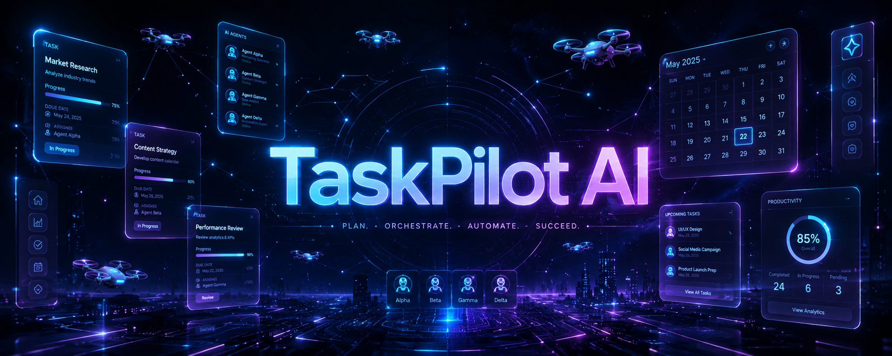
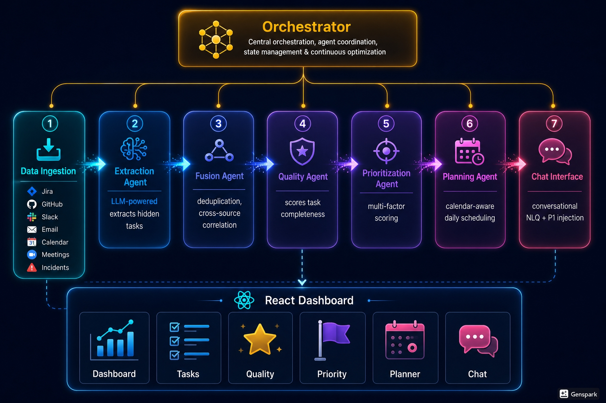
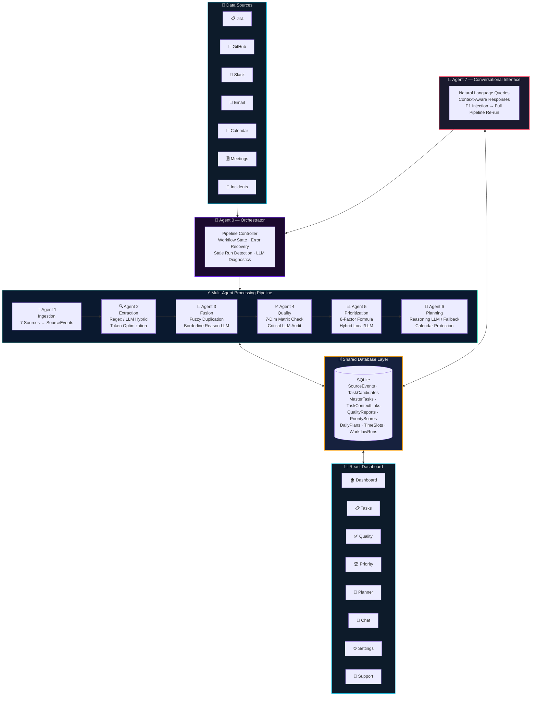
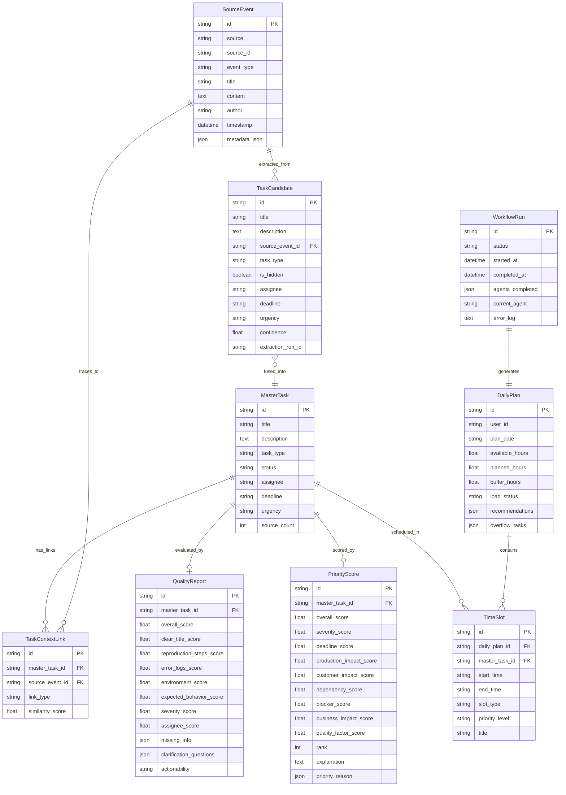
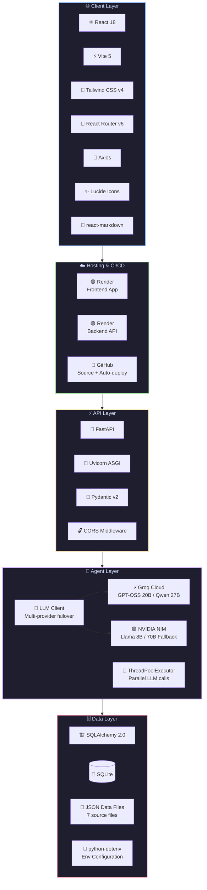

<p align="center">
  
</p>

<h1 align="center">🚀 TaskPilot AI</h1>

<p align="center">
  <strong>Your Personal AI Chief of Staff — Conquering Engineer Task Overload with Autonomous Multi-Agent Intelligence</strong>
</p>

<p align="center">
  <a href="#-live-demo"></a>
  <a href="#-api-endpoint"></a>
  <a href="LICENSE"></a>
  <a href="#-tech-stack"></a>
  <a href="#-tech-stack"></a>
</p>

<p align="center">
  <em>Built for the <strong>DELL FutureMind AI Hackathon</strong> by Team <strong>IdeaForg-E</strong></em>
</p>

---

## 📋 Table of Contents

- [Problem Statement](#-the-problem)
- [Our Solution](#-our-solution)
- [System Architecture](#-system-architecture)
- [Research & Concept Docs](#-research--concept-docs)
- [Multi-Agent Pipeline](#-multi-agent-pipeline-deep-dive)
- [Frontend Dashboard](#-frontend-dashboard)
- [Tech Stack & Tools](#-tech-stack--tools)
- [Getting Started](#-getting-started)
- [Live Demo & Deployment](#-live-demo)
- [Demo Walkthrough](#-demo-walkthrough)
- [Team](#-team-ideaforg-e)

---

## 🔥 The Problem

Modern software engineers are **drowning in context fragmentation**. Work arrives from Scrum boards, defect trackers, emails, Slack threads, meeting notes, and ad-hoc requests — there's no single pane of glass.

| Pain Point | Impact | Data |
|:---|:---|:---|
| 🔀 **Source Fragmentation** | Engineers juggle 4–7 tools daily | 73% report tool fatigue *(Stack Overflow 2024)* |
| 🧠 **Context Switching Tax** | Every switch costs 23 min to regain focus | ~2.1 hours/day lost to switching |
| 👻 **Invisible Task Debt** | Action items buried in emails & chat | ~35% of tasks are untracked |
| 🎯 **Priority Blindness** | Engineers optimize locally, not globally | ~40% of sprint tasks are reprioritized |
| 📧 **Summarization Burden** | Manual email/meeting triage daily | 45+ min/day on email triage alone |

> **The result?** Engineers spend their first 45 minutes each morning just figuring out *what to work on*. Critical P1 defects get buried in Friday emails and aren't discovered until Monday. Sprint commitments slip. Manager escalations follow.

---

## 💡 Our Solution

**TaskPilot AI** is an autonomous multi-agent system that acts as a **personal chief of staff** for every software engineer. It:

- 🔄 **Autonomously aggregates** tasks from 7 heterogeneous data sources
- 🔍 **Extracts hidden action items** from unstructured emails, Slack messages, and meeting transcripts using LLM-powered NLP
- 🔗 **Deduplicates and correlates** related work across systems via semantic similarity
- 📊 **Intelligently prioritizes** using 8-dimensional scoring with explainable, auditable rationale
- 📅 **Generates dynamic daily plans** that are calendar-aware and adapt in real-time
- 💬 **Supports natural language interaction** — ask questions, inject P1 incidents mid-day, get instant re-prioritization
- 🚨 **Proactively detects** overloaded developers, approaching deadlines, and blocked pipelines
- 🛡️ **SQLite WAL Concurrency Mode:** Built-in Write-Ahead Logging preventing thread/connection locking during parallel reads and writes
- ⚡ **LLM Parsing & Token Resilience:** Upgraded regex parser that automatically filters `<think>` reasoning tags and repairs malformed JSON syntax on the fly, backed by optimized output token limits to prevent 429 TPM errors
- 🖥️ **Live Performance Diagnostics:** Fully dynamic dashboard widgets displaying real-time API latency values tracked directly from backend calls
- 🔔 **Smart Notification System:** Real-time alerts for pipeline status, P1 critical escalations, developer overload warnings, and next upcoming scheduled task — all updating every 15 seconds
- 📥 **One-Click Report Download:** Dashboard button generates a comprehensive `.txt` system health report covering task summaries, QA metrics, priority leaderboard, and developer workload status
- 🌗 **System Theme Sync:** Automatic dark/light theme detection synced with OS-level `prefers-color-scheme`, with manual toggle override
- 🏆 **Interactive Leaderboard:** Clickable priority cards with inline rank numbers and dedicated EvaluationModal showing per-task scoring breakdown and AI-generated explanations

### Before vs After

| | Before TaskPilot | After TaskPilot |
|:---|:---|:---|
| **Morning Routine** | Open 5+ tools, manually scan, mentally prioritize | Open TaskPilot → see unified, ranked daily plan |
| **Hidden Tasks** | Buried in emails, 35% untracked | Auto-extracted by LLM agents, 0% missed |
| **Prioritization** | Gut-feel, loudest wins | 8-factor algorithmic scoring with explanations |
| **Mid-day Changes** | Manually re-triage everything | Say "Inject P1" → pipeline auto re-runs |
| **Time Saved** | 0 | **2+ hours/day** |

---

## 🏗 System Architecture

<p align="center">
  
</p>

TaskPilot AI employs a **cooperative multi-agent architecture** where 6 specialized AI agents work in a sequential pipeline, orchestrated by a central controller. Each agent has a single responsibility, communicates through a shared SQLite database, and uses LLM-powered reasoning for complex decisions.

### High-Level System Flow



### Data Flow & Agent Communication

```mermaid
flowchart LR
    subgraph INPUT["Raw Data"]
        RAW["7 JSON Files\n~80+ raw events"]
    end

    subgraph STAGE1["Stage 1"]
        ING["Ingestion Agent\nNormalize to SourceEvent schema"]
    end

    subgraph STAGE2["Stage 2"]
        EXT["Extraction Agent\nRegex Heuristics (Slack)\nThreadPoolExecutor x4 (Email/Meeting)"]
    end

    subgraph STAGE3["Stage 3"]
        FUS["Fusion Agent\nFuzzy SequenceMatcher\nReasoning LLM (Borderline)\nPersistent Cache"]
    end

    subgraph STAGE4["Stage 4"]
        QUA["Quality Agent\n7-Dimension QA Matrix\nLocal Fallbacks\nCritical LLM (Thread Pool)"]
    end

    subgraph STAGE5["Stage 5"]
        PRI["Priority Agent\n8-Factor Scoring\nLocal Heuristic Fallbacks\nBatched Critical LLM"]
    end

    subgraph STAGE6["Stage 6"]
        PLN["Planning Agent\nCalendar Slot Protection\nReasoning LLM / Fallback\nBuffer Break Injection"]
    end

    subgraph OUTPUT["Outputs"]
        OUT["Daily Plan\nRanked Leaderboard\nExplainable Insights"]
    end

    RAW -->|"80+ events"| ING -->|"SourceEvents"| EXT -->|"TaskCandidates"| FUS -->|"MasterTasks"| QUA -->|"QualityReports"| PRI -->|"PriorityScores"| PLN -->|"TimeSlots"| OUT

    style INPUT fill:#1a1a2e,stroke:#e94560,color:#fff
    style STAGE1 fill:#16213e,stroke:#0f3460,color:#fff
    style STAGE2 fill:#16213e,stroke:#0f3460,color:#fff
    style STAGE3 fill:#16213e,stroke:#0f3460,color:#fff
    style STAGE4 fill:#16213e,stroke:#0f3460,color:#fff
    style STAGE5 fill:#16213e,stroke:#0f3460,color:#fff
    style STAGE6 fill:#16213e,stroke:#0f3460,color:#fff
    style OUTPUT fill:#1a1a2e,stroke:#64ffda,color:#fff
```



### Database Entity Relationship



---

## 📚 Research & Concept Docs

Explore our research, design documents, and conceptual POC documentation on Notion:

- 📑 **[Research on TaskPilot AI](https://app.notion.com/p/38386af917aa8071901cfade62812c7b?v=38386af917aa806992b3000c718c8c5a)** — Problem definition, developer fatigue analysis, and key feature brainstorming.
- 📐 **[TaskPilot AI – Final Multi-Agent Architecture (POC)](https://app.notion.com/p/TaskPilot-AI-Final-Multi-Agent-Architecture-POC-38486af917aa8093b7b2f742bac92a34)** — Comprehensive overview of orchestrator design, database entities, prompts, and agent logic.

---

## 🤖 Multi-Agent Pipeline Deep-Dive

### Agent 0 — Orchestrator Service
> **Role:** Central pipeline workflow coordinator and self-healing execution manager

- **Strict Pipeline Execution:** Orchestrates and triggers the 6 sequential stages: Ingestion $\rightarrow$ Extraction $\rightarrow$ Fusion $\rightarrow$ Quality $\rightarrow$ Prioritization $\rightarrow$ Planning.
- **State Monitoring:** Tracks execution details (`WorkflowRun` table in SQLite) updating statuses dynamically from `running` to `completed` or `failed`.
- **Self-Healing Run Recovery:** Scans for stale workflows (runs stuck in `running` status $> 5$ minutes due to server restarts or process halts) and automatically transitions them to `failed` with descriptive diagnostic logs.
- **Dynamic System Analytics:** Consolidates LLM metrics (latencies, token counts, engine configurations) and dynamically computes system accuracy by averaging quality scores from all evaluated task records.

### Agent 1 — Ingestion Service
> **Role:** Bulk parser and normalizer for heterogeneous developer data

- **7 Source Streams:** Ingests raw developer events from **7 distinct sources**:
  - 📋 **Jira** (`jira_data.json`): Sprint items, bugs, and backlog tickets
  - 🐙 **GitHub** (`github_data.json`): Repository issues and pull requests
  - 💬 **Slack** (`slack_data.json`): Channels, conversations, and direct messages
  - 📧 **Email** (`emails.json`): Inbox communications and customer threads
  - 📅 **Calendar** (`calendar.json`): Schedule blocks and meeting windows
  - 🗒 **Meetings** (`meeting_notes.json`): Live conversation summaries and action checklists
  - 🚨 **Incidents** (`incidents.json`): Server alerts and production P1 escalations
- **Data Cleanliness Guarantee:** Clears all database tables (source events, candidates, master tasks, planning schedules) at the beginning of each pipeline invocation to prevent stale context drift.
- **Event Normalization:** Maps raw payloads to a standardized database-level `SourceEvent` schema featuring parsed ISO-8601 timestamps and serialized JSON metadata.

### Agent 2 — Extraction Agent (LLM-Powered / Hybrid)
> **Role:** Hidden task extractor and candidate task parser

- **Explicit Mapping:** Direct mapping of structured systems (Jira, GitHub, Incidents) using deterministic fallback heuristics without querying the LLM, reducing latency.
- **Concurrent LLM Extraction:** Parses unstructured systems (Emails, Meetings) in parallel using a concurrent `ThreadPoolExecutor` (4 workers) for high-performance extraction.
- **Smart Token Optimization:** Bypasses LLM queries for Slack messages by utilizing deterministic regular expressions (checking for key action prefixes like *please, need to, don't forget, fix, review*) to isolate tasks for free.
- **Confidence Filter:** Evaluates extraction confidence; candidates with confidence score $< 0.5$ are auto-discarded to prevent clutter.

### Agent 3 — Fusion Agent (LLM-Powered / Hybrid)
> **Role:** Semantic deduplicator and cross-platform context aggregator

- **Fuzzy Correlation Engine:** Compares candidate details using local deterministic metrics (fuzzy `SequenceMatcher` ratio + set token overlaps) to find potential duplicates.
- **Immediate Auto-Merge (Token-Saver):**
  - If title/description correlation score is $\ge 0.68$, tasks are merged automatically without calling the LLM.
  - If correlation score is $< 0.60$, they are marked unique immediately.
  - Only borderline cases between $0.60$ and $0.68$ query a reasoning LLM (`qwen/qwen3.6-27b`) to verify.
- **Dynamic Threshold Adjustments:** Subtracts similarity thresholds when metadata diverges: different assignee ($-0.15$), different platform ($-0.05$), or different deadline ($-0.10$).
- **Structured Fusion Layout:** Combines duplicate candidates into a single `MasterTask` featuring a Markdown-formatted Unified Task Overview with full traceability links (`TaskContextLink`).
- **Persistent Fusion Cache:** Implements a project-level file cache (`fusion_cache.json`) to skip redundant duplicate check calls.

### Agent 4 — Quality Agent (LLM-Powered / Hybrid)
> **Role:** Completeness auditor and actionability classifier

- **7-Dimension QA Score:** Evaluates all master tasks across 7 criteria: Title clarity, Reproduction steps, Error logs, Environment specification, Expected behavior, Urgency classification, and Assignee presence.
- **Cost-Optimized Evaluation Flow:**
  - Tasks that are *not* critical are graded using local heuristic logic (0 token cost). The agent creates context-aware, realistic follow-up questions (e.g., asking for database connection pool stack traces on timeout issues, or target domain names for SSL renewals).
  - Critical tasks (`urgency == "critical"`) call the LLM (`openai/gpt-oss-20b`) in parallel via `ThreadPoolExecutor` (4 workers).
- **Actionability States:** Classifies task statuses into `actionable`, `blocked`, or `needs_info` (for tasks with an overall quality score $< 55$).

### Agent 5 — Prioritization Agent (LLM-Powered / Hybrid)
> **Role:** Explaining priority evaluator and multi-factor rank scheduler

- **8-Factor Weighted Formula:** Dynamically computes priority based on:
  - Technical Severity (25%)
  - Production Outage Risk (20%)
  - User/Customer Impact (18%)
  - SLA/Deadline Proximity (12%)
  - Blocker Status (10%)
  - Business Impact (10%)
  - Quality Score (5%)
- **Anti-Noise Demotion Modifiers:** Applies strict multipliers: demotes vague titles under 12 characters by **0.55x**; demotes administrative/reporting requests (e.g., retrospectives, demo coordination) by **0.72x**.
- **Hybrid Performance Batching:** Run local heuristics first; only critical tasks (urgency "critical", score $\ge 8.0$, or crash/outage words) are sent to the LLM. It processes them in batches of 8 tasks per prompt to minimize token counts.
- **Explainability Engine:** Generates bulleted priority reasons and narrative paragraphs dynamically from numerical scores to prevent LLM hallucinations or drift.

### Agent 6 — Daily Planning Agent (LLM-Powered / Hybrid)
> **Role:** Calendar-aware scheduler and workload balancing optimizer

- **Meeting Block Protection:** Parses active calendar items and treats them as locked slots to protect deep focus blocks.
- **Capacity Balancing:** Computes focus limits daily ($8\text{ hours} - \text{meetings} - \text{buffers}$).
- **Context Reduction:** Truncates description context to 150 characters and selects only the top 12 prioritized tasks to prevent LLM token limits.
- **Calendar Allocation:** Generates the plan using a reasoning LLM or fallback deterministic scheduler.
- **Decompression Breaks:** Automatically schedules custom buffers (e.g. "Mid-Morning Coffee Break", "Afternoon Decompression Break") post deep focus blocks to keep cognitive fatigue low.
- **Capacity Warnings:** Highlights calendar status as `healthy`, `moderate`, or `overloaded` (when tasks overflow daily capacity).

### Agent 7 — Conversational Chat Interface (LLM-Powered)
> **Role:** Interactive copilot and autonomous P1 task injector

- **Live Context Retrieval:** Injects real-time task records, priority standings, and daily schedules directly from SQLite as system prompt context.
- **LLM Connectivity Guard:** Checks LLM keys on boot; if missing, displays helpful Markdown instructions to guide developers on configuring their env parameters while keeping offline systems alive.
- **Autonomous P1 Injection Flow:** Intercepts natural language triggers like "inject a P1 defect...":
  1. Uses the LLM to extract JSON parameters (Title, Description, Source, Urgency).
  2. Synthesizes a raw source item matching the target platform format and appends it to the project JSON data storage files.
  3. Autonomously re-runs the entire pipeline orchestrator (`OrchestratorService.run_full_pipeline()`).
  4. Queries database scores to output the newly calculated priority score and leaderboard rank back in the chat reply.

---

## 🖥 Frontend Dashboard

The React dashboard provides **8 purpose-built views** with a premium dark glassmorphism design:

| Page | Purpose | Key Features |
|:---|:---|:---|
| 🏠 **Dashboard** | Command center overview | Stats cards, pipeline stepper with real-time status, system metrics, recent activity, **one-click Download Report** |
| 📋 **Tasks** | Unified task explorer | Filterable/searchable task list, source badges, detailed task drill-down via centered modal pop-ups |
| ✅ **Quality** | QA analytics dashboard | **SVG circular gauge ring**, dynamic pass/fail tabs, search queries, score breakdowns, missing info alerts |
| 🏆 **Priority** | Priority leaderboard | Ranked cards with **inline rank numbers (#1, #2…)**, clickable rows opening dedicated **EvaluationModal** with AI explanation text and multi-factor score breakdown |
| 📅 **Planner** | Daily schedule view | Time-blocked timeline, meeting protection, top-3 agenda, overflow detection, **clickable tasks opening TaskDetail**, **Optimizer Rules modal** |
| 💬 **Chat** | AI copilot assistant | Real-time chat interface, P1 injection, **prompt suggestion chips**, **task injection quick actions**, **paperclip file attachment**, markdown rendering |
| ⚙️ **Settings** | System configurations | Primary LLM engine selectors, temperature controls, backup failover toggle |
| 💬 **Support** | Help & FAQ Support | Interactive FAQs accordion search |

### Smart Notification System (Bell Icon)

The header **notification bell** dropdown automatically tracks and surfaces:

| Alert Type | Badge Color | Trigger |
|:---|:---:|:---|
| 🚀 **Pipeline Status** | 🟢 Green / 🔴 Red | Pipeline completes or fails |
| ⚠️ **Developer Overload** | 🟡 Amber | Any engineer has >5 active tasks |
| 🔥 **P1 Critical Escalation** | 🔴 Red | Tasks with `critical` or `high` urgency |
| 🟣 **Next Upcoming Task** | 🟣 Purple | Next scheduled task from today's AI plan, or highest-priority backlog task as fallback |

> Notifications auto-refresh every **15 seconds** in the background.

### Download Report

One-click **"Download Report"** button on the Dashboard generates a comprehensive `.txt` file containing:
- System health summary (total tasks, QA scores, pipeline status, system accuracy)
- Quality assurance pass/fail breakdown
- Full priority leaderboard with scores, assignees, urgency, and platforms
- Developer workload analysis with `[OVERLOAD ALERT]` flags

**Design Highlights:**
- 🌙 **Dark mode** with glassmorphism card design (`backdrop-blur-xl`)
- 🌗 **System theme sync** — auto-detects OS `prefers-color-scheme` with manual toggle override
- ✨ **Micro-animations** — fade-in-up stagger effects, pulse indicators, hover transitions
- 📱 **Fully responsive** — collapsible sidebar, mobile-optimized layouts
- 🔄 **Auto-polling** — dashboard updates every 4 seconds during pipeline execution
- 🎨 **Gradient accents** — violet-to-cyan brand palette throughout
- 🖼️ **React Portals** — all modals render via `createPortal` to `document.body`, preventing CSS transform context issues

---

## 🛠 Tech Stack & Tools

### Core Technologies

<table>
<tr>
<td align="center" width="33%">

**🐍 Backend**


</td>
<td align="center" width="33%">

**⚛️ Frontend**


</td>
<td align="center" width="33%">

**🤖 AI / LLM**


</td>
</tr>
<tr>
<td align="center" width="33%">

**☁️ Infrastructure**


</td>
<td align="center" width="33%">

**🧰 Dev Tools**


</td>
<td align="center" width="33%">

**📦 Libraries**


</td>
</tr>
</table>

### Tech Stack Architecture



### LLM Models & Providers

| Provider | Model | Parameters | Use Case | Latency |
|:---|:---|:---:|:---|:---:|
|  | `openai/gpt-oss-20b` | 20B | Fast extraction, fusion, quality scoring | ~300ms |
|  | `qwen/qwen3.6-27b` | 27B | Complex reasoning, prioritization, planning | ~1.5s |
|  | `meta/llama-3.1-8b-instruct` | 8B | Fast fallback when Groq is unavailable | ~500ms |
|  | `meta/llama-3.3-70b-instruct` | 70B | Reasoning fallback | ~3s |

> **Failover Strategy:** The `LLMClient` automatically tries Groq first, then falls back to NVIDIA NIM. If both fail, deterministic local fallback algorithms produce results without any LLM — ensuring the pipeline **never breaks** even without API keys.

---

## 🚀 Getting Started

### Prerequisites

- **Python** 3.11+
- **Node.js** 18+
- **Git**
- A **Groq API Key** (free at [console.groq.com](https://console.groq.com))

### Quick Start (Windows)

```bash
# 1. Clone the repository
git clone https://github.com/IdeaForg-e/TaskPilot-AI.git
cd TaskPilot-AI

# 2. Configure environment
cp backend/.env.example backend/.env
# Edit backend/.env and add your GROQ_API_KEY

# 3. One-click launch
start.bat
```

The `start.bat` script automatically:
- ✅ Creates Python virtual environment
- ✅ Installs backend dependencies
- ✅ Installs frontend node modules
- ✅ Kills conflicting port processes
- ✅ Launches backend on `http://localhost:8000`
- ✅ Launches frontend on `http://localhost:5173`
- ✅ Opens Chrome to the dashboard

### Manual Setup

<details>
<summary><strong>Backend Setup</strong></summary>

```bash
cd backend

# Create virtual environment
python -m venv venv
venv\Scripts\activate       # Windows
# source venv/bin/activate  # macOS/Linux

# Install dependencies
pip install -r requirements.txt

# Configure API keys
cp .env.example .env
# Edit .env: Add GROQ_API_KEY=gsk_your_key_here

# Start the server
uvicorn app.main:app --reload --port 8000
```
</details>

<details>
<summary><strong>Frontend Setup</strong></summary>

```bash
cd frontend

# Install dependencies
npm install

# Start dev server
npm run dev
# → http://localhost:5173
```
</details>

### Environment Variables

```env
# Required — Primary LLM
GROQ_API_KEY=gsk_your_groq_api_key

# Optional — Model overrides
GROQ_MODEL_FAST=openai/gpt-oss-20b
GROQ_MODEL_REASONING=qwen/qwen3.6-27b

# Optional — Fallback LLM (NVIDIA NIM)
NVIDIA_API_KEY=nvapi_your_nvidia_key
NVIDIA_MODEL_FAST=meta/llama-3.1-8b-instruct
NVIDIA_MODEL_REASONING=meta/llama-3.3-70b-instruct

# Database (auto-configured)
DATABASE_URL=sqlite:///./taskpilot.db
```

---

## 🌐 Live Demo

| Component | URL |
|:---|:---|
| 🖥 **Frontend** (Render) | [taskpilot-ai-app.onrender.com](https://taskpilot-ai-app.onrender.com) |
| ⚡ **Backend API** (Render) | [taskpilot-ai-xrnr.onrender.com](https://taskpilot-ai-xrnr.onrender.com/) |
| 📖 **API Docs** (Swagger) | [taskpilot-ai-xrnr.onrender.com/docs](https://taskpilot-ai-xrnr.onrender.com/docs) |
| 💚 **Health Check** | [taskpilot-ai-xrnr.onrender.com/health](https://taskpilot-ai-xrnr.onrender.com/health) |


---

## 🎬 Demo Walkthrough & Acceptance Testing Guide

Follow this sequence to see the entire TaskPilot AI system in action, verify integrations, and test the multi-agent pipeline:

### 🏠 Step 1: Command Center & Real-Time Stepper
1. Open the **Dashboard** page (`/`).
2. Verify the system diagnostics:
   - Check the **Average Latency** widget to see real-time backend API execution speed.
   - Verify the **System Accuracy** widget showing the average score across all task quality reviews.
3. Click **"Run Pipeline"** to trigger the sequential multi-agent execution. Watch the 6-stage interactive stepper animate:
   `Ingestion` ➔ `Extraction` ➔ `Fusion` ➔ `Quality` ➔ `Prioritization` ➔ `Planning`.
4. While the pipeline is executing, verify the **smart loader** and real-time dashboard state polling (refreshing every 4 seconds).
5. Click the **"Download Report"** button. Verify that a detailed `.txt` system health summary (complete with quality audits, priority ranks, and developer overload warnings) is generated and downloaded instantly in the browser.

### 🔔 Step 2: Test the Smart Notification Panel
1. Locate the **Bell Icon** in the top-right header corner. Click it to open the glassmorphism notification dropdown.
2. Verify the 4 distinct notification alerts populated by the backend:
   - 🚀 **Pipeline Status (Green/Red Badge):** Confirms if the last pipeline run was completed or failed.
   - ⚠️ **Developer Overload (Amber Badge):** Alerts you if any developer is assigned $> 5$ active tasks.
   - 🔥 **P1 Critical Escalation (Red Badge):** Lists all urgent issues currently threating service level agreements.
   - 🟣 **Next Upcoming Task (Purple Badge):** Tells you the next scheduled item from today's daily plan, or the highest backlog priority task.
3. Test the **Auto-Refresh:** The notification dropdown polls the backend every **15 seconds** to guarantee real-time updates.

### 📋 Step 3: Explore Task Ingestion & Search
1. Navigate to the **Tasks** page (`/tasks`).
2. Verify the consolidated task list from **7 different sources** (Jira, GitHub, Slack, Email, Calendar, Meetings, Incidents).
3. Test the **Search & Filtering:**
   - Type in the **Search bar** to query specific text matches.
   - Click the **Source Filters** (e.g. Jira, Slack) to isolate events from that specific platform.
4. Locate the **"Hidden Task"** badge on tasks extracted from Slack and emails, noting how the LLM discovered implied requests.
5. Click a task to open the **centered Task Detail Modal (Portal)**. Verify the traceback details, including the original source timestamp and description.

### ✅ Step 4: Quality Check & Clarifications
1. Navigate to the **Quality** page (`/quality`).
2. Check the **Circular SVG Gauge Ring** displaying the overall pipeline QA pass rate.
3. Toggle between the **"Actionable"** and **"Needs Info"** tabs.
4. Click on a task in the **"Needs Info"** tab. Verify the AI-generated **Clarification Questions** showing exact missing info (e.g. asking for database cluster info for timeout incidents).

### 🏆 Step 5: Leaderboard Prioritization
1. Navigate to the **Priority** page (`/priority`).
2. Verify the ranked leaderboard. Each task displays its **absolute rank number (#1, #2...)** inline.
3. Click any row to trigger the **Evaluation Modal**. 
4. Review the 8-factor score breakdown (Severity, Production Impact, Customer Impact, Blocker status, deadlines, etc.) and read the narrative explanation paragraph detailing the priority decision.

### 📅 Step 6: Calendar-Aware Planner
1. Navigate to the **Planner** page (`/planner`).
2. Verify the day scheduler. Note that **Meetings** (e.g., Daily Standup, Sprint Planning) are auto-detected and color-coded as locked to protect them.
3. Check the focus slots. Tasks are filled in priority order inside available times.
4. Verify that the agent auto-injected custom cognitive breaks (e.g. **"Mid-Morning Coffee Break"**, **"Afternoon Decompression Break"**) between focus slots.
5. Click **"Optimizer Rules"** to review the scheduler's capacity allocation formulas.

### 💬 Step 7: Natural Language Copilot & P1 Injection
1. Navigate to the **Chat** page (`/chat`).
2. Click any of the **Prompt Suggestion Chips** to quickly pre-fill the chat area (e.g. *"What's my top priority today?"*).
3. **Test File Attachment:** Click the paperclip icon and select a local file (e.g., a `.log` or `.js` script). Verify that the interface reads it using the HTML5 `FileReader` and displays a confirmation.
4. **Test Autonomous P1 Injection:**
   - Type: *"inject a P1 defect - Mobile payment gateway timed out on checkout"* and click send.
   - The Copilot will call the LLM to extract JSON properties, write the mock event, and **autonomously trigger the entire pipeline re-run**.
   - Verify that the chat reply reports: *"Pipeline run completed... New task prioritized with score 9.8 and ranked #1 on your Leaderboard."*
   - Return to the **Dashboard**, **Priority**, and **Planner** pages to verify that the new incident has instantly taken the top spot in the schedule!

---

## 📁 Project Structure

```
TaskPilot-AI/
├── 📂 backend/
│   ├── 📂 agents/                    # AI Agent implementations
│   │   ├── llm_client.py            # Multi-provider LLM client (Groq + NVIDIA)
│   │   ├── agent_2_extraction_agent.py
│   │   ├── agent_3_fusion_agent.py
│   │   ├── agent_4_quality_agent.py
│   │   ├── agent_5_prioritization_agent.py
│   │   ├── agent_6_planning_agent.py
│   │   ├── llm_client.py
│   │   └── 📂 prompts/              # LLM prompt templates per agent
│   ├── 📂 app/
│   │   ├── main.py                   # FastAPI app entry point
│   │   ├── config.py                 # Environment config loader
│   │   ├── database.py               # SQLAlchemy engine + sessions
│   │   ├── logging_config.py
│   │   ├── 📂 models/               # SQLAlchemy ORM models
│   │   │   ├── source_event.py       # Raw ingested events
│   │   │   ├── task.py               # TaskCandidate + MasterTask + ContextLink
│   │   │   ├── quality_report.py     # Quality evaluation scores
│   │   │   ├── priority_score.py     # Multi-factor priority scores
│   │   │   ├── daily_plan.py         # DailyPlan + TimeSlot
│   │   │   └── workflow_run.py       # Pipeline execution tracking
│   │   ├── 📂 routers/              # FastAPI API routes
│   │   │   ├── router_0_orchestrator.py  # Pipeline execution endpoints
│   │   │   ├── router_1_ingest.py    # Data ingestion triggers
│   │   │   ├── router_2_extract.py   # Task extraction endpoints
│   │   │   ├── router_3_fuse.py      # Fusion/dedup endpoints
│   │   │   ├── router_4_quality.py   # Quality evaluation endpoints
│   │   │   ├── router_5_prioritize.py # Prioritization endpoints
│   │   │   ├── router_6_planner.py   # Daily plan generation + calendar
│   │   │   ├── router_7_tasks.py     # Task CRUD + detail endpoints
│   │   │   └── router_8_chat.py      # Chat + P1 injection endpoint
│   │   ├── 📂 services/             # Business logic layer
│   │   │   ├── agent_0_orchestrator_service.py
│   │   │   ├── agent_1_ingestion_service.py
│   │   │   ├── agent_2_extraction_service.py
│   │   │   ├── agent_3_fusion_service.py
│   │   │   ├── agent_4_quality_service.py
│   │   │   ├── agent_5_prioritization_service.py
│   │   │   └── agent_6_planning_service.py
│   │   └── 📂 schemas/              # Pydantic request/response schemas
│   ├── requirements.txt
│   └── .env.example
├── 📂 frontend/
│   └── 📂 src/
│       ├── App.jsx                    # React Router setup (6 routes)
│       ├── 📂 context/               # React Context providers
│       │   └── ThemeContext.jsx        # Dark/light theme with OS prefers-color-scheme sync
│       ├── 📂 pages/                 # Page-level components
│       │   ├── Dashboard.jsx          # Command center with stats + pipeline + Download Report
│       │   ├── Tasks.jsx              # Unified task explorer with filters + search
│       │   ├── Quality.jsx            # QA analytics dashboard with SVG gauge + tabs
│       │   ├── Priority.jsx           # Priority leaderboard + EvaluationModal
│       │   ├── Planner.jsx            # Daily schedule timeline + Optimizer Rules modal
│       │   └── ChatPage.jsx           # AI copilot with prompt chips + file attachment
│       │   └── Settings.jsx
│       │   └── Support.jsx
│       ├── 📂 components/            # Reusable UI components
│       │   ├── 📂 dashboard/         # StatsCard, PipelineStatus, RecentActivity
│       │   ├── 📂 layout/            # Sidebar, Layout, Header (notifications + theme toggle)
│       │   ├── 📂 common/            # LoadingSpinner, ErrorMessage
│       │   ├── 📂 tasks/             # TaskDetail (React Portal modal)
│       │   ├── 📂 priority/          # PriorityList component
│       │   ├── 📂 quality/           # Quality sub-components
│       │   └── 📂 planner/           # DailyPlanner components
│       └── 📂 services/
│           └── api.js                 # Axios client + error normalization
├── 📂 data/                           # Simulated enterprise data sources
│   ├── jira_data.json                 # 15 Jira tickets (stories, bugs, tasks)
│   ├── github_data.json               # 10 GitHub issues + PRs
│   ├── slack_data.json                # 8 Slack messages with hidden tasks
│   ├── emails.json                    # 6 email threads (VP escalations, action items)
│   ├── calendar.json                  # Meeting schedule for daily planning
│   ├── meeting_notes.json             # Meeting transcripts with action items
│   ├── incidents.json                 # Production incidents (P1-P4)
│   └── users.json                     # Engineer profiles
├── render.yaml                        # Render.com deployment Blueprint
├── start.bat                          # One-click Windows launcher
└── README.md
└── testing_commands.md
└── research.txt
```

---

## 🔌 API Reference

All endpoints are prefixed with `/api/v1`.

| Method | Endpoint | Description |
|:---:|:---|:---|
| `POST` | `/orchestrate/run` | Execute full 6-stage pipeline |
| `GET` | `/orchestrate/status/{id}` | Get pipeline run status |
| `GET` | `/orchestrate/latest` | Get latest pipeline run + metrics |
| `POST` | `/ingest` | Ingest raw data from sources |
| `POST` | `/extract` | Extract tasks (explicit + hidden) |
| `POST` | `/fuse` | Run deduplication/fusion |
| `POST` | `/quality/evaluate` | Run quality evaluation |
| `GET` | `/quality/reports` | Get all quality reports |
| `POST` | `/prioritize` | Run multi-factor prioritization |
| `GET` | `/tasks` | List all master tasks |
| `GET` | `/tasks/ranked` | Get priority-ranked task list |
| `GET` | `/tasks/{id}` | Get task detail with quality + priority |
| `POST` | `/tasks/{id}/status` | Update task status |
| `POST` | `/daily-plan` | Generate daily plan for a date |
| `GET` | `/daily-plan/{date}` | Get existing plan for date |
| `GET` | `/daily-plans` | List all generated plans |
| `POST` | `/chat` | Chat with AI assistant / inject P1 |
| `GET` | `/health` | System health + LLM config status |

---

## ✅ Hackathon Acceptance Criteria Mapping

| Criteria | Status | How We Address It |
|:---|:---:|:---|
| Multi-source ingestion (3+ sources) | ✅ | **7 sources** — Jira, GitHub, Slack, Email, Calendar, Meetings, Incidents |
| Unstructured text parsing | ✅ | LLM-powered extraction from emails, Slack, meeting transcripts |
| Extract 2+ action items from emails | ✅ | Hidden task extraction with confidence scoring |
| Task deduplication | ✅ | Semantic similarity via LLM with dynamic confidence thresholds |
| Intelligent prioritization (3+ factors) | ✅ | **8-factor** scoring model with weighted algorithm |
| Explainable priority output | ✅ | Human-readable explanation paragraphs + tagged reason arrays |
| Daily plan generation | ✅ | Calendar-aware, priority-ordered, overflow-detecting planner |
| Conversational interface (5+ queries) | ✅ | Context-aware LLM chat with full DB context injection |
| Agentic behavior (autonomous reasoning) | ✅ | Pipeline auto-runs, P1 injection triggers full re-prioritization |
| Dynamic re-prioritization | ✅ | Chat P1 injection → full pipeline re-run → new rankings |
| Multi-agent architecture | ✅ | 7 specialized agents with orchestrator coordination |
| Proactive alerting | ✅ | Developer overload warnings, stale pipeline detection, **smart notification bell with next task tracking** |
| Calendar-aware planning | ✅ | Meeting block protection, available hours calculation |
| Exportable reports | ✅ | **One-click Dashboard report download** — system health, QA metrics, priority leaderboard, workload status |

---

## 👥 Team IdeaForg-E

| Member | Role | Focus Area |
|:---|:---|:---|
| **Disha** | 🔧 Backend Lead | FastAPI architecture, Database design, API routes, Service layer |
| **Priyanka** | 🤖 Agent Dev 1 | Ingestion + Extraction + Fusion agents |
| **Chaitanya** | 🤖 Agent Dev 2 | Quality + Prioritization + Daily Planning agents |
| **Disha + Jagruti** | 🎨 Frontend Dev | React dashboard, all UI pages, design system |
| **Anil** | 🔗 Integration Lead | Orchestrator, end-to-end pipeline, deployment, demo prep |

---

## 📄 License

This project is licensed under the **MIT License** — see the [LICENSE](LICENSE) file for details.

---

<p align="center">
  <strong>Built with ❤️ by Team IdeaForg-E for the DELL FutureMind AI Hackathon</strong>
</p>

<p align="center">
  <em>"An agent that functions as a personal chief of staff for every engineer — one that never forgets a task, never misses an email, and always has a data-driven answer to 'what should I work on next?'"</em>
</p>
