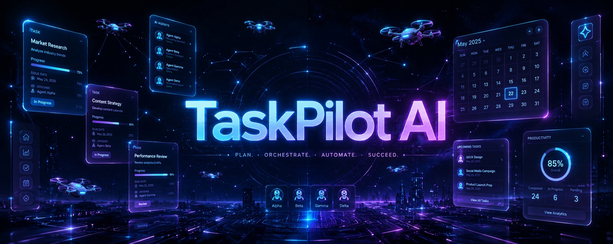
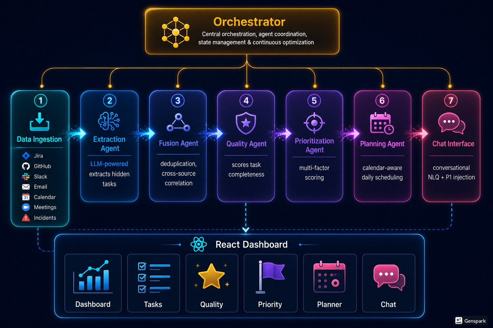
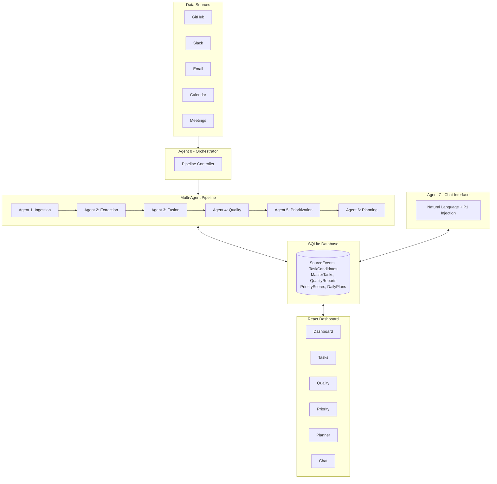
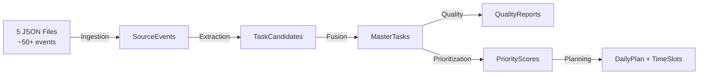
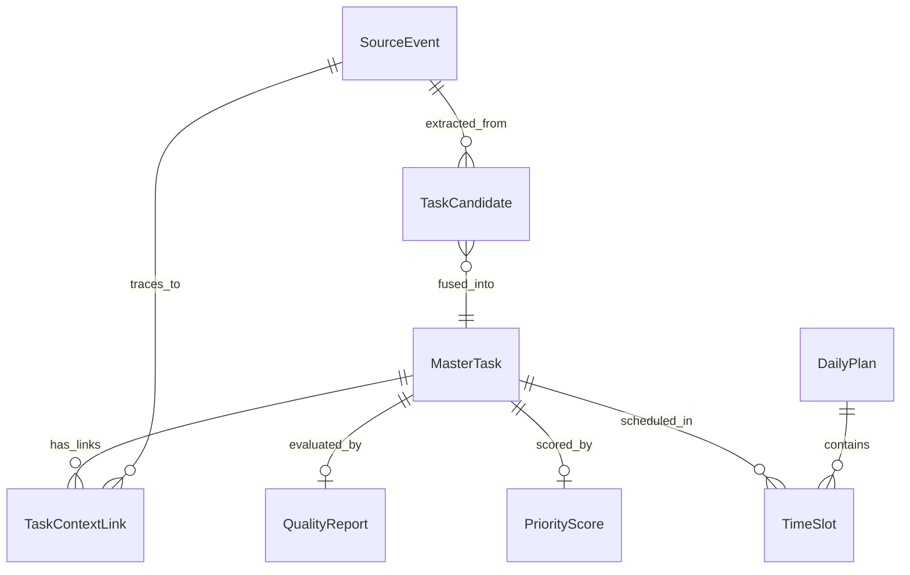

<p align="center">
  
</p>

<h1 align="center">TaskPilot AI</h1>

<p align="center">
  <strong>Your Personal AI Chief of Staff — Conquering Engineer Task Overload with Autonomous Multi-Agent Intelligence</strong>
</p>

<p align="center">
  <a href="LICENSE"></a>
  <a href="#tech-stack"></a>
  <a href="#tech-stack"></a>
  <a href="#tech-stack"></a>
</p>

<p align="center">
  <em>Built for the <strong>DELL FutureMind AI Hackathon</strong> by Team <strong>IdeaForg-E</strong></em>
</p>

---

## Table of Contents

- [The Problem](#the-problem)
- [Our Solution](#our-solution)
- [System Architecture](#system-architecture)
- [Multi-Agent Pipeline](#multi-agent-pipeline)
- [Tech Stack](#tech-stack)
- [Getting Started](#getting-started)
- [Environment Variables](#environment-variables)
- [Project Structure](#project-structure)
- [API Reference](#api-reference) — see also [docs/api.md](docs/api.md)
- [Agent Deep-Dive](#agent-deep-dive) — see also [docs/agents.md](docs/agents.md)
- [Demo Walkthrough](#demo-walkthrough)
- [Team](#team-ideaforg-e)

---

## The Problem

Modern software engineers are **drowning in context fragmentation**. Work arrives from Scrum boards, defect trackers, emails, Slack threads, meeting notes, and ad-hoc requests — there's no single pane of glass.

| Pain Point | Impact |
|:---|:---|
| **Source Fragmentation** | Engineers juggle 4-7 tools daily |
| **Context Switching Tax** | Every switch costs 23 min to regain focus |
| **Invisible Task Debt** | ~35% of tasks buried in emails & chat are untracked |
| **Priority Blindness** | Engineers optimize locally, not globally |
| **Summarization Burden** | 45+ min/day on email/meeting triage alone |

---

## Our Solution

**TaskPilot AI** is an autonomous multi-agent system that acts as a **personal chief of staff** for every software engineer:

- **Autonomously aggregates** tasks from 5 heterogeneous data sources
- **Extracts hidden action items** from unstructured emails, Slack messages, and meeting transcripts using LLM-powered NLP
- **Deduplicates and correlates** related work across systems via semantic similarity
- **Intelligently prioritizes** using 7-dimensional weighted scoring with explainable rationale
- **Generates dynamic daily plans** that are calendar-aware and adapt in real-time
- **Supports natural language interaction** — ask questions, inject P1 incidents, get instant re-prioritization

### Before vs After

| | Before TaskPilot | After TaskPilot |
|:---|:---|:---|
| **Morning Routine** | Open 5+ tools, manually scan | Open TaskPilot, see unified ranked plan |
| **Hidden Tasks** | 35% untracked | Auto-extracted by LLM agents |
| **Prioritization** | Gut-feel, loudest wins | 7-factor algorithmic scoring |
| **Mid-day Changes** | Manually re-triage | "Inject P1" triggers auto re-run |
| **Time Saved** | 0 | **2+ hours/day** |

---

## System Architecture

<p align="center">
  
</p>

TaskPilot AI employs a **cooperative multi-agent architecture** where 8 specialized AI agents work in coordination. Each agent has a single responsibility, communicates through a shared SQLite database, and uses LLM-powered reasoning for complex decisions.


```mermaid
flowchart TB
    subgraph DS["Data Sources"]
        direction LR
        GH["GitHub"]
        SL["Slack"]
        EM["Email"]
        CA["Calendar"]
        MT["Meetings"]
    end

    subgraph ORCH["Agent 0 - Orchestrator"]
        OC["Pipeline Controller"]
    end

    subgraph PIPELINE["Multi-Agent Pipeline"]
        direction LR
        A1["Agent 1: Ingestion"]
        A2["Agent 2: Extraction"]
        A3["Agent 3: Fusion"]
        A4["Agent 4: Quality"]
        A5["Agent 5: Prioritization"]
        A6["Agent 6: Planning"]
        A1 --> A2 --> A3 --> A4 --> A5 --> A6
    end

    subgraph CHAT["Agent 7 - Chat Interface"]
        C1["Natural Language + P1 Injection"]
    end

    subgraph DB["SQLite Database"]
        SQL[("SourceEvents, TaskCandidates\nMasterTasks, QualityReports\nPriorityScores, DailyPlans")]
    end

    subgraph FE["React Dashboard"]
        direction LR
        P1["Dashboard"]
        P2["Tasks"]
        P3["Quality"]
        P4["Priority"]
        P5["Planner"]
        P6["Chat"]
    end

    DS --> ORCH --> PIPELINE
    PIPELINE <--> DB
    CHAT <--> DB
    DB <--> FE
```

### Data Flow


```mermaid
flowchart LR
    RAW["5 JSON Files\n~50+ events"] -->|"Ingestion"| SE["SourceEvents"]
    SE -->|"Extraction"| TC["TaskCandidates"]
    TC -->|"Fusion"| MT["MasterTasks"]
    MT -->|"Quality"| QR["QualityReports"]
    MT -->|"Prioritization"| PS["PriorityScores"]
    PS -->|"Planning"| DP["DailyPlan + TimeSlots"]
```

### Database ER Diagram


```mermaid
erDiagram
    SourceEvent ||--o{ TaskCandidate : "extracted_from"
    TaskCandidate }o--|| MasterTask : "fused_into"
    MasterTask ||--o{ TaskContextLink : "has_links"
    TaskContextLink }o--|| SourceEvent : "traces_to"
    MasterTask ||--o| QualityReport : "evaluated_by"
    MasterTask ||--o| PriorityScore : "scored_by"
    MasterTask ||--o{ TimeSlot : "scheduled_in"
    DailyPlan ||--o{ TimeSlot : "contains"
```

---

## Multi-Agent Pipeline

For a detailed explanation of each agent, see [docs/agents.md](docs/agents.md).

| Agent | Role | LLM Used | Fallback |
|:---|:---|:---|:---|
| **Agent 0** | Orchestrator | None | Pipeline coordinator |
| **Agent 1** | Ingestion | None | JSON parser |
| **Agent 2** | Extraction | `openai/gpt-oss-20b` | Regex heuristics |
| **Agent 3** | Fusion | None (fast dedup) | SequenceMatcher |
| **Agent 4** | Quality | `openai/gpt-oss-20b` (critical only) | Heuristic scoring |
| **Agent 5** | Prioritization | `openai/gpt-oss-20b` (critical only) | 7-factor formula |
| **Agent 6** | Planning | `openai/gpt-oss-120b` | Deterministic scheduler |
| **Agent 7** | Chat | `openai/gpt-oss-20b` | None |

---

## Tech Stack

### Backend
- **Python 3.11+** with FastAPI
- **SQLAlchemy 2.0** + SQLite (WAL mode)
- **Pydantic v2** for data validation
- **Groq Cloud** — `openai/gpt-oss-20b` (fast) + `openai/gpt-oss-120b` (reasoning)

### Frontend
- **React 18** with Vite 5
- **Tailwind CSS v4**
- **React Router v6**
- **Axios** for API calls
- **Lucide Icons** + **react-markdown**

### LLM Provider

| Model | Use Case | Latency |
|:---|:---|:---:|
| `openai/gpt-oss-20b` | Fast extraction, quality, prioritization | ~1s |
| `openai/gpt-oss-120b` | Complex reasoning, planning | ~2s |

> **Failover:** If Groq fails, deterministic local algorithms produce results without any LLM — the pipeline **never breaks**.

---

## Getting Started

### Prerequisites

- **Python** 3.11+
- **Node.js** 18+
- A **Groq API Key** (free at [console.groq.com](https://console.groq.com))

### Quick Start (Windows)

```bash
# 1. Clone
git clone https://github.com/IdeaForg-e/TaskPilot-AI.git
cd TaskPilot-AI

# 2. Configure
cp backend/.env.example backend/.env
# Edit backend/.env and add your GROQ_API_KEY

# 3. Run
start.bat
```

`start.bat` launches both backend (port 8000) and frontend (port 5173).

### Manual Setup

<details>
<summary>Backend</summary>

```bash
cd backend
python -m venv venv
venv\Scripts\activate       # Windows
pip install -r requirements.txt
cp .env.example .env
# Edit .env: add GROQ_API_KEY=gsk_your_key
uvicorn app.main:app --reload --port 8000
```
</details>

<details>
<summary>Frontend</summary>

```bash
cd frontend
npm install
npm run dev
# → http://localhost:5173
```
</details>

---

## Environment Variables

```env
# Required - Primary LLM (Groq)
GROQ_API_KEY=gsk_your_groq_api_key

# Optional - Model overrides
GROQ_MODEL_FAST=openai/gpt-oss-20b
GROQ_MODEL_REASONING=openai/gpt-oss-120b

# Database (auto-configured)
DATABASE_URL=sqlite:///./taskpilot.db

# Demo mode: 0 = real LLM, 1 = fast pipeline (no LLM)
TASKPILOT_FAST_PIPELINE=0
```

---

## Project Structure

```
TaskPilot-AI/
├── backend/
│   ├── agents/                    # AI Agent implementations
│   │   ├── llm_client.py          # Multi-provider LLM client with circuit breaker
│   │   ├── agent_2_extraction_agent.py
│   │   ├── agent_3_fusion_agent.py
│   │   ├── agent_4_quality_agent.py
│   │   ├── agent_5_prioritization_agent.py
│   │   ├── agent_6_planning_agent.py
│   │   ├── agent_2_validation.py  # Post-extraction validation layer
│   │   └── prompts/               # LLM prompt templates
│   ├── app/
│   │   ├── main.py                # FastAPI entry point
│   │   ├── config.py              # Environment config
│   │   ├── database.py            # SQLAlchemy engine
│   │   ├── models/                # ORM models
│   │   ├── routers/               # API routes
│   │   ├── services/              # Business logic
│   │   └── schemas/               # Pydantic schemas
│   ├── tests/
│   │   ├── golden_dataset.json    # 11 test cases
│   │   └── test_accuracy.py       # Accuracy measurement
│   ├── requirements.txt
│   └── .env.example
├── frontend/
│   └── src/
│       ├── App.jsx
│       ├── context/               # ThemeContext
│       ├── pages/                 # Dashboard, Tasks, Quality, Priority, Planner, Chat
│       ├── components/            # Reusable UI
│       └── services/api.js        # Axios client
├── data/                          # JSON data sources (5 files)
├── docs/images/                   # Architecture diagram, banner
├── start.bat                      # One-click launcher
├── README.md
└── LICENSE
```

---

## API Reference

For full details with request/response examples, see [docs/api.md](docs/api.md).

All endpoints prefixed with `/api/v1`.

### Pipeline
| Method | Endpoint | Description |
|:---:|:---|:---|
| `POST` | `/orchestrate/run` | Execute full 6-stage pipeline |
| `GET` | `/orchestrate/status/{run_id}` | Get run status |
| `GET` | `/orchestrate/latest` | Get latest run + metrics |

### Individual Stages
| Method | Endpoint | Description |
|:---:|:---|:---|
| `POST` | `/ingest` | Ingest raw data |
| `POST` | `/extract` | Extract tasks |
| `POST` | `/fuse` | Run deduplication |
| `POST` | `/quality/evaluate` | Evaluate quality |
| `GET` | `/quality/reports` | Get all quality reports |
| `POST` | `/prioritize` | Run prioritization |

### Tasks
| Method | Endpoint | Description |
|:---:|:---|:---|
| `GET` | `/tasks` | List all master tasks |
| `GET` | `/tasks/ranked` | Priority-ranked list |
| `GET` | `/tasks/{task_id}` | Task detail + quality + priority |
| `POST` | `/tasks/{task_id}/status` | Update task status |

### Planning
| Method | Endpoint | Description |
|:---:|:---|:---|
| `POST` | `/daily-plan` | Generate plan for date |
| `GET` | `/daily-plan/{date}` | Get plan for date |
| `GET` | `/daily-plans` | List all plans |

### Chat & System
| Method | Endpoint | Description |
|:---:|:---|:---|
| `POST` | `/chat` | Chat with AI / inject P1 |
| `GET` | `/health` | Health check + config status |

---

## Agent Deep-Dive

For a detailed explanation of each agent's internals, prompts, and fallback logic, see [docs/agents.md](docs/agents.md).

### Quick Summary

| Stage | Agent | What It Does | Speed |
|:---:|:---|:---|:---:|
| 1 | **Ingestion** | Parses 5 JSON files into SourceEvents | Instant |
| 2 | **Extraction** | Regex (Slack) + LLM (Email/Meeting) -> TaskCandidates | ~5s |
| 3 | **Fusion** | SequenceMatcher dedup -> MasterTasks | ~3s |
| 4 | **Quality** | 7-dimension QA scoring | ~2s |
| 5 | **Prioritization** | 7-factor weighted scoring + rank | ~2s |
| 6 | **Planning** | Calendar-aware daily schedule | ~3s |

**Total pipeline time: ~20 seconds**

---

## Demo Walkthrough

### Step 1: Dashboard
1. Open the Dashboard page
2. Click **"Run Pipeline"** - watch the 6-stage stepper animate
3. Verify real-time stats update (tasks, quality, latency)

### Step 2: Tasks
1. Navigate to Tasks page
2. See all 50+ tasks from 5 sources
3. Filter by source (GitHub, Slack, Email, etc.)
4. Click a task to see details in modal

### Step 3: Quality
1. Check the circular QA gauge
2. Toggle between Actionable and Needs Info tabs
3. Review AI-generated clarification questions

### Step 4: Priority Leaderboard
1. See ranked tasks with scores
2. Click any task for score breakdown + explanation

### Step 5: Planner
1. See calendar-aware daily schedule
2. Note meeting protection and decompression breaks
3. Check capacity status (healthy/moderate/overloaded)

### Step 6: Chat
1. Ask "What's my top priority today?"
2. Test P1 injection: "inject a P1 defect - payment gateway down"
3. Pipeline auto-re-runs, new task takes #1 rank

---

## Team IdeaForg-E

| Member | Role | Focus Area |
|:---|:---|:---|
| **Disha** | Backend Lead | FastAPI, Database, API routes |
| **Priyanka** | Agent Dev 1 | Ingestion, Extraction, Fusion |
| **Chaitanya** | Agent Dev 2 | Quality, Prioritization, Planning |
| **Disha + Jagruti** | Frontend Dev | React dashboard, UI |
| **Anil** | Integration Lead | Orchestrator, pipeline, deployment |

---

## License

MIT License - see [LICENSE](LICENSE).

---

<p align="center">
  <strong>Built with care by Team IdeaForg-E for the DELL FutureMind AI Hackathon</strong>
</p>
