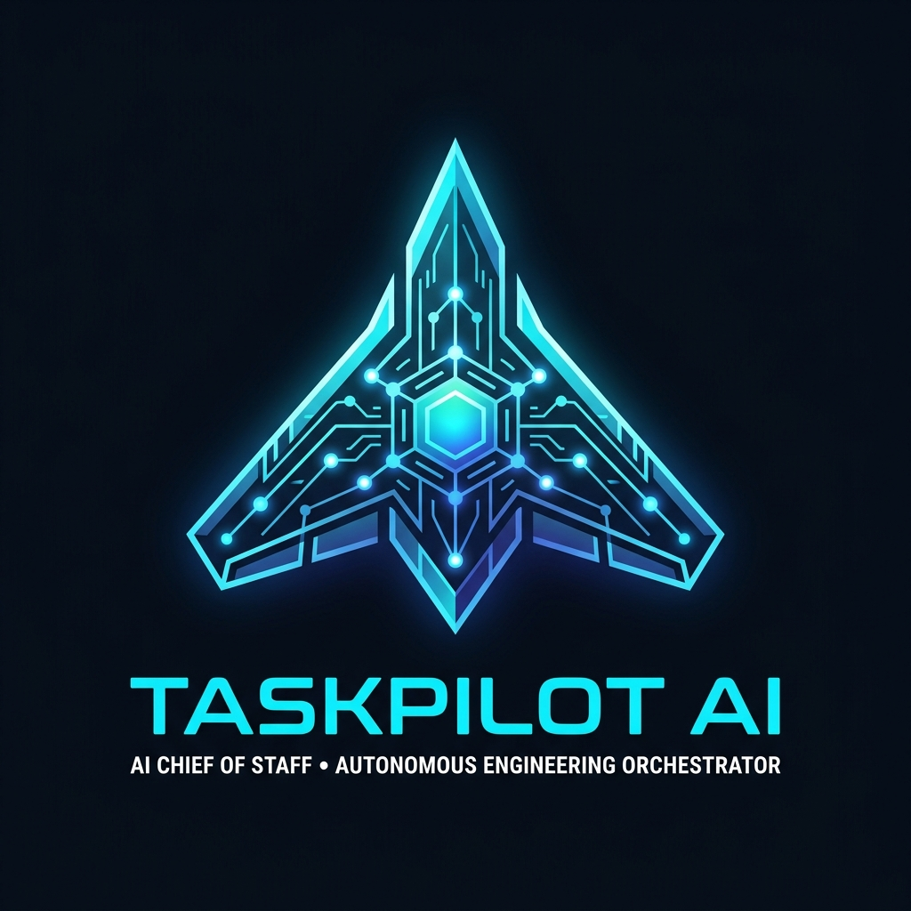
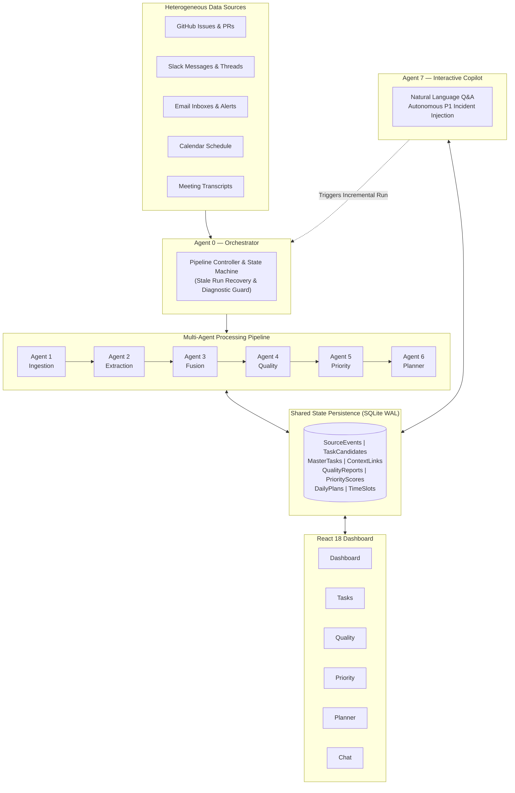
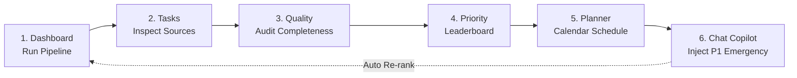

<p align="center">
  
</p>

<h1 align="center">TaskPilot AI</h1>

<p align="center">
  <strong>Your Personal AI Chief of Staff — Conquering Engineer Task Overload with Autonomous Multi-Agent Intelligence</strong>
</p>

<p align="center">
  <a href="LICENSE"></a>
  <a href="#tech-stack"></a>
  <a href="#tech-stack"></a>
  <a href="#tech-stack"></a>
  <a href="#tech-stack"></a>
  <a href="#tech-stack"></a>
</p>

<p align="center">
  <em>Built for the <strong>DELL FutureMind AI Hackathon</strong> by Team <strong>IdeaForg-E</strong></em>
</p>

---

## 📑 Complete Documentation Suite

TaskPilot AI is accompanied by dedicated technical documentation:

| Document | Focus & Scope | Link |
|:---|:---|:---:|
| 🏛️ **System Architecture** | Multi-layer topology, dual-tier LLM engine, SQLite WAL persistence, design trade-offs | [docs/architecture.md](docs/architecture.md) |
| ⚡ **Pipeline Deep-Dive** | End-to-end data transformation stages, mathematical formulas, P1 injection | [docs/pipeline.md](docs/pipeline.md) |
| 🤖 **Agent Internals** | Deep technical specifications for all 8 agents, heuristics, validation, prompts | [docs/agents.md](docs/agents.md) |
| 🔌 **API Reference** | Complete REST contract, Pydantic schemas, request/response examples | [docs/api.md](docs/api.md) |
| 📊 **Interactive Diagrams** | Standalone explorable architecture and user journey diagrams via Archify | [Archify Visualizations](#interactive-architecture-diagrams-archify) |

---

## Table of Contents

- [The Problem](#the-problem)
- [Our Solution](#our-solution)
- [System Architecture](#system-architecture)
- [Interactive Architecture Diagrams (Archify)](#interactive-architecture-diagrams-archify)
- [Multi-Agent Pipeline](#multi-agent-pipeline)
- [Tech Stack](#tech-stack)
- [Getting Started](#getting-started)
- [Environment Variables](#environment-variables)
- [Project Structure](#project-structure)
- [API Overview](#api-overview)
- [Demo Walkthrough](#demo-walkthrough)
- [Team IdeaForg-E](#team-ideaforg-e)
- [License](#license)

---

## The Problem

Modern software engineers are **drowning in context fragmentation**. Critical work items arrive across disparate, disconnected tools: issue boards, Slack threads, customer email escalations, calendar invites, and meeting transcripts. Without a single pane of glass, engineers suffer severe cognitive overload:

| Operational Friction | Impact on Engineering Productivity |
|:---|:---|
| 🔀 **Source Fragmentation** | Developers juggle 4 to 7 tools daily to track action items |
| ⏳ **Context Switching Tax** | Every interruption requires an average of 23 minutes to regain focus |
| 👻 **Invisible Task Debt** | ~35% of actionable obligations buried in emails and chat are untracked |
| 🎯 **Priority Blindness** | Engineers optimize locally for the loudest alert, not global impact |
| 📋 **Triage Overhead** | 45+ minutes lost each morning manually summarizing notes and emails |

---

## Our Solution

**TaskPilot AI** is an autonomous multi-agent assistant that acts as a **personal chief of staff** for software engineers:

* 📥 **Autonomously aggregates** tasks across 5 heterogeneous data sources (GitHub, Slack, Email, Calendar, Meetings).
* 🔍 **Extracts hidden action items** from unstructured conversational text using targeted few-shot LLM reasoning and regex heuristics.
* 🔗 **Deduplicates and correlates** cross-platform duplicate signals into unified Master Tasks via string and token similarity.
* 🛡️ **Audits quality and completeness** across 7 dimensions, automatically drafting clarification questions for vague tickets.
* ⚖️ **Intelligently prioritizes** using a 7-factor weighted scoring model with explainable rationale and anti-noise safeguards.
* 📅 **Compiles dynamic daily plans** that lock fixed calendar commitments and auto-inject decompression breaks to prevent burnout.
* 💬 **Enables interactive copilot dialogue** with natural language retrieval and autonomous mid-day P1 incident re-prioritization.

### Before vs After TaskPilot

| Workflow Stage | Traditional Developer Routine | With TaskPilot AI |
|:---|:---|:---|
| **Morning Routine** | Open 5+ browser tabs, manually read threads | Open TaskPilot: see a single, ranked, calendar-aware plan |
| **Hidden Obligations** | ~35% forgotten in Slack threads or email chains | Extracted automatically with calibrated confidence scoring |
| **Prioritization** | Subjective gut-feel or loudest stakeholder | Objective 7-factor algorithmic scoring + explainable tags |
| **Mid-Day Emergency** | Manually re-read schedule, panic reschedule | Chat: *"Inject P1"* $\rightarrow$ incremental re-rank in seconds |
| **Daily Time Saved** | Baseline | **2+ hours saved per engineer daily** |

---

## System Architecture

TaskPilot AI uses a **cooperative multi-agent architecture** where 8 specialized agents collaborate through a shared SQLite database in WAL mode.


```mermaid
flowchart TB
    subgraph DS["Heterogeneous Data Sources"]
        direction LR
        GH["GitHub Issues & PRs"]
        SL["Slack Messages & Threads"]
        EM["Email Inboxes & Alerts"]
        CA["Calendar Schedule"]
        MT["Meeting Transcripts"]
    end

    subgraph ORCH["Agent 0 — Orchestrator"]
        OC["Pipeline Controller & State Machine\n(Stale Run Recovery & Diagnostic Guard)"]
    end

    subgraph PIPELINE["Multi-Agent Processing Pipeline"]
        direction LR
        A1["Agent 1\nIngestion"]
        A2["Agent 2\nExtraction"]
        A3["Agent 3\nFusion"]
        A4["Agent 4\nQuality"]
        A5["Agent 5\nPriority"]
        A6["Agent 6\nPlanner"]
        A1 --> A2 --> A3 --> A4 --> A5 --> A6
    end

    subgraph CHAT["Agent 7 — Interactive Copilot"]
        C1["Natural Language Q&A\nAutonomous P1 Incident Injection"]
    end

    subgraph DB["Shared State Persistence (SQLite WAL)"]
        SQL[("SourceEvents | TaskCandidates\nMasterTasks | ContextLinks\nQualityReports | PriorityScores\nDailyPlans | TimeSlots")]
    end

    subgraph FE["React 18 Dashboard"]
        direction LR
        P1["Dashboard"]
        P2["Tasks"]
        P3["Quality"]
        P4["Priority"]
        P5["Planner"]
        P6["Chat"]
    end

    DS --> ORCH --> PIPELINE
    PIPELINE <--> DB
    CHAT <--> DB
    CHAT -.->|Triggers Incremental Run| ORCH
    DB <--> FE
```

> [!NOTE]
> For a comprehensive breakdown of architectural tiers, entity relationships, and engineering trade-offs, read [System Architecture Blueprint](docs/architecture.md).

---

## Interactive Architecture Diagrams (Archify)

Explore interactive system diagrams generated with [Archify](https://github.com/tt-a1i/archify):

| Diagram | Technical Focus | Link |
|:---|:---|:---:|
| 🤖 **Agent Architecture** | Multi-agent execution pipeline with 8 specialized stages | [Open Interactive Diagram](docs/agent-architecture.html) |
| 🔄 **User Flow Journey** | End-to-end user navigation from ingestion to daily schedule | [Open Interactive Diagram](docs/user-flow.html) |
| 🏗️ **Application Architecture** | Full-stack topology connecting React, FastAPI, Groq, and SQLite | [Open Interactive Diagram](docs/application-architecture.html) |

*Features: Search nodes, trace connected dependencies, switch light/dark themes, and export high-res PNG/SVG artifacts.*

---

## Multi-Agent Pipeline

The core pipeline transforms raw signals through 6 sequential stages plus an interactive copilot:

| Stage | Agent Name | Primary Execution Logic | LLM Model | Offline Fallback |
|:---:|:---|:---|:---|:---|
| **0** | **Orchestrator** | Coordinates sequential execution & tracks state | None | Sequential execution loop |
| **1** | **Ingestion** | Parses 5 raw JSON feeds into uniform `SourceEvent` records | None | Native JSON parsers |
| **2** | **Extraction** | Discovers explicit tickets & hidden tasks with confidence scoring | `openai/gpt-oss-20b` | Regex action heuristics |
| **3** | **Fusion** | Correlates duplicate items via string & token similarity | None | `difflib.SequenceMatcher` |
| **4** | **Quality** | Audits completeness across 7 dimensions (0-100 rubric) | `openai/gpt-oss-20b` (critical) | Rule-based QA rubric |
| **5** | **Prioritization**| Calculates 7-factor weighted score & anti-noise penalties | `openai/gpt-oss-20b` (batch of 8) | 7-factor weighted formula |
| **6** | **Planning** | Builds calendar-aware schedule with decompression breaks | `openai/gpt-oss-120b` | Greedy slot allocator |
| **7** | **Chat Copilot** | Answers schedule queries & triggers incremental P1 injection | `openai/gpt-oss-20b` | Template message responses |

> [!TIP]
> **Total Pipeline Speed:** Full pipeline completes in **~14-18 seconds** on Groq Cloud LPUs, and in **< 2 seconds** in zero-token local fallback mode (`TASKPILOT_DISABLE_LLM=1`).
>
> Learn more in the [Pipeline Deep-Dive](docs/pipeline.md) and [Agent Internals](docs/agents.md).

---

## Tech Stack

### Backend & AI Engine
* **Runtime:** Python 3.11+
* **API Framework:** FastAPI with Pydantic v2 data validation
* **ORM & Database:** SQLAlchemy 2.0 + SQLite with WAL mode (`PRAGMA journal_mode=WAL`)
* **LLM Hardware:** Groq Cloud Language Processing Units (LPU)
* **LLM Models:**
  * `openai/gpt-oss-20b`: Ultra-fast extraction, quality auditing, batch prioritization, and chat (~1.0s latency).
  * `openai/gpt-oss-120b`: High-capability multi-constraint schedule optimization (~2.5s latency).
* **Resilience:** Circuit breaker (2 consecutive failures $\rightarrow$ 60s cooldown), rate-limit backoff, and truncated JSON auto-repair.

### Frontend Dashboard
* **Framework:** React 18 SPA built with Vite 5
* **Styling:** Tailwind CSS v4 (responsive dark/light themes)
* **Routing:** React Router v6
* **Client:** Axios with diagnostic and error hint interceptors
* **Components:** Lucide React icons, React Markdown renderer

---

## Getting Started

### Prerequisites
* **Python** 3.11+
* **Node.js** 18+ (with npm)
* A free **Groq API Key** from [console.groq.com](https://console.groq.com)

### Quick Start (Windows)
```cmd
:: 1. Clone repository
git clone https://github.com/IdeaForg-e/TaskPilot-AI.git
cd TaskPilot-AI

:: 2. Configure environment
copy backend\.env.example backend\.env
:: Edit backend\.env and insert your GROQ_API_KEY

:: 3. Launch full stack with one click
start.bat
```
`start.bat` automatically launches the FastAPI backend on `http://localhost:8000` and the React frontend on `http://localhost:5173`.

### Manual Setup

<details>
<summary><strong>Backend Setup (FastAPI)</strong></summary>

```bash
cd backend
python -m venv venv

# Activate virtual environment
# Windows:
venv\Scripts\activate
# Linux/macOS:
# source venv/bin/activate

pip install -r requirements.txt
cp .env.example .env
# Edit .env and configure GROQ_API_KEY=gsk_your_key

uvicorn app.main:app --reload --port 8000
```
API docs available at: `http://localhost:8000/docs`
</details>

<details>
<summary><strong>Frontend Setup (React + Vite)</strong></summary>

```bash
cd frontend
npm install
npm run dev
```
Dashboard available at: `http://localhost:5173`
</details>

---

## Environment Variables

Configure `backend/.env`:

```env
# ==============================================================================
# Primary LLM Provider (Groq Cloud LPU)
# ==============================================================================
GROQ_API_KEY=gsk_your_actual_groq_api_key_here

# Model Overrides (Optional)
GROQ_MODEL_FAST=openai/gpt-oss-20b
GROQ_MODEL_REASONING=openai/gpt-oss-120b

# ==============================================================================
# Database Persistence
# ==============================================================================
DATABASE_URL=sqlite:///./taskpilot.db

# ==============================================================================
# Development Flags
# ==============================================================================
# Set to 1 to run entirely in zero-token local fallback mode (no LLM calls)
TASKPILOT_DISABLE_LLM=0

# Clean database tables on startup (default: false to preserve data)
CLEAN_DB_ON_STARTUP=false
```

---

## Project Structure

```
TaskPilot-AI/
├── backend/
│   ├── app/                       # FastAPI core application
│   │   ├── main.py                # Server entry point & global error handler
│   │   ├── database.py            # SQLite connection & WAL pragma configuration
│   │   ├── models/                # 8 SQLAlchemy relational entities
│   │   ├── routers/               # 9 modular API route files (routers 0 through 8)
│   │   ├── schemas/               # Pydantic request/response schemas
│   │   └── services/              # Business logic controllers (Agents 0 through 6)
│   ├── agents/                    # AI Agent core implementations
│   │   ├── llm_client.py          # Resilient Groq client, circuit breaker, JSON parser
│   │   ├── agent_2_extraction_agent.py
│   │   ├── agent_2_validation.py  # 6-step candidate validation filter
│   │   ├── agent_3_fusion_agent.py
│   │   ├── agent_4_quality_agent.py
│   │   ├── agent_5_prioritization_agent.py
│   │   ├── agent_6_planning_agent.py
│   │   └── prompts/               # Versioned prompt templates
│   ├── tests/
│   │   ├── golden_dataset.json    # Accuracy test dataset (11 scenarios)
│   │   └── test_accuracy.py       # Precision, recall, and F1 validation suite
│   ├── requirements.txt
│   └── .env.example
├── frontend/
│   ├── src/
│   │   ├── pages/                 # Dashboard, Tasks, Quality, Priority, Planner, Chat
│   │   ├── components/            # Steppers, modal dialogs, schedule timelines
│   │   ├── services/api.js        # Axios client with error unwrapping
│   │   └── context/               # Theme & session context
│   └── package.json
├── data/                          # 5 input JSON feeds (~50 developer records)
├── docs/                          # Technical documentation & Archify diagrams
│   ├── architecture.md            # System architecture blueprint
│   ├── pipeline.md                # Data transformation pipeline deep-dive
│   ├── agents.md                  # Comprehensive agent specifications
│   ├── api.md                     # Complete REST API reference
│   ├── agent-architecture.html    # Interactive agent diagram
│   ├── application-architecture.html # Interactive full-stack diagram
│   └── user-flow.html             # Interactive user journey diagram
├── start.bat                      # One-click Windows launcher
├── README.md
└── LICENSE
```

---

## API Overview

All routes are served under `/api/v1`. Full schemas and response payloads are in [docs/api.md](docs/api.md).

| Domain | Method | Endpoint | Description |
|:---|:---:|:---|:---|
| **Orchestrator** | `POST` | `/orchestrate/run` | Triggers asynchronous 6-stage pipeline |
| | `GET` | `/orchestrate/status/{run_id}` | Polls real-time stage progress & status |
| | `GET` | `/orchestrate/latest` | Fetches latest run metrics, latency & accuracy |
| **Ingestion** | `POST` | `/ingest` | Parses raw JSON files into `SourceEvent` rows |
| **Extraction** | `POST` | `/extract` | Extracts explicit tickets & hidden tasks |
| **Fusion** | `POST` | `/fuse` | Correlates and merges duplicate candidates |
| **Quality** | `POST` | `/quality/evaluate` | Evaluates task completeness across 7 dimensions |
| | `GET` | `/quality/reports` | Retrieves all task quality audit reports |
| **Prioritization**| `POST` | `/prioritize` | Computes 7-factor scores & assigns rank order |
| | `GET` | `/tasks/ranked` | Fetches the ranked priority Leaderboard |
| **Tasks** | `GET` | `/tasks` | Lists all MasterTasks with status/source filters |
| | `GET` | `/tasks/{task_id}` | Returns 360° telemetry: task, quality, priority & context links |
| | `POST` | `/tasks/{task_id}/status` | Updates task status (`open`, `in_progress`, `done`) |
| **Planning** | `POST` | `/daily-plan` | Compiles calendar-aware schedule with buffer hours |
| | `GET` | `/daily-plan/{date}` | Retrieves daily plan & timeslot schedule |
| | `GET` | `/planner/calendar` | Groups tasks with deadlines by date |
| **Chat & P1** | `POST` | `/chat` | Conversational copilot & autonomous P1 injection |
| **System** | `GET` | `/health` | Liveness probe & LLM configuration status |

---

## Demo Walkthrough

Follow this 6-step walkthrough to experience TaskPilot AI's full feature set:


```mermaid
flowchart LR
    Step1["1. Dashboard\nRun Pipeline"] --> Step2["2. Tasks\nInspect Sources"]
    Step2 --> Step3["3. Quality\nAudit Completeness"]
    Step3 --> Step4["4. Priority\nLeaderboard"]
    Step4 --> Step5["5. Planner\nCalendar Schedule"]
    Step5 --> Step6["6. Chat Copilot\nInject P1 Emergency"]
    Step6 -.->|Auto Re-rank| Step1
```

1. **Dashboard:** Navigate to the Dashboard and click **"Run Pipeline"**. Watch the live 6-stage stepper execute across Ingestion, Extraction, Fusion, Quality, Prioritization, and Planning in ~15 seconds.
2. **Tasks Explorer:** Open the Tasks view to explore the unified master backlog. Use source badges (`GitHub`, `Slack`, `Email`, etc.) to filter, and click any item to inspect its provenance.
3. **Quality Auditor:** Visit the Quality page to view the circular QA gauge. Review which tasks are classified as `Actionable` vs `Needs Info`, and inspect AI-generated clarification questions.
4. **Priority Leaderboard:** Check the Priority tab to see tasks mathematically ranked from `#1` to `#N`. Click any card to view the 7-factor breakdown and explainable narrative.
5. **Calendar Planner:** Open the Planner to see the synthesized workday. Notice how fixed meetings from `calendar.json` are protected and decompression coffee breaks are automatically inserted.
6. **Chat Copilot & P1 Injection:** Open the Chat tab and type:
   > *"inject a P1 defect - payment gateway down in production"*
   
   Watch the system extract incident details, modify the source datastore, trigger an incremental pipeline re-run, and announce that the new emergency has captured the **#1 rank** on your schedule.

---

## Team IdeaForg-E

Built for the **DELL FutureMind AI Hackathon** by:

| Team Member | Engineering Responsibility |
|:---|:---|
| **Disha** | Backend Lead (FastAPI architecture, SQLite database, API routers) |
| **Priyanka** | Agent Engineer 1 (Ingestion normalizer, Extraction agent, Fusion deduplicator) |
| **Chaitanya** | Agent Engineer 2 (7-dimension Quality auditor, Prioritization formula, Calendar scheduler) |
| **Disha + Jagruti** | Frontend Engineers (React 18 SPA, Tailwind CSS v4 dashboard, responsive UI) |
| **Anil** | Integration Lead (Orchestrator, pipeline lifecycle, LLM resilience, deployment) |

---

## License

This project is licensed under the MIT License — see the [LICENSE](LICENSE) file for details.

<p align="center">
  <strong>Built with care by Team IdeaForg-E for the DELL FutureMind AI Hackathon</strong>
</p>
