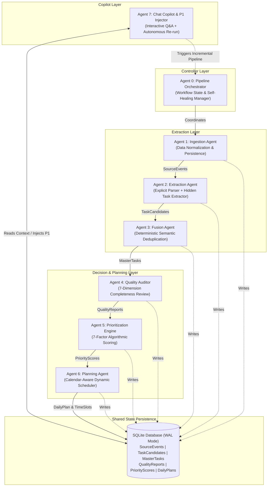
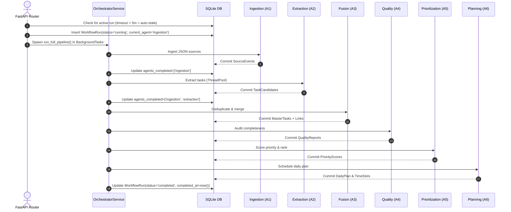
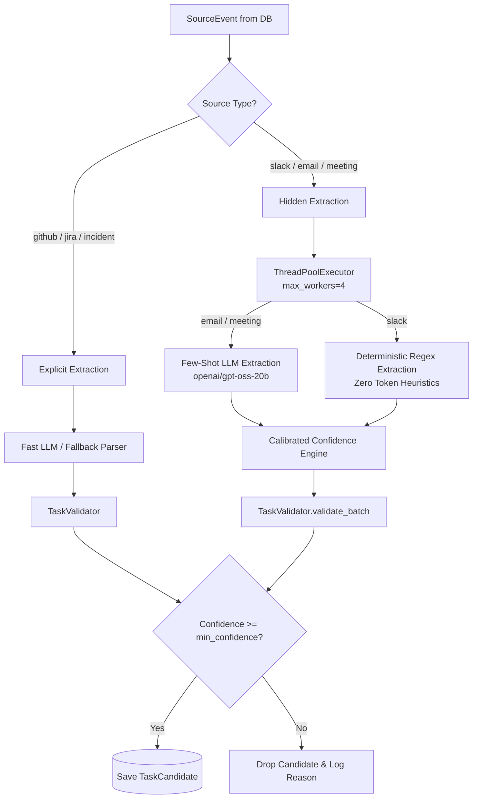
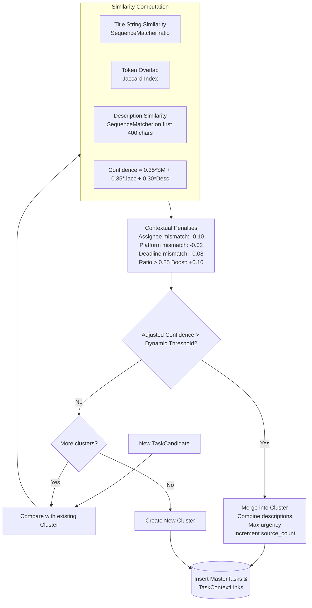
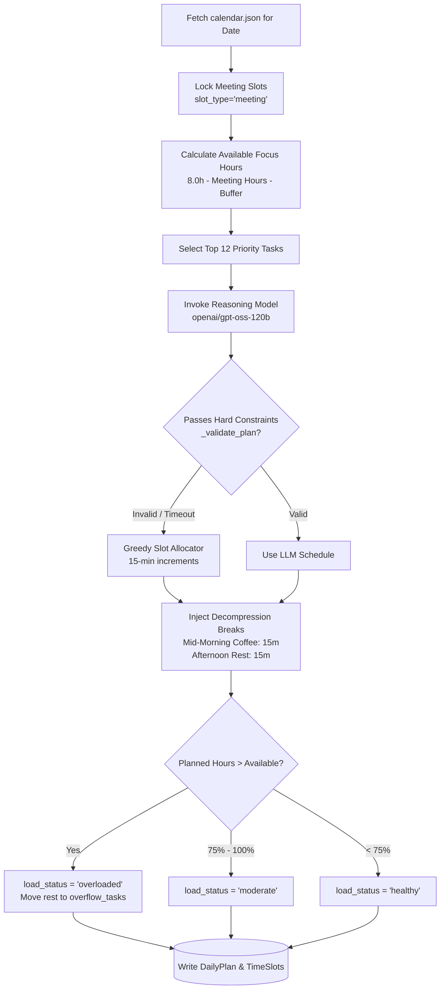
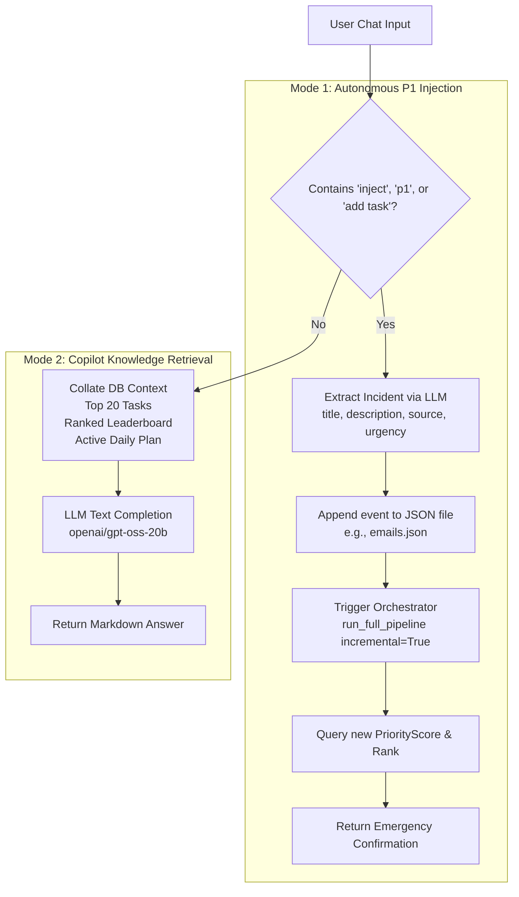

# TaskPilot AI — Agent Architecture & Internals Deep-Dive

This document provides a comprehensive technical specification for the **8 specialized AI agents** that power the TaskPilot AI autonomous engineering workflow assistant.

---

## Architecture Overview

TaskPilot AI decouples engineering workflow automation into 8 autonomous, single-responsibility agents. Rather than running a single monolithic prompt, each agent operates on a structured stage of the decision pipeline, communicating asynchronously through a shared SQLite database in WAL (Write-Ahead Logging) mode.



---

## Agent Summary Matrix

| Agent | Module File | Primary Execution | LLM Model | Latency | Deterministic Fallback |
|:---|:---|:---|:---|:---:|:---|
| **Agent 0** | `app/services/agent_0_orchestrator_service.py` | Python / ThreadPool | None | Instant | Sequential stage executor |
| **Agent 1** | `app/services/agent_1_ingestion_service.py` | JSON / File I/O | None | < 100ms | Native JSON parsers |
| **Agent 2** | `agents/agent_2_extraction_agent.py` | LLM + ThreadPool (4 workers) | `openai/gpt-oss-20b` | ~5s | Regex + Heuristic parser |
| **Agent 3** | `agents/agent_3_fusion_agent.py` | String & Jaccard similarity | None | ~1s | `difflib.SequenceMatcher` |
| **Agent 4** | `agents/agent_4_quality_agent.py` | Heuristics + Critical LLM | `openai/gpt-oss-20b` (critical) | ~2s | Rule-based rubric (7-D) |
| **Agent 5** | `agents/agent_5_prioritization_agent.py` | 7-Factor math + Batch LLM | `openai/gpt-oss-20b` (batch of 8) | ~2s | 7-Factor weighted formula |
| **Agent 6** | `agents/agent_6_planning_agent.py` | LLM + Constraint Validator | `openai/gpt-oss-120b` | ~3s | Greedy free-slot allocator |
| **Agent 7** | `app/routers/router_8_chat.py` | Context RAG + Pipeline trigger | `openai/gpt-oss-20b` | ~1.5s | Template message responses |

---

## Agent 0 — Orchestrator

### 1. Purpose & Why It Exists
In multi-agent systems, agents must execute in a strict dependency sequence without coupling directly to one another. `Agent 0` acts as the centralized finite state machine (FSM) controller. It guarantees stage sequencing, tracks progress in the database, recovers from crashed or stale jobs, and provides an asynchronous non-blocking execution interface for the frontend.

### 2. Implementation & File Location
* **Service:** `backend/app/services/agent_0_orchestrator_service.py`
* **Router:** `backend/app/routers/router_0_orchestrator.py`

### 3. Input
* `existing_run_id` (Optional string): Re-attaches to a generated run ID.
* `incremental` (Boolean, default `False`):
  * `incremental=False`: Full pipeline execution. Clears existing task tables and runs clean ingestion.
  * `incremental=True`: Incremental execution (used by Agent 7 for P1 injection). Preserves existing candidates and only processes newly ingested source events.

### 4. Processing Flow


### 5. Important Logic & Edge Cases
* **Self-Healing Stale Run Recovery:** During startup and status queries, if a run has been in `running` status for more than 5 minutes (`elapsed > timedelta(minutes=5)`), the orchestrator automatically transitions the record to `status="failed"` with the error log: `"Pipeline was interrupted (server restarted or process killed). Marked as stale."` This prevents the UI from freezing indefinitely.
* **Pipeline Diagnostic Capture:** Sets `LLMClient.pipeline_mode = True` and resets diagnostic logs at the start of every run. Upon completion or failure, collects LLM latency, token counts, and provider error warnings.
* **Dynamic Accuracy Computation:** Computes real-time system accuracy across runs via:
  $$\text{System Accuracy} = \frac{1}{N} \sum_{i=1}^{N} \text{QualityReport.overall\_score}_i$$

### 6. Database Interaction
* **Reads/Writes:** `workflow_runs` table (`id`, `status`, `started_at`, `completed_at`, `agents_completed`, `current_agent`, `error_log`).
* **Reads:** `quality_reports` table for computing system accuracy.

### 7. Failure Handling
If any stage throws an unhandled exception, execution stops immediately. The exception is logged, the `current_agent` is recorded as `failed_agent`, `WorkflowRun.status` is marked as `"failed"`, and the transaction is committed so the user immediately sees the root cause in the UI.

---

## Agent 1 — Ingestion Agent

### 1. Purpose & Why It Exists
Raw engineering data comes in wildly heterogeneous schemas (GitHub issues with Markdown bodies, Slack messages with thread mentions, Email headers with recipient chains, Calendar meetings with UTC timestamps). `Agent 1` standardizes all incoming payloads into a unified relational entity (`SourceEvent`), ensuring downstream agents never need source-specific parsing adapters.

### 2. Implementation & File Location
* **Service:** `backend/app/services/agent_1_ingestion_service.py`
* **Router:** `backend/app/routers/router_1_ingest.py`

### 3. Input
Five JSON files residing in `backend/../data/`:
* `github_data.json`: Issues and pull requests.
* `slack_data.json`: Channel messages, threads, and user mentions.
* `emails.json`: Inbox threads, incident reports, customer escalations.
* `calendar.json`: Scheduled engineering meetings with time boundaries.
* `meeting_notes.json`: Sprint planning notes, action items, and transcripts.

### 4. Processing Flow & Normalization
1. **Target Identification:** Matches sources against active data files.
2. **Pipeline Reset (if `clear=True`):** Executes cascading deletion of downstream tables (`time_slots`, `daily_plans`, `priority_scores`, `quality_reports`, `task_context_links`, `master_tasks`, `task_candidates`, `source_events`).
3. **Incremental Check (if `clear=False`):** Queries existing `(source, source_id)` tuples into an in-memory hash set and skips existing records.
4. **Field Normalization:** Maps heterogeneous fields into uniform `SourceEvent` columns:
   * `source`: Normalized platform identifier (`"github"`, `"slack"`, `"email"`, `"calendar"`, `"meeting"`).
   * `source_id`: Source system key (`"GH-102"`, `"msg-301"`, `"email-405"`).
   * `event_type`: Mapped category (`"pull_request"`, `"issue"`, `"message"`, `"email"`, `"meeting"`).
   * `title`: Extracted from `title`, `subject`, or `key`.
   * `content`: Structured string synthesis (e.g., combining email `subject` + `body`, or extracting meeting `action_items` as JSON text).
   * `author`: Normalized from `author`, `reporter`, `from`, or `organizer`.
   * `timestamp`: Parsed into a standard Python `datetime` object.
   * `metadata_json`: Preserved original JSON payload for complete lineage and trace audits.

### 5. Database Interaction
* **Table:** `source_events` (INSERT).
* **Downstream Cleanup:** Clears all 7 task-related tables on full run.

### 6. Concrete Example
**Raw Email Input (`emails.json`):**
```json
{
  "id": "email-003",
  "subject": "URGENT: Payment Gateway Timeouts in Prod",
  "from": "ops-lead@company.com",
  "date": "2026-09-05T08:15:00Z",
  "body": "We are observing 504 gateway timeouts on the Stripe payment endpoint since 07:30 UTC. Over 200 checkout sessions failed."
}
```
**Normalized Database Output (`SourceEvent`):**
```python
SourceEvent(
    id="e8a12d8a-9f4c-4e8b-b892-d6683fae2170",
    source="email",
    source_id="email-003",
    event_type="email",
    title="URGENT: Payment Gateway Timeouts in Prod",
    content="URGENT: Payment Gateway Timeouts in Prod\n\nWe are observing 504 gateway timeouts on the Stripe payment endpoint...",
    author="ops-lead@company.com",
    timestamp=datetime(2026, 9, 5, 8, 15, 0),
    metadata_json={...},
    ingestion_run_id="demo"
)
```

---

## Agent 2 — Extraction Agent

### 1. Purpose & Why It Exists
Over 35% of actionable engineering tasks never originate in formal issue trackers—they are buried in Slack threads, email conversations, and meeting transcripts. `Agent 2` discovers both:
1. **Explicit Tasks:** Structured issues and pull requests from GitHub.
2. **Hidden Tasks:** Implied action items, operational obligations, and bug reports buried inside unstructured text.

### 2. Implementation & File Location
* **Agent:** `backend/agents/agent_2_extraction_agent.py`
* **Validation Layer:** `backend/agents/agent_2_validation.py`
* **Service:** `backend/app/services/agent_2_extraction_service.py`
* **Prompts:** `backend/agents/prompts/agent_2_extraction_prompts.py`

### 3. Input
* Query set of `SourceEvent` records from SQLite.
* `include_hidden` (Boolean, default `True`).
* `min_confidence` (Float, default `0.65` in service, `0.5` in API schema).

### 4. Processing Flow & ThreadPool Concurrency


### 5. Important Logic & Algorithms

#### A. Regex Heuristics (Slack)
Slack channels generate high conversational noise. Calling an LLM for every casual message is cost-prohibitive. `Agent 2` uses a compiled regex engine:
* **Action Verbs:** `can you`, `could you`, `please`, `need to`, `should`, `don't forget`, `action`, `blocked`, `urgent`, `asap`, `review`, `investigate`, `fix`, `patch`, `deploy`, `migrate`, `verify`.
* **Atomic Line Splitting:**
  ```python
  re.split(r"[\n\r]+|(?=\s[-*•]\s)|(?<=[.!?])\s+(?=[A-Z])", text)
  ```
* **Vague Title Rejection:** Rejects candidate titles shorter than 8 characters or starting with vague phrases (`"include:"`, `"join as well"`, `"help with that"`).

#### B. Calibrated Confidence Scoring Formula
Instead of relying on LLM self-reported confidence (which is notoriously over-optimistic), confidence is calculated algorithmically using a base score and additive evidence boosts:

$$\text{Confidence} = \min\left(0.95, \text{Base} + \sum \text{Boosts}\right)$$

| Evidence Factor | Value | Rationale |
|:---|:---:|:---|
| **Base: Meeting Source** | `0.70` | Structured action item sections are highly reliable |
| **Base: Email Source** | `0.62` | Contains formal subject and targeted context |
| **Base: Slack Source** | `0.55` | Conversational text with higher noise probability |
| **Assignee Identified** | `+0.12` | Strongest signal of genuine personal commitment |
| **Deadline Identified** | `+0.10` | Specific date or relative time constraint present |
| **Urgency Signal** | `+0.08` | Contains `P0`, `P1`, `critical`, `outage`, or `sev1` |
| **Text Length > 100 chars** | `+0.03` | Provides adequate context for actionability |
| **Email Context (Subject)** | `+0.02` | Grounded by formal email thread header |

*Minimum bound:* `0.45`, *Maximum cap:* `0.95`.

#### C. Post-Extraction Validation Layer (`TaskValidator`)
Every candidate must pass through 6 validation filters before entering the database:
1. **Minimum Length:** Discards titles < 10 characters (`title_too_short`).
2. **Maximum Length:** Truncates titles exceeding 200 characters (`MAX_TITLE_LENGTH`).
3. **Noise Pattern Filter:** Matches against `NOISE_PATTERNS` regex (`^untitled`, `^test$`, `^see above$`, `^todo$`, `^misc$`).
4. **Alphanumeric Content Check:** Discards tasks with < 5 alphanumeric characters.
5. **In-Batch Deduplication:** Tracks normalized alphanumeric title keys (`re.sub(r"\W+", " ", title.lower()).strip()`) across the current run to discard redundant duplicate extractions.
6. **Field Normalization:** Enforces standard urgency enums (`low`, `medium`, `high`, `critical`), strips empty assignees/deadlines, and bounds confidence between `0.0` and `1.0`.

### 6. Database Interaction
* **Reads:** `source_events`.
* **Writes:** `task_candidates` (`id`, `title`, `description`, `source_event_id`, `task_type`, `is_hidden`, `assignee`, `deadline`, `urgency`, `confidence`).

### 7. Concrete Example
**Source Input (Slack message snippet):**
> *"@priya can you please investigate the redis memory leak on worker-02 before Friday? It's causing intermittent queue stalls."*

**Extraction Output (`TaskCandidate`):**
* **Title:** `"Investigate the redis memory leak on worker-02"`
* **Assignee:** `"priya"` (extracted via `@priya` mention regex)
* **Deadline:** `"friday"`
* **Urgency:** `"medium"`
* **Task Type:** `"bug"`
* **Is Hidden:** `True`
* **Confidence Score:** `0.55 (base) + 0.12 (assignee) + 0.10 (deadline) + 0.03 (length > 100) = 0.80`

---

## Agent 3 — Fusion Agent

### 1. Purpose & Why It Exists
When a major issue occurs, it surfaces simultaneously across multiple channels: an engineer files a GitHub issue, an alert posts to Slack `#incidents`, a manager sends an email escalation, and standup notes record the blocker. If uncoordinated, the engineer sees 4 distinct tasks for the exact same problem. `Agent 3` correlates cross-platform signals and merges them into a single canonical `MasterTask` while maintaining audit links to every origin.

### 2. Implementation & File Location
* **Agent:** `backend/agents/agent_3_fusion_agent.py`
* **Service:** `backend/app/services/agent_3_fusion_service.py`

### 3. Input
* All active `TaskCandidate` records from the current pipeline run.
* All `SourceEvent` records for platform attribution mapping.

### 4. Processing Flow & Correlation Algorithm
`Agent 3` iterates through candidate tasks and compares them against actively accumulating clusters:



### 5. Important Logic & Formulas

#### A. Multi-Factor Similarity Equation
Similarity between Candidate $A$ and Cluster $B$ is calculated as:

$$\text{Confidence} = 0.35 \cdot \text{Ratio}_{\text{title}} + 0.35 \cdot \text{Jaccard}_{\text{tokens}} + 0.30 \cdot \text{Ratio}_{\text{desc}}$$

Where:
* $\text{Ratio}_{\text{title}} = \text{SequenceMatcher}(\text{title}_A, \text{title}_B).\text{ratio}()$
* $\text{Jaccard}_{\text{tokens}} = \frac{|\text{Tokens}_A \cap \text{Tokens}_B|}{|\text{Tokens}_A \cup \text{Tokens}_B|}$
* $\text{Ratio}_{\text{desc}} = \text{SequenceMatcher}(\text{desc}_A[:400], \text{desc}_B[:400]).\text{ratio}()$ (computed only if both descriptions > 60 chars)

#### B. Contextual Adjustments & Dynamic Thresholds
* **Assignee Penalty:** If both items have assignees but they differ, confidence is reduced by `-0.10`. In addition, the matching threshold is raised from `0.65` to `0.80` to prevent accidentally merging different engineers' assignments.
* **Deadline Penalty:** If deadlines differ, confidence is reduced by `-0.08` and threshold is raised by `+0.10`.
* **Platform Variance:** If originating from different platforms, confidence receives a minor adjustment of `-0.02` and threshold adjusts by `+0.05`.
* **Strong Match Boost:** If title string similarity exceeds `0.85`, confidence receives a `+0.10` boost (`+0.05` for ratio > `0.75`).

#### C. Cluster Merging Rules
1. **Title Selection:** The longer, more descriptive title is retained.
2. **Description Synthesis:**
   ```markdown
   ### Unified Task Overview
   [Primary Description]

   ---
   ### Fused Source Details
   * **GITHUB:** Fix payment gateway timeout in checkout
   * **EMAIL:** URGENT: Payment Gateway Timeouts in Prod
   ```
3. **Max Urgency Escalation:** The cluster assumes the highest urgency of any contributing candidate (`critical` > `high` > `medium` > `low`).
4. **Context Link Creation:** For every contributing candidate, a `TaskContextLink` record is written to preserve data lineage.

### 6. Performance Optimization Decision
`Agent 3` runs purely deterministic algorithms (`difflib.SequenceMatcher` + Jaccard sets). An earlier experiment using local sentence transformers (`all-MiniLM-L6-v2`) introduced high startup overhead (~30s CPU lockup on cold starts). Pure sequence matching achieves comparable deduplication accuracy across engineering tasks in **< 1 second**.

### 7. Database Interaction
* **Reads:** `task_candidates`, `source_events`.
* **Writes:** `master_tasks`, `task_context_links` (`id`, `master_task_id`, `source_event_id`, `link_type`, `similarity_score`).

---

## Agent 4 — Quality Agent

### 1. Purpose & Why It Exists
Vague tasks paralyze developers. A ticket reading *"fix login bug"* lacks reproduction steps, environment details, or error logs, forcing engineers to spend hours chasing clarifications. `Agent 4` acts as an automated quality assurance auditor: it inspects every `MasterTask`, scores it across 7 distinct dimensions, categorizes its actionability, and drafts specific, context-aware clarification questions.

### 2. Implementation & File Location
* **Agent:** `backend/agents/agent_4_quality_agent.py`
* **Service:** `backend/app/services/agent_4_quality_service.py`
* **Prompts:** `backend/agents/prompts/agent_4_quality_prompts.py`

### 3. Input
* `MasterTask` entity attributes: `title`, `description`, `task_type`, `assignee`, `deadline`, and `urgency`.

### 4. The 7-Dimension Rubric
Every task is scored from `0` to `100` across 7 criteria:

| Dimension | Weight / Target | Evaluation Criteria |
|:---|:---:|:---|
| **Clear Title** | Primary identifier | `85` if title > 30 chars & specific; `65` if > 18 chars; `35` if brief/vague |
| **Reproduction Steps** | Bug / Incident | `80` if contains steps/repro keywords; `55` if symptoms/timeline; `25` if absent |
| **Error Logs** | Diagnostics | `85` if stack trace/exception attached; `60` if error/alert mentioned; `25` if absent |
| **Environment** | Deployment context | `80` if production, staging, iOS, Android, or OS version specified; `35` if absent |
| **Expected Behavior** | Requirements | `80` if expected vs actual or acceptance criteria outlined; `35` if absent |
| **Severity** | Technical impact | `90` if P0/outage; `70` if P1/urgent; `45` for routine tasks |
| **Assignee** | Ownership | `85` if owner is explicitly designated; `20` if unassigned |

$$\text{Overall Quality Score} = \frac{1}{7} \sum_{k=1}^{7} \text{Dimension Score}_k$$

### 5. Cost-Optimized Dual Execution
* **Standard Tasks:** Evaluated instantly via the deterministic heuristic rubric in `_fallback()` (**0 LLM tokens, 0ms latency**).
* **Critical Tasks (`urgency == "critical"`):** Dispatched via `ThreadPoolExecutor(max_workers=4)` to `openai/gpt-oss-20b` using `QUALITY_PROMPT`. The LLM performs deep natural language auditing to inspect subtle nuance in incident reports.

### 6. Actionability Classification & Question Generation
Tasks are partitioned into three actionable states:
* `actionable`: Overall Score $\ge 55$. The task has sufficient context for an engineer to begin implementation.
* `needs_info`: Overall Score $< 55$. Missing critical details (e.g., reproduction steps, environment, or error logs).
* `blocked`: Explicitly contains the keyword `"blocked"`.

For `needs_info` tasks, context-aware clarification questions are automatically formulated:
* *Missing Environment in DB task:* `"Please specify if this database timeout is occurring in the Production database cluster or Staging."*
* *Missing SSL endpoint:* `"Which environment's SSL endpoint is expiring? Please provide the domain name (e.g., api.company.com)."*
* *Missing Owner:* `"No primary owner is assigned. Who on the engineering team should take ownership of this task?"*

### 7. Database Interaction
* **Reads:** `master_tasks`.
* **Writes:** `quality_reports` (`id`, `master_task_id`, `overall_score`, `clear_title_score`, `reproduction_steps_score`, `error_logs_score`, `environment_score`, `expected_behavior_score`, `severity_score`, `assignee_score`, `missing_info`, `clarification_questions`, `actionability`).

---

## Agent 5 — Prioritization Agent

### 1. Purpose & Why It Exists
Engineers often prioritize whatever arrived most recently in Slack or whichever manager shouts the loudest. `Agent 5` replaces subjective prioritization with a reproducible, multi-factor scoring formula that balances technical severity, customer impact, infrastructure risk, and upcoming deadlines.

### 2. Implementation & File Location
* **Agent:** `backend/agents/agent_5_prioritization_agent.py`
* **Service:** `backend/app/services/agent_5_prioritization_service.py`
* **Prompts:** `backend/agents/prompts/agent_5_prioritization_prompts.py`

### 3. Input
* List of all `MasterTask` dictionaries.
* Quality scores map (`{master_task_id: overall_score}`) from Agent 4.

### 4. 7-Factor Weighted Scoring Equation
Tasks are scored on a normalized scale from `1.0` to `10.0`:

$$\text{Base Score} = \sum_{i=1}^{7} w_i \cdot F_i$$

$$\text{Overall Score} = \text{round}\Big(\text{Base Score} \cdot M_{\text{title}} \cdot M_{\text{worktype}}, 1\Big)$$

$$\text{Weights } \{w_i\}:$$

| Factor ($F_i$) | Weight ($w_i$) | Evaluation Logic |
|:---|:---:|:---|
| **Technical Severity** | **24%** | `9.6` for critical, `8.8` for security/incident, `8.2` for high, `5.4` for medium, `2.8` for low |
| **Production Outage Risk** | **18%** | `9.8` for outage/500-error/database-down; `8.4` for prod/staging mention; `4.0` standard |
| **User/Customer Impact** | **16%** | `9.5` for enterprise tiers (Acme, GlobalTech); `8.2` for customer/affecting users; `3.8` standard |
| **Deadline Proximity** | **12%** | `9.6` if due today/immediately; `8.8` if tomorrow; `7.5` if this week; `4.0` if no deadline |
| **Blocker Status** | **10%** | `9.2` if blocking/blocker; `7.8` if credentials/expired/stuck; `3.0` standard |
| **Business Impact** | **10%** | Derived dynamically: $\max(\text{Customer}, \text{Production}) \cdot 0.95 + 0.4$ |
| **Quality Factor** | **10%** | Normalizes Agent 4 score: $\max\left(1.0, \min\left(10.0, \frac{\text{QualityScore}}{10}\right)\right)$ |

$$\sum w_i = 0.24 + 0.18 + 0.16 + 0.12 + 0.10 + 0.10 + 0.10 = \mathbf{1.00}$$

#### Anti-Noise Demotion Multipliers
* **Vague Title Multiplier ($M_{\text{title}}$):** `0.55x` penalty if title is < 12 characters or begins with vague prefixes (`"misc"`, `"todo"`, `"update"`, `"fix this today"`).
* **Administrative Work Multiplier ($M_{\text{worktype}}$):** `0.72x` penalty if task is classified as routine administrative reporting (e.g., *"sprint retrospective"*, *"management report"*).

#### Blocker Boost & Workload Safeguards
* **Blocker Boost:** If task descriptions contain active blocker keywords (`"blocks"`, `"dependent on"`, `"blocker for"`), `overall_score` is boosted by `+2.0` (capped at `10.0`), and `blocker_score` is pinned to `10.0`.
* **Developer Workload Alerting:** The service calculates task distribution per assignee. If any individual has more than 3 high-priority tasks assigned, a diagnostic warning is emitted (`"Developer 'assignee' has an overloaded queue..."`).

### 5. LLM Batch Prioritization
For critical tasks (`overall_score >= 8.0` or `urgency == "critical"`), `Agent 5` batches tasks in groups of 8 into `BATCH_PRIORITY_PROMPT` sent to `openai/gpt-oss-20b`. 

> [!NOTE]
> **Hallucination Guardrail:** The qualitative `priority_reason` tags and `explanation` are **always rebuilt locally** via the deterministic `FACTOR_RULES` engine, ensuring explanations never hallucinate facts not present in the numeric scores.

### 6. Database Interaction
* **Reads:** `master_tasks`, `quality_reports`, `task_context_links`.
* **Writes:** `priority_scores` (`id`, `master_task_id`, `overall_score`, `severity_score`, `deadline_score`, `production_impact_score`, `customer_impact_score`, `dependency_score`, `blocker_score`, `business_impact_score`, `quality_factor_score`, `rank`, `explanation`, `priority_reason`).

---

## Agent 6 — Planning Agent

### 1. Purpose & Why It Exists
Having a prioritized list of 40 tasks does not tell an engineer how to spend their Thursday. Real work must coexist with scheduled meetings, deep-work cognitive limits, and decompression breaks. `Agent 6` synthesizes priorities, calendar commitments, and available hours into a realistic, calendar-aware daily schedule.

### 2. Implementation & File Location
* **Agent:** `backend/agents/agent_6_planning_agent.py`
* **Service:** `backend/app/services/agent_6_planning_service.py`
* **Prompts:** `backend/agents/prompts/agent_6_planning_prompts.py`

### 3. Input
* `user_id` (String, e.g., `"user-001"`).
* `date` (String formatted `"YYYY-MM-DD"`).
* `buffer_hours` (Float, default `1.0` reserved for unexpected interruptions).
* Top 12 prioritized tasks from `PriorityScore` table.
* Calendar events from `calendar.json`.

### 4. Planning Process & Constraint Logic


### 5. Important Guardrails & Fallback Logic

#### A. LLM Schedule Guardrail (`_validate_plan`)
If `openai/gpt-oss-120b` generates a plan, it is subjected to strict structural validation:
1. Every task slot must have valid `start_time`, `end_time`, and `task_id`.
2. Time formatting must parse to `%H:%M`.
3. Start time must precede end time.
4. **Zero Meeting Collisions:** Task blocks are mathematically checked against all locked meeting intervals:
   $$\text{Collision if: } \text{Start}_{\text{task}} < \text{End}_{\text{meeting}} \quad \text{and} \quad \text{End}_{\text{task}} > \text{Start}_{\text{meeting}}$$
5. **Capacity Cap:** Total planned task hours must not exceed $\text{Available Hours} + 0.5\text{h}$.
*If any validation rule fails, the LLM plan is rejected and the deterministic fallback plan is deployed.*

#### B. Decompression Break Injection
To prevent burnout, the schedule automatically injects two protected 15-minute breaks after deep-work sessions:
1. **"Mid-Morning Coffee Break"** (between 10:30 and 11:30).
2. **"Afternoon Decompression Break"** (between 14:30 and 15:30).

#### C. Multi-Day Unplanned Task Scheduler (`schedule_unplanned_tasks`)
For backlog tasks that cannot fit into today's schedule, `PlanningService` provides a forward-looking greedy scheduler that distributes remaining hours across future working days before their deadlines.

### 6. Database Interaction
* **Reads:** `master_tasks`, `priority_scores`, `calendar.json`.
* **Writes:** `daily_plans` (`id`, `user_id`, `plan_date`, `available_hours`, `planned_hours`, `buffer_hours`, `load_status`, `recommendations`, `overflow_tasks`), `time_slots` (`id`, `daily_plan_id`, `master_task_id`, `start_time`, `end_time`, `slot_type`, `priority_level`, `title`).

---

## Agent 7 — Chat Copilot & P1 Injector

### 1. Purpose & Why It Exists
Engineers need an interactive dialogue partner to ask questions about their schedule, query task details, and react immediately to production emergencies. `Agent 7` provides conversational retrieval augmented generation (RAG) over the entire database and powers the **P1 Injection Workflow**, which simulates an incident arrival, modifies the data sources, and triggers an autonomous re-prioritization pipeline run.

### 2. Implementation & File Location
* **Router / Service:** `backend/app/routers/router_8_chat.py`

### 3. Dual Operational Modes



### 4. Detailed P1 Injection Flow
1. **Intent Detection:** Detects keywords (`"inject"`, `"p1"`, `"add task"`, `"new defect"`).
2. **Entity Extraction:** LLM extracts structured incident attributes (`title`, `description`, `source`, `urgency`).
3. **Data Source Modification:** Appends the new event directly to the matching source file (e.g., `emails.json` or `github_data.json`) with a newly minted ID and timestamp.
4. **Incremental Pipeline Execution:** Calls `OrchestratorService.run_full_pipeline(incremental=True)`:
   * Only the new event is ingested and extracted.
   * Existing `TaskCandidate` records are retained.
   * Fusion, Quality, Prioritization, and Planning re-run across the entire corpus.
5. **Leaderboard Response:** Queries the newly generated `PriorityScore` and returns the new rank (typically `#1`) and score directly in chat.

---

## LLM Infrastructure & Resilience (`LLMClient`)

### 1. File Location
`backend/agents/llm_client.py`

### 2. Model Selection & Configuration
* **Fast Model:** `openai/gpt-oss-20b` (Extraction, Quality, Prioritization, Chat). Optimized for low-latency JSON completion (~1.0s).
* **Reasoning Model:** `openai/gpt-oss-120b` (Daily Schedule Planning). Optimized for multi-constraint schedule optimization (~2.5s).
* **Provider:** Groq Cloud LPU.

### 3. Circuit Breaker State Machine
Prevents cascading connection lockups when upstream API providers suffer outages:
* **Failure Threshold:** 2 consecutive exceptions trip the circuit.
* **Open State:** For `CIRCUIT_COOLDOWN = 60` seconds, all calls to that provider fail immediately without network I/O, triggering the deterministic fallback.
* **Half-Open Retry:** After 60 seconds, exactly one request is allowed through. Success clears the circuit; failure resets the cooldown timer.

### 4. Truncated JSON Auto-Repair (`_repair_truncated_json`)
When open-source LLMs hit max token limits mid-generation, standard `json.loads` throws syntax errors. `LLMClient` implements a stack-based structural repair algorithm:
1. Strips trailing commas preceding closing braces.
2. Tracks open braces `{` and brackets `[` while respecting string boundaries.
3. Automatically closes unclosed quotation marks.
4. Synthesizes closing braces in reverse order of nesting, salvaging partially completed JSON objects.

---

## Prompt Template Catalog

All prompt templates are strictly versioned under `backend/agents/prompts/`:

| Prompt Constant | File | Model Used | Enforced Output Schema |
|:---|:---|:---|:---|
| `EXPLICIT_TASK_PROMPT` | `agent_2_extraction_prompts.py` | `gpt-oss-20b` | `{"title", "description", "assignee", "deadline", "urgency", "task_type"}` |
| `EMAIL_HIDDEN_TASK_PROMPT` | `agent_2_extraction_prompts.py` | `gpt-oss-20b` | `[{"title", "description", "assignee", "deadline", "urgency", "confidence"}]` |
| `MEETING_HIDDEN_TASK_PROMPT` | `agent_2_extraction_prompts.py` | `gpt-oss-20b` | `[{"title", "description", "assignee", "deadline", "urgency", "confidence"}]` |
| `QUALITY_PROMPT` | `agent_4_quality_prompts.py` | `gpt-oss-20b` | `{"clear_title", "reproduction_steps", ..., "clarification_questions", "actionability"}` |
| `BATCH_PRIORITY_PROMPT` | `agent_5_prioritization_prompts.py` | `gpt-oss-20b` | `{"scores": {"<task_id>": {"overall_score", "severity_score", ...}}}` |
| `PLANNING_PROMPT` | `agent_6_planning_prompts.py` | `gpt-oss-120b` | `{"available_hours", "planned_hours", "load_status", "time_slots": [...]}` |

---

*See also: [System Architecture](architecture.md) for data flow and persistence models, [Pipeline Deep-Dive](pipeline.md) for data transformation stages, and [API Reference](api.md) for REST contracts.*
