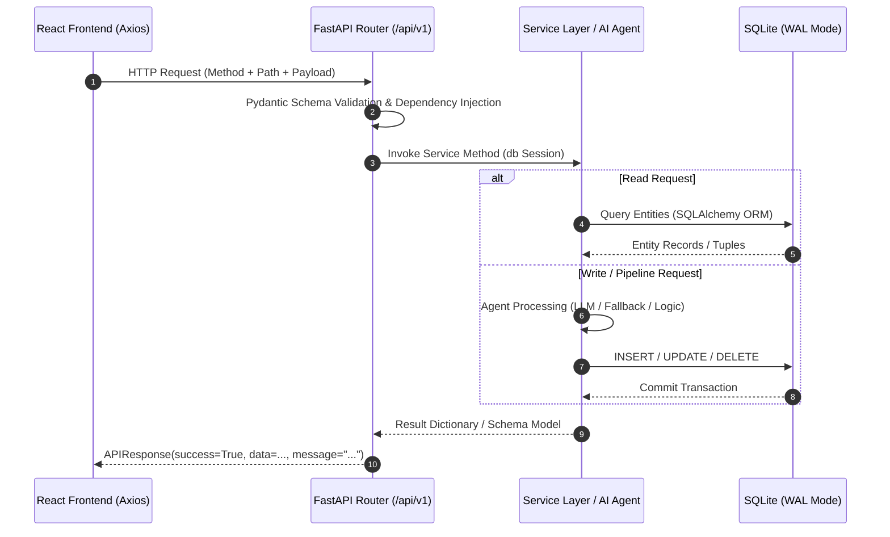

# TaskPilot AI — API Reference & Integration Contract

All backend API endpoints are served under the `/api/v1` prefix. The backend defaults to `http://localhost:8000`.

---

## Architectural Interaction Flow

Every request follows a strict tiered execution flow across the application stack:



---

## Global Response & Error Contract

All responses conform to the standard `APIResponse` schema:

```json
{
  "success": true,
  "data": { ... },
  "message": "Human-readable status description"
}
```

### Global Error Handling (`app/main.py`)
If an unhandled exception occurs, FastAPI catches it via `unhandled_exception_handler`, analyzes the failure signature, generates a user-friendly hint, captures the latest LLM diagnostics, and returns HTTP 500:

```json
{
  "success": false,
  "message": "LLM API key may be missing or invalid. Check GROQ_API_KEY in backend/.env",
  "data": {
    "error": "Error code 401 - invalid_api_key",
    "llm_diagnostics": [
      {
        "level": "warning",
        "message": "LLM provider groq failed: Error code 401",
        "timestamp": "2026-09-05T10:00:15.123456",
        "duration": 0.42
      }
    ]
  }
}
```

### HTTP Status Code Conventions
| Status Code | Meaning | Typical Trigger |
|:---|:---|:---|
| `200 OK` | Success | Valid query or command execution |
| `400 Bad Request` | Validation Error | Request body does not match Pydantic schema |
| `404 Not Found` | Entity Missing | Task ID or Plan Date does not exist |
| `429 Too Many Requests`| Rate Limit | Groq TPM / RPM limits reached |
| `500 Internal Error` | Execution Failure | Database lock, unhandled LLM crash, or network timeout |

---

## 1. Orchestration Endpoints

### `POST /api/v1/orchestrate/run`
* **Purpose:** Asynchronously triggers the complete 6-stage pipeline (`Ingestion` $\rightarrow$ `Extraction` $\rightarrow$ `Fusion` $\rightarrow$ `Quality` $\rightarrow$ `Prioritization` $\rightarrow$ `Planning`).
* **Authentication:** None (Local application).
* **Request Body:** None.
* **Internal Processing:**
  1. Checks for active pipeline runs in `WorkflowRun`.
  2. If an active run exists but started $> 5$ minutes ago, marks it as stale/failed. If active and $< 5$ minutes old, rejects the request.
  3. Inserts a new `WorkflowRun(status='running', current_agent='ingestion')`.
  4. Dispatches `run_pipeline_task` to FastAPI `BackgroundTasks`.
  5. Returns immediately with the generated `run_id`.
* **Example Request:**
  ```bash
  curl -X POST http://localhost:8000/api/v1/orchestrate/run
  ```
* **Example Response (HTTP 200):**
  ```json
  {
    "success": true,
    "data": {
      "run_id": "4b2e88a0-7164-4e2a-a521-8f5c09772d1f",
      "status": "running",
      "completed_agents": [],
      "llm_diagnostics": []
    },
    "message": "Pipeline started in background"
  }
  ```

---

### `GET /api/v1/orchestrate/status/{run_id}`
* **Purpose:** Polls the real-time execution state of a specific pipeline run.
* **Path Parameters:** `run_id` (string, required) — Unique UUID of the pipeline run.
* **Processing:** Queries `WorkflowRun` by ID.
* **Example Request:**
  ```bash
  curl -X GET http://localhost:8000/api/v1/orchestrate/status/4b2e88a0-7164-4e2a-a521-8f5c09772d1f
  ```
* **Example Response (HTTP 200):**
  ```json
  {
    "success": true,
    "data": {
      "run_id": "4b2e88a0-7164-4e2a-a521-8f5c09772d1f",
      "status": "completed",
      "started_at": "2026-09-05 10:00:00.123456",
      "completed_at": "2026-09-05 10:00:18.847120",
      "current_agent": null,
      "agents_completed": [
        "ingestion",
        "extraction",
        "fusion",
        "quality",
        "prioritization",
        "planning"
      ],
      "error": null
    },
    "message": "OK"
  }
  ```

---

### `GET /api/v1/orchestrate/latest`
* **Purpose:** Retrieves summary metrics and diagnostic status for the most recent pipeline execution.
* **Processing:** Queries the latest `WorkflowRun`, computes total runs, averages `QualityReport` overall scores to determine system accuracy, and fetches average LLM latency from `LLMClient`.
* **Example Response (HTTP 200):**
  ```json
  {
    "success": true,
    "data": {
      "latest_run": {
        "run_id": "4b2e88a0-7164-4e2a-a521-8f5c09772d1f",
        "status": "completed",
        "started_at": "2026-09-05 10:00:00.123456",
        "completed_at": "2026-09-05 10:00:18.847120",
        "current_agent": null,
        "agents_completed": ["ingestion", "extraction", "fusion", "quality", "prioritization", "planning"],
        "error": null
      },
      "total_runs": 6,
      "system_accuracy": 78.4,
      "environment": "Development",
      "average_latency": 1420.5,
      "llm_diagnostics": [
        {
          "level": "info",
          "message": "Groq request completed in 1.12s",
          "timestamp": "2026-09-05T10:00:08.120",
          "duration": 1.12
        }
      ]
    },
    "message": "OK"
  }
  ```

---

## 2. Ingestion Endpoints

### `POST /api/v1/ingest`
* **Purpose:** Executes Stage 1: parses raw source JSON files and commits `SourceEvent` records to the database.
* **Request Schema (`IngestRequest`):**
  ```json
  {
    "sources": ["github", "slack", "email", "calendar", "meetings"]
  }
  ```
* **Processing:** Deletes all downstream tables to ensure clean slate, reads JSON data files, standardizes fields, and inserts into `source_events`.
* **Example Response (HTTP 200):**
  ```json
  {
    "success": true,
    "data": {
      "total_events": 48,
      "per_source": {
        "github": 9,
        "slack": 15,
        "email": 6,
        "calendar": 10,
        "meeting": 8
      },
      "new_events": 48,
      "skipped_existing": 0,
      "incremental": false
    },
    "message": "Ingestion completed"
  }
  ```

---

### `GET /api/v1/ingest/status`
* **Purpose:** Returns the total count of ingested `SourceEvent` records currently in the database.
* **Example Response (HTTP 200):**
  ```json
  {
    "success": true,
    "data": {
      "total_events": 48
    },
    "message": "OK"
  }
  ```

---

## 3. Extraction Endpoints

### `POST /api/v1/extract`
* **Purpose:** Executes Stage 2: extracts explicit tasks (GitHub) and discovers hidden tasks (Email, Meeting, Slack).
* **Request Schema (`ExtractRequest`):**
  ```json
  {
    "include_hidden": true,
    "min_confidence": 0.5
  }
  ```
* **Processing:**
  1. Clears existing downstream tables (`master_tasks`, `quality_reports`, etc.).
  2. Directly maps structured sources (`github`, `jira`).
  3. Uses a 4-worker `ThreadPoolExecutor` to process unstructured items. Emails and meeting notes invoke `openai/gpt-oss-20b` with few-shot prompts; Slack messages invoke compiled regex heuristics.
  4. Runs all candidates through `TaskValidator` (filters noise, enforces bounds, deduplicates).
  5. Discards tasks with confidence $< \text{min\_confidence}$.
* **Example Response (HTTP 200):**
  ```json
  {
    "success": true,
    "data": {
      "total_tasks": 42,
      "explicit_tasks": 9,
      "hidden_tasks": 33,
      "filtered_out": 4,
      "validation_stats": {
        "total": 46,
        "passed": 42,
        "filtered": 4,
        "reasons": {
          "title_too_short": 2,
          "duplicate_in_batch": 2
        }
      },
      "incremental": false,
      "tasks": [
        {
          "id": "c1f76dae-9310-4820-a88a-d99c43d83b10",
          "title": "Fix payment gateway timeout in checkout",
          "description": "504 gateway timeout on Stripe endpoint",
          "task_type": "bug",
          "is_hidden": false,
          "assignee": "user-002",
          "deadline": "2026-09-06",
          "urgency": "critical",
          "confidence": 1.0,
          "source_event_id": "e8a12d8a-9f4c-4e8b-b892-d6683fae2170"
        }
      ]
    },
    "message": "Extraction completed"
  }
  ```

---

### `GET /api/v1/extract/results`
* **Purpose:** Fetches all currently stored `TaskCandidate` records without re-running extraction.
* **Example Response (HTTP 200):**
  ```json
  {
    "success": true,
    "data": {
      "total": 42,
      "explicit": 9,
      "hidden": 33,
      "tasks": [ ... ]
    },
    "message": "OK"
  }
  ```

---

## 4. Fusion / Deduplication Endpoints

### `POST /api/v1/fuse`
* **Purpose:** Executes Stage 3: clusters similar candidates across platforms, merges duplicates, and creates canonical `MasterTask` records.
* **Request Body:** None.
* **Processing:**
  1. Computes similarity using title `SequenceMatcher` ($35\%$), token Jaccard overlap ($35\%$), and description similarity ($30\%$).
  2. Applies contextual penalties for differing assignees, deadlines, and sources.
  3. Merges duplicates into unified clusters, picking the longest title, aggregating descriptions, and retaining max urgency.
  4. Inserts `MasterTask` and `TaskContextLink` rows.
* **Example Response (HTTP 200):**
  ```json
  {
    "success": true,
    "data": {
      "input_candidates": 42,
      "master_tasks": 35,
      "duplicates_merged": 7
    },
    "message": "Fusion completed"
  }
  ```

---

## 5. Quality Evaluation Endpoints

### `POST /api/v1/quality/evaluate`
* **Purpose:** Executes Stage 4: audits every `MasterTask` across 7 completeness dimensions and assigns an actionability state.
* **Request Body:** None.
* **Processing:**
  1. Standard tasks are scored using the rule-based 7-dimension rubric (zero token cost).
  2. Critical tasks (`urgency == "critical"`) are evaluated using `openai/gpt-oss-20b` via `QUALITY_PROMPT`.
  3. Assigns actionability status: `actionable` ($\ge 55$), `needs_info` ($< 55$), or `blocked`.
  4. Formulates context-aware clarification questions for missing elements.
* **Example Response (HTTP 200):**
  ```json
  {
    "success": true,
    "data": {
      "total_evaluated": 35,
      "actionable": 28,
      "needs_info": 7,
      "avg_score": 74.2,
      "reports": [
        {
          "id": "q-9912",
          "master_task_id": "m-1001",
          "task_title": "Fix payment gateway timeout in checkout",
          "overall_score": 82.5,
          "clear_title_score": 85.0,
          "reproduction_steps_score": 80.0,
          "error_logs_score": 85.0,
          "environment_score": 80.0,
          "expected_behavior_score": 80.0,
          "severity_score": 90.0,
          "assignee_score": 85.0,
          "missing_info": [],
          "clarification_questions": [],
          "actionability": "actionable"
        }
      ]
    },
    "message": "Quality evaluation completed"
  }
  ```

---

### `GET /api/v1/quality/reports`
* **Purpose:** Retrieves all existing `QualityReport` records with their associated task titles.
* **Example Response (HTTP 200):**
  ```json
  {
    "success": true,
    "data": [
      {
        "id": "q-9912",
        "master_task_id": "m-1001",
        "task_title": "Fix payment gateway timeout in checkout",
        "overall_score": 82.5,
        "actionability": "actionable",
        "missing_info": [],
        "clarification_questions": []
      }
    ],
    "message": "OK"
  }
  ```

---

## 6. Prioritization Endpoints

### `POST /api/v1/prioritize`
* **Purpose:** Executes Stage 5: computes 7-factor priority scores, applies anti-noise modifiers and blocker boosts, and generates the ranked Leaderboard.
* **Request Body:** None.
* **Processing:**
  1. Calculates multi-factor scores: Severity ($24\%$), Production ($18\%$), Customer ($16\%$), Deadline ($12\%$), Blocker ($10\%$), Business ($10\%$), Quality ($10\%$).
  2. Applies anti-noise multipliers (vague titles $0.55\times$, reporting tasks $0.72\times$).
  3. Checks for blocker keywords ($+2.0$ boost).
  4. Batches critical tasks to `openai/gpt-oss-20b` (batch size 8) for nuanced reasoning.
  5. Generates human-readable narrative explanation and dynamic `priority_reason` tags.
  6. Ranks tasks in descending order of overall score.
* **Example Response (HTTP 200):**
  ```json
  {
    "success": true,
    "data": {
      "total_ranked": 35,
      "ranked_tasks": [
        {
          "id": "p-001",
          "master_task_id": "m-1001",
          "task_title": "Fix payment gateway timeout in checkout",
          "overall_score": 9.4,
          "rank": 1,
          "severity_score": 9.6,
          "deadline_score": 9.6,
          "production_impact_score": 9.8,
          "customer_impact_score": 9.5,
          "blocker_score": 3.0,
          "business_impact_score": 9.7,
          "quality_factor_score": 8.3,
          "priority_reason": [
            "Classified as incident (elevated priority)",
            "High severity (9.6/10)",
            "Critical production impact (9.8/10)",
            "High customer impact (9.5/10)",
            "Reported by 2 merged signals"
          ],
          "explanation": "This task is prioritized with a score of 9.4/10 due to being classified as a critical incident issue, its elevated technical severity (9.6/10), high risk of production outage or infrastructure impact, and direct customer-facing degradation.",
          "sources": ["github", "email"]
        }
      ]
    },
    "message": "Prioritization completed"
  }
  ```

---

### `GET /api/v1/tasks/ranked`
* **Purpose:** Retrieves the prioritized Leaderboard sorted strictly by `rank` (1 being the highest priority).
* **Example Response (HTTP 200):**
  ```json
  {
    "success": true,
    "data": [
      {
        "id": "p-001",
        "master_task_id": "m-1001",
        "task_title": "Fix payment gateway timeout in checkout",
        "overall_score": 9.4,
        "rank": 1,
        "priority_reason": ["High severity (9.6/10)"],
        "explanation": "...",
        "sources": ["github", "email"]
      }
    ],
    "message": "OK"
  }
  ```

---

## 7. Tasks Management Endpoints

### `GET /api/v1/tasks`
* **Purpose:** Queries the complete list of `MasterTask` records with filtering support.
* **Query Parameters:**
  * `status` (string, optional): Filter by task status (`"open"`, `"in_progress"`, `"done"`).
  * `assignee` (string, optional): Filter by assignee ID/name (e.g., `"user-002"`).
  * `source` (string, optional): Comma-separated list of sources (e.g., `source=github,email`).
* **Processing:** Uses bulk relational joins (`_bulk_source_platforms` and `_bulk_context_counts`) to avoid N+1 query overhead.
* **Example Request:**
  ```bash
  curl -X GET "http://localhost:8000/api/v1/tasks?status=open&source=github"
  ```
* **Example Response (HTTP 200):**
  ```json
  {
    "success": true,
    "data": {
      "total": 9,
      "tasks": [
        {
          "id": "m-1001",
          "title": "Fix payment gateway timeout in checkout",
          "description": "504 gateway timeout on Stripe endpoint",
          "task_type": "bug",
          "status": "open",
          "assignee": "user-002",
          "deadline": "2026-09-06",
          "urgency": "critical",
          "source_count": 2,
          "estimated_hours": 1.0,
          "is_hidden": false,
          "sources": ["github", "email"],
          "source_platforms": ["github", "email"],
          "context_count": 2,
          "agent_summary": "Fusion agent merged 2 related signals from github, email.",
          "created_at": "2026-09-05T10:00:10.000000"
        }
      ]
    },
    "message": "OK"
  }
  ```

---

### `GET /api/v1/tasks/{task_id}`
* **Purpose:** Retrieves complete 360-degree telemetry for a single task: master metadata, quality report breakdown, priority score details, and lineage links to original source events.
* **Path Parameters:** `task_id` (string, required) — UUID of the `MasterTask`.
* **Example Response (HTTP 200):**
  ```json
  {
    "success": true,
    "data": {
      "task": {
        "id": "m-1001",
        "title": "Fix payment gateway timeout in checkout",
        "description": "...",
        "task_type": "bug",
        "status": "open",
        "assignee": "user-002",
        "deadline": "2026-09-06",
        "urgency": "critical",
        "source_count": 2,
        "sources": ["github", "email"]
      },
      "quality": {
        "overall_score": 82.5,
        "actionability": "actionable",
        "clear_title_score": 85.0,
        "reproduction_steps_score": 80.0,
        "error_logs_score": 85.0,
        "environment_score": 80.0,
        "expected_behavior_score": 80.0,
        "severity_score": 90.0,
        "assignee_score": 85.0,
        "missing_info": [],
        "clarification_questions": []
      },
      "priority": {
        "overall_score": 9.4,
        "rank": 1,
        "explanation": "...",
        "priority_reason": ["High severity (9.6/10)"],
        "severity_score": 9.6,
        "deadline_score": 9.6,
        "production_impact_score": 9.8,
        "customer_impact_score": 9.5,
        "dependency_score": 4.8,
        "blocker_score": 3.0,
        "business_impact_score": 9.7,
        "quality_factor_score": 8.3
      },
      "context_links": [
        {
          "source": "github",
          "title": "Stripe timeout error on checkout page",
          "content": "Users seeing 504 error...",
          "link_type": "origin"
        },
        {
          "source": "email",
          "title": "URGENT: Payment Gateway Timeouts in Prod",
          "content": "We are observing 504 gateway timeouts...",
          "link_type": "related"
        }
      ]
    },
    "message": "OK"
  }
  ```

---

### `POST /api/v1/tasks/{task_id}/status`
* **Purpose:** Updates the workflow state of a task (e.g., marks as completed).
* **Request Body:**
  ```json
  {
    "status": "done"
  }
  ```
* **Example Response (HTTP 200):**
  ```json
  {
    "success": true,
    "data": {
      "task_id": "m-1001",
      "status": "done"
    },
    "message": "Task status updated to done"
  }
  ```

---

## 8. Daily Planning Endpoints

### `POST /api/v1/daily-plan`
* **Purpose:** Executes Stage 6: builds a calendar-aware schedule for a specific date, locking calendar commitments, inserting top priority tasks, and injecting decompression breaks.
* **Request Schema (`DailyPlanRequest`):**
  ```json
  {
    "user_id": "user-001",
    "date": "2026-07-14",
    "buffer_hours": 1.0
  }
  ```
* **Processing:**
  1. Deletes any pre-existing plan for `(user_id, date)`.
  2. Queries `calendar.json` for fixed meetings on that date.
  3. Calculates available focus hours: $8.0\text{h} - \text{Meeting Hours} - \text{Buffer Hours}$.
  4. Fetches top 12 prioritized tasks.
  5. Invokes `openai/gpt-oss-120b` (or deterministic greedy allocator).
  6. Validates schedule constraints (no meeting overlaps, hours within limits).
  7. Injects 15-minute decompression breaks.
  8. Commits `DailyPlan` and `TimeSlot` entities.
* **Example Response (HTTP 200):**
  ```json
  {
    "success": true,
    "data": {
      "id": "dp-4401",
      "user_id": "user-001",
      "plan_date": "2026-07-14",
      "available_hours": 5.5,
      "planned_hours": 4.5,
      "buffer_hours": 1.0,
      "load_status": "healthy",
      "recommendations": [
        "Lead with 'Fix payment gateway timeout in checkout' — top-ranked critical work, protect this block first.",
        "Full backlog fits today; keep buffer reserved for incident follow-ups."
      ],
      "overflow_tasks": [],
      "time_slots": [
        {
          "start_time": "09:00",
          "end_time": "09:30",
          "slot_type": "meeting",
          "priority_level": "neutral",
          "title": "Engineering Daily Standup",
          "master_task_id": null
        },
        {
          "start_time": "09:30",
          "end_time": "10:30",
          "slot_type": "task",
          "priority_level": "critical",
          "title": "Fix payment gateway timeout in checkout",
          "master_task_id": "m-1001"
        },
        {
          "start_time": "10:30",
          "end_time": "10:45",
          "slot_type": "buffer",
          "priority_level": "neutral",
          "title": "Mid-Morning Coffee Break",
          "master_task_id": null
        }
      ]
    },
    "message": "Daily plan generated"
  }
  ```

---

### `GET /api/v1/daily-plan/{date}`
* **Purpose:** Retrieves the saved daily schedule and time slots for a specific date (`YYYY-MM-DD`).
* **Example Response (HTTP 200):**
  ```json
  {
    "success": true,
    "data": {
      "id": "dp-4401",
      "plan_date": "2026-07-14",
      "load_status": "healthy",
      "available_hours": 5.5,
      "planned_hours": 4.5,
      "time_slots": [ ... ]
    },
    "message": "OK"
  }
  ```

---

### `GET /api/v1/daily-plans`
* **Purpose:** Lists all dates for which a `DailyPlan` has been generated.
* **Example Response (HTTP 200):**
  ```json
  {
    "success": true,
    "data": ["2026-07-14", "2026-09-05"],
    "message": "OK"
  }
  ```

---

### `GET /api/v1/planner/calendar`
* **Purpose:** Groups all tasks possessing deadlines by date (`YYYY-MM-DD`), sorted by priority score. Used by the frontend month/week calendar view.
* **Example Response (HTTP 200):**
  ```json
  {
    "success": true,
    "data": {
      "2026-09-06": [
        {
          "id": "m-1001",
          "title": "Fix payment gateway timeout in checkout",
          "priority": 9.4,
          "deadline": "2026-09-06",
          "status": "open"
        }
      ]
    },
    "message": "OK"
  }
  ```

---

### `GET /api/v1/planner/day/{date}`
* **Purpose:** Fetches the granular tasks scheduled for a given date. If a plan exists, returns timeslot items; otherwise falls back to tasks with matching deadlines.
* **Example Response (HTTP 200):**
  ```json
  {
    "success": true,
    "data": [
      {
        "title": "Fix payment gateway timeout in checkout",
        "priority": 9.4
      }
    ],
    "message": "OK"
  }
  ```

---

### `POST /api/v1/planner/schedule`
* **Purpose:** Generates a multi-day schedule allocation for all uncompleted tasks across future working days.
* **Query Parameters:** `start_date` (string, required, format `"YYYY-MM-DD"`).
* **Processing:** Distributes work across consecutive days up to 8.0 hours/day before task deadlines.
* **Example Request:**
  ```bash
  curl -X POST "http://localhost:8000/api/v1/planner/schedule?start_date=2026-09-05"
  ```
* **Example Response (HTTP 200):**
  ```json
  {
    "success": true,
    "data": {
      "2026-09-05": [
        {
          "task_id": "m-1001",
          "title": "Fix payment gateway timeout in checkout",
          "hours": 1.0
        }
      ]
    },
    "message": "Schedule generated"
  }
  ```

---

## 9. Chat Copilot & P1 Incident Endpoints

### `POST /api/v1/chat`
* **Purpose:** Interactive natural language copilot and P1 incident injection interface.
* **Request Schema (`ChatRequest`):**
  ```json
  {
    "message": "What is my highest priority task today?",
    "context": null
  }
  ```

#### Flow A: General Query (Copilot RAG)
When the message is a general query, the backend injects the top 20 tasks, leaderboard rankings, and active daily plan into the prompt, returning a structured markdown response:
* **Example Response (HTTP 200):**
  ```json
  {
    "success": true,
    "data": {
      "reply": "Your highest priority task today is **Fix payment gateway timeout in checkout** (Score: **9.4/10**, Rank: **#1**). It is a critical production bug reported across GitHub and Email affecting payment transactions.",
      "llm_diagnostics": [ ... ]
    },
    "message": "Response generated"
  }
  ```

#### Flow B: P1 Incident Injection
When the message contains keywords such as `"inject"`, `"p1"`, or `"new defect"`:
1. The LLM extracts incident parameters.
2. The event is written directly to the datastore (e.g., `emails.json` or `github_data.json`).
3. The orchestrator triggers an autonomous incremental pipeline run (`run_full_pipeline(incremental=True)`).
4. The new task's priority rank is returned.
* **Example Request:**
  ```json
  {
    "message": "inject a P1 defect - auth service returning 500 on all mobile logins"
  }
  ```
* **Example Response (HTTP 200):**
  ```json
  {
    "success": true,
    "data": {
      "reply": "🚨 **P1 Incident Injected!**\n\nI have successfully injected a new raw event into the system datastore:\n* **Title**: Auth service returning 500 on all mobile logins\n* **Source**: EMAIL\n\n**Pipeline Orchestrator triggered autonomously...** All stages (Ingestion $\\rightarrow$ Extraction $\\rightarrow$ Fusion $\\rightarrow$ Quality check $\\rightarrow$ Prioritization $\\rightarrow$ Daily Schedule Planning) have been re-run. The task has been prioritized with score **9.6** and ranked **#1** on your Leaderboard.\n\nCheck the **Dashboard**, **Priority**, and **Planner** pages to see the live updates!"
    },
    "message": "Event injected and pipeline re-run"
  }
  ```

---

## 10. System & Health Endpoints

### `GET /health` (or `GET /api/v1/health`)
* **Purpose:** Liveness and readiness probe for server uptime and LLM provider configuration status.
* **Example Response (HTTP 200):**
  ```json
  {
    "status": "healthy",
    "config": {
      "groq_configured": true,
      "llm_providers_available": true
    },
    "llm_diagnostics": []
  }
  ```

---

*See also: [Agent Architecture](agents.md) for individual agent logic, [System Architecture](architecture.md) for layer topologies, and [Pipeline Flow](pipeline.md) for end-to-end data processing.*
