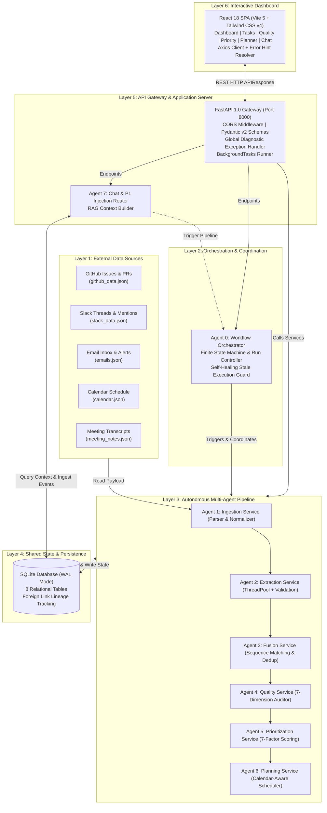
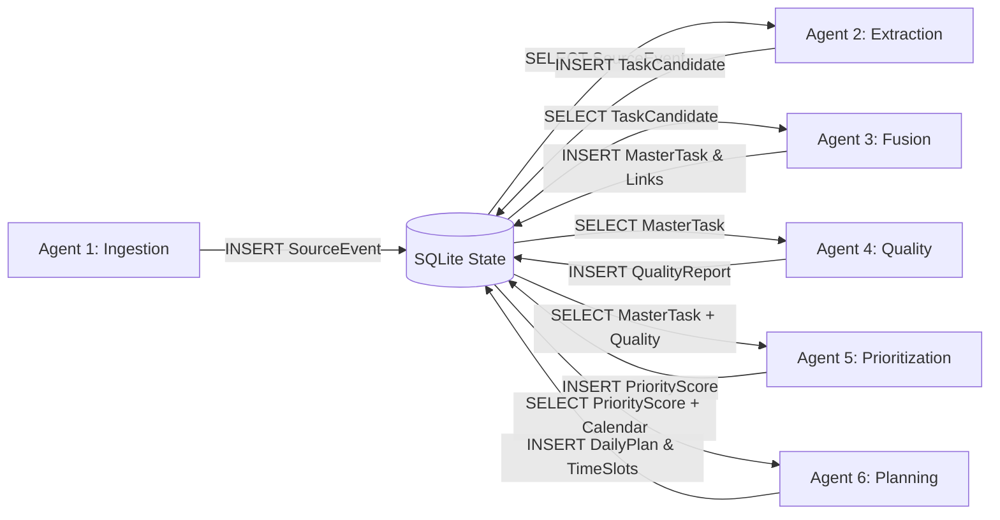
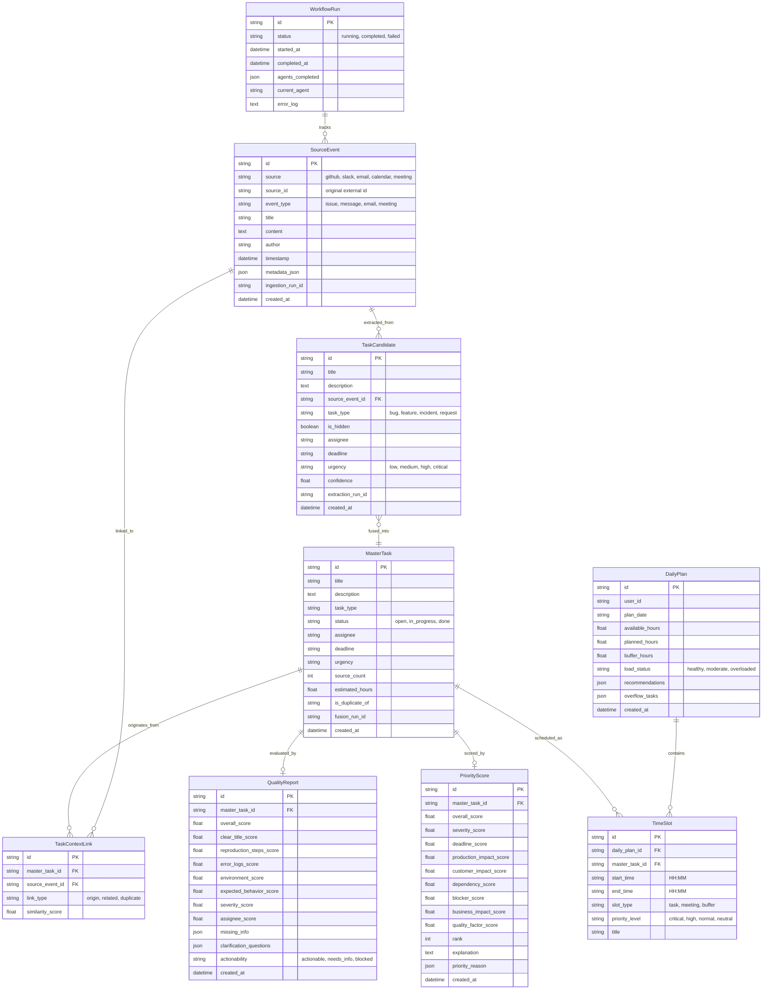
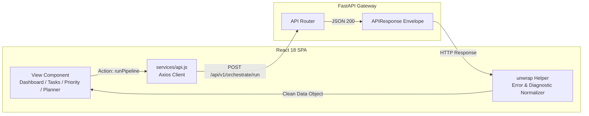

# TaskPilot AI — System Architecture & Design Blueprint

## Executive Overview & Problem Context

Modern software engineers are inundated with fragmented notifications and task requests scattered across issue trackers, team chats, email threads, calendar invites, and meeting transcripts. 

> **The Core Problem:** Engineering work does not arrive in a single unified queue. It is scattered across 4 to 7 tools daily. Approximately 35% of actionable obligations remain hidden inside conversational chatter, context-switching costs up to 23 minutes per disruption, and prioritization often defaults to who messages most urgently rather than technical impact.

**TaskPilot AI** solves this by acting as an autonomous **AI Chief of Staff**. It aggregates raw signals from heterogeneous sources, extracts explicit and hidden tasks, correlates cross-platform duplicates into canonical master tasks, audits actionability, computes a 7-factor priority score, and compiles a calendar-aware daily plan.

---

## 1. System Layers

The TaskPilot AI platform is structured into six decoupled operational tiers:



### Layer Descriptions

1. **External Data Sources Layer:** Ingests live data snapshots from 5 standard engineering feeds. No assumptions are made about schema uniformity.
2. **Orchestration Layer:** Manages end-to-end execution lifecycle. Handles asynchronous non-blocking job dispatching, stage completion auditing, and 5-minute timeout cleanup.
3. **Multi-Agent Pipeline Layer:** 6 sequential autonomous stages that progressively transform raw unstructured text into structured, scored, and scheduled work.
4. **Shared State Layer:** High-performance local SQLite database configured with Write-Ahead Logging (WAL) and normal synchronization. Serves as the central blackboard state machine for all agents.
5. **API Gateway Layer:** FastAPI application exposing modular routes (`/orchestrate`, `/ingest`, `/extract`, `/fuse`, `/quality`, `/prioritize`, `/tasks`, `/daily-plan`, `/chat`, `/health`) wrapped in a uniform `APIResponse` envelope.
6. **Dashboard Layer:** A responsive React 18 single-page application built with Vite and Tailwind CSS v4, providing real-time stepper visualizations, QA score gauges, priority leaderboards, interactive daily schedule timelines, and a natural language copilot.

---

## 2. Major Components & Code Organization

```
TaskPilot-AI/
├── backend/
│   ├── app/
│   │   ├── main.py                     # Application entry point & exception interceptor
│   │   ├── config.py                   # Environment settings (Groq, NVIDIA, DB URLs)
│   │   ├── database.py                 # SQLAlchemy engine, session maker, WAL pragmas
│   │   ├── logging_config.py           # Structured logging configuration
│   │   ├── models/                     # 8 SQLAlchemy ORM entity definitions
│   │   │   ├── source_event.py         # Normalized raw external events
│   │   │   ├── task.py                 # TaskCandidate, MasterTask, TaskContextLink
│   │   │   ├── quality_report.py       # 7-dimension completeness audit records
│   │   │   ├── priority_score.py       # 7-factor weighted scoring & rank records
│   │   │   ├── daily_plan.py           # DailyPlan header & TimeSlot schedule blocks
│   │   │   └── workflow_run.py         # Pipeline execution run tracker
│   │   ├── schemas/                    # Pydantic v2 request/response schemas
│   │   ├── services/                   # Business logic orchestrators for Agents 0-6
│   │   └── routers/                    # REST API endpoints (routers 0 through 8)
│   ├── agents/
│   │   ├── llm_client.py               # Resilient LLM wrapper (Groq, circuit breaker)
│   │   ├── agent_2_extraction_agent.py # Explicit & hidden task extraction algorithms
│   │   ├── agent_2_validation.py       # 6-step candidate validation & noise filter
│   │   ├── agent_3_fusion_agent.py     # String & Jaccard token deduplication engine
│   │   ├── agent_4_quality_agent.py    # 7-dimension heuristic & LLM QA evaluator
│   │   ├── agent_5_prioritization_agent.py # 7-factor priority scoring & reasoning
│   │   ├── agent_6_planning_agent.py   # Calendar-aware scheduler & constraint guard
│   │   └── prompts/                    # Versioned few-shot prompt templates
│   └── tests/
│       ├── golden_dataset.json         # 11 validation test scenarios
│       └── test_accuracy.py            # Quantitative precision/recall evaluator
├── frontend/
│   ├── src/
│   │   ├── pages/                      # Dashboard, Tasks, Quality, Priority, Planner, Chat
│   │   ├── components/                 # Steppers, modal inspectors, schedule views
│   │   ├── services/api.js             # Axios API client with error hint normalizer
│   │   └── context/                    # ThemeContext & global state
│   └── package.json
└── data/                               # 5 raw mock engineering data files
```

---

## 3. Agent Architecture & Shared State Pattern

Traditional multi-agent systems often use in-memory message queues (e.g., Celery, RabbitMQ, Kafka) or peer-to-peer agent network protocols. In TaskPilot AI, the **SQLite database acts as the shared blackboard state machine**.



### Advantages of the Shared State Pattern
1. **Full Traceability & Auditability:** Every stage persists its intermediate state. If prioritization generates an unexpected result, developers can inspect the exact `QualityReport` and `TaskCandidate` records that led to it.
2. **Decoupled Lifecycle:** Agents have zero compile-time dependencies on each other. Agent 4 does not need to know how Agent 2 extracted tasks; it only reads `MasterTask` records.
3. **Resilience & Restartability:** If the server is terminated during stage 5, stages 1 through 4 remain safely committed on disk.
4. **Instant UI Synchronization:** The frontend can query any stage's data independently (e.g., viewing extraction candidates or inspecting quality reports) without requiring a full pipeline re-run.

---

## 4. LLM Architecture & Dual-Tier Inference

TaskPilot AI uses a **tiered LLM strategy** powered by **Groq Cloud LPU (Language Processing Unit)** hardware to achieve near-instantaneous inference.

```mermaid
flowchart TD
    Req[Agent LLM Request] --> CB{Circuit Breaker Open?}
    CB -->|Yes (Cooldown < 60s)| Fallback[Execute Deterministic Fallback]
    CB -->|No / Half-Open| Route{Model Type}
    
    Route -->|Fast Extraction & QA\nopenai/gpt-oss-20b| GroqFast[Groq LPU Fast Endpoint\nTimeout: 120s | MaxTokens: 600]
    Route -->|Complex Reasoning & Planning\nopenai/gpt-oss-120b| GroqReasoning[Groq LPU Reasoning Endpoint\nTimeout: 300s | MaxTokens: 1024]
    
    GroqFast --> RetryCheck{HTTP 429 Rate Limit?}
    GroqReasoning --> RetryCheck
    
    RetryCheck -->|Yes (Attempt 0)| Wait[Sleep 1s & Retry Once]
    Wait --> Route
    RetryCheck -->|Failure / Crash| RecordFail[Record Failure\nCircuit Count++]
    RecordFail --> Fallback
    
    RetryCheck -->|Success| Parse[parse_json Engine]
    Parse --> TruncCheck{Truncated JSON?}
    TruncCheck -->|Yes| Repair[_repair_truncated_json Stack Alg]
    TruncCheck -->|No| Output[Return Python Dict / List]
    Repair --> Output
```

### Model Allocation Matrix

| Tier | Model | Latency | Assigned Agents | Why This Model? |
|:---|:---|:---:|:---|:---|
| **Fast Tier** | `openai/gpt-oss-20b` | **~1.0s** | Agent 2 (Extraction)<br>Agent 4 (Critical QA)<br>Agent 5 (Batch Priority)<br>Agent 7 (Chat Copilot) | Ultra-low latency, high token throughput, strong few-shot schema adherence. Ideal for high-volume text parsing. |
| **Reasoning Tier** | `openai/gpt-oss-120b` | **~2.5s** | Agent 6 (Daily Planning) | Deep reasoning capability required for multi-constraint schedule optimization without calendar collisions. |

### Resiliency & Fault-Tolerance Features

1. **Deterministic Local Fallbacks:** Every single agent contains an offline, deterministic algorithmic fallback. If no API key is provided, if Groq is unreachable, or if `TASKPILOT_DISABLE_LLM=1` is set, the entire pipeline executes locally with **zero tokens**.
2. **Circuit Breaker:** If a provider incurs 2 consecutive failures, it enters the `OPEN` state for `CIRCUIT_COOLDOWN = 60` seconds. All subsequent requests fall back instantly without network latency. After 60 seconds, the circuit becomes `HALF-OPEN` to attempt recovery.
3. **Rate Limit Recovery:** When HTTP 429 (Too Many Requests) is detected, the client waits 1 second and retries once before gracefully degrading to local fallbacks.
4. **Truncated JSON Auto-Repair:** Open-source models occasionally hit `max_tokens` mid-stream. `_repair_truncated_json()` uses a bracket-matching stack to auto-close open strings, arrays, and objects, salvaging partially completed responses instead of crashing.
5. **Key Redaction:** Diagnostics scrub all API keys (`(gsk|nvapi)-...` $\rightarrow$ `[redacted-api-key]`) before logging or sending error payloads to the frontend.

---

## 5. Database Architecture & Relational Schema

TaskPilot AI uses SQLAlchemy 2.0 with a SQLite backend configured for high-concurrency local operations.

### Concurrency Configuration (`app/database.py`)
* **WAL Mode (`PRAGMA journal_mode=WAL`):** Allows readers to read while writers write, completely avoiding database lockups during pipeline execution.
* **Synchronous Normal (`PRAGMA synchronous=NORMAL`):** Provides excellent write performance while maintaining file integrity.
* **Timeout:** Set to `45` seconds (`connect_args={"timeout": 45}`).

### Entity-Relationship Diagram



---

## 6. Frontend ↔ Backend Integration Architecture

The frontend is a modern React 18 single-page application built on Vite 5 and styled with Tailwind CSS v4.



### Frontend Integration Highlights (`frontend/src/services/api.js`)
* **Environment-Aware Base URL:** Automatically toggles between `http://localhost:8000/api/v1` during local development (`import.meta.env.DEV`) and production endpoints.
* **The `unwrap` Helper:** Inspects the standard `APIResponse` envelope. If `success === false`, extracts `errorMsg`, attaches `llm_diagnostics`, and throws a JavaScript `Error` that UI components catch and render in red alert banners.
* **Intelligent Error Classification:** `getApiErrorMessage(err)` detects HTTP 401 (API key issues), 404, 429 (rate limits), and connection drops, translating low-level network failures into clear engineering guidance.

---

## 7. Architectural Decisions & Trade-Off Analysis

| Decision | Alternative Considered | Why This Choice? | Trade-Off Accepted |
|:---|:---|:---|:---|
| **Multi-Agent Decomposition** | Monolithic Single LLM Prompt | Prompts that attempt to ingest, extract, deduplicate, score, and plan simultaneously suffer from prompt drift, hallucination, and token context overflow. Single-responsibility agents provide inspectable intermediate outputs. | Slightly higher orchestration complexity and disk I/O between stages. |
| **Shared SQLite State (WAL)** | Redis / Celery / Kafka | Engineers running TaskPilot locally or in lightweight containers do not want to manage Redis, RabbitMQ, and Celery worker daemons. SQLite in WAL mode provides ACID transactions, zero operational overhead, and instant queryability. | Not designed for multi-region active-active distributed deployments. |
| **Deterministic Fallbacks** | Hard Failure on LLM Outage | If an engineer is testing offline or Groq experiences rate limits, the assistant must still deliver value. Regex heuristics, sequence matching, and mathematical scoring ensure the pipeline **never breaks**. | Fallback extractions lack the subtle semantic nuances of 120B reasoning models. |
| **Decoupled Quality & Priority** | Unified Scoring Model | A task can have severe business urgency while being completely unactionable due to missing reproduction steps. Separating Agent 4 (completeness) from Agent 5 (urgency) ensures unblocking questions are drafted before work is scheduled. | Requires an additional processing stage in the pipeline. |
| **Groq Cloud LPU** | OpenAI API / Local Ollama | Local 70B+ models require expensive GPUs ($2,000+) and take 30+ seconds per prompt. OpenAI introduces higher API costs. Groq delivers sub-second inference speeds (~1.0s for 20B, ~2.5s for 120B) on free-tier access. | Subject to token-per-minute (TPM) rate limits during heavy batch processing. |
| **FastAPI + React SPA** | Next.js Fullstack / Django | Python is the undisputed standard for AI/ML and agent libraries; React provides the richest ecosystem for interactive schedule timelines, real-time steppers, and gauge components. Decoupling them enables independent testing. | Requires running two separate development servers (`port 8000` and `port 5173`). |

---

*See also: [Agent Deep-Dive](agents.md) for individual agent code implementations, [Pipeline Architecture](pipeline.md) for data transformation stages, and [API Reference](api.md) for REST contracts.*
