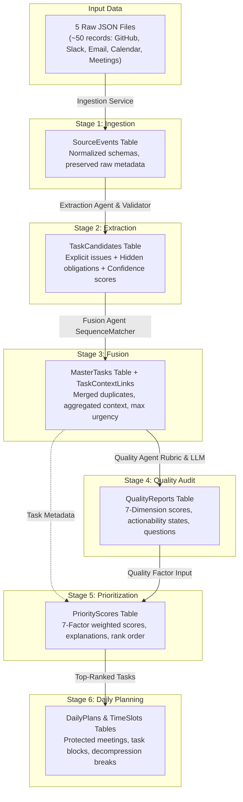
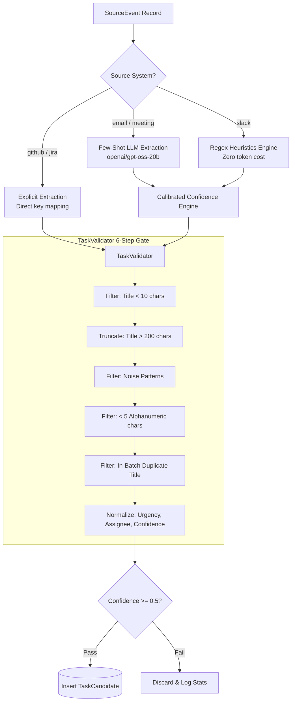
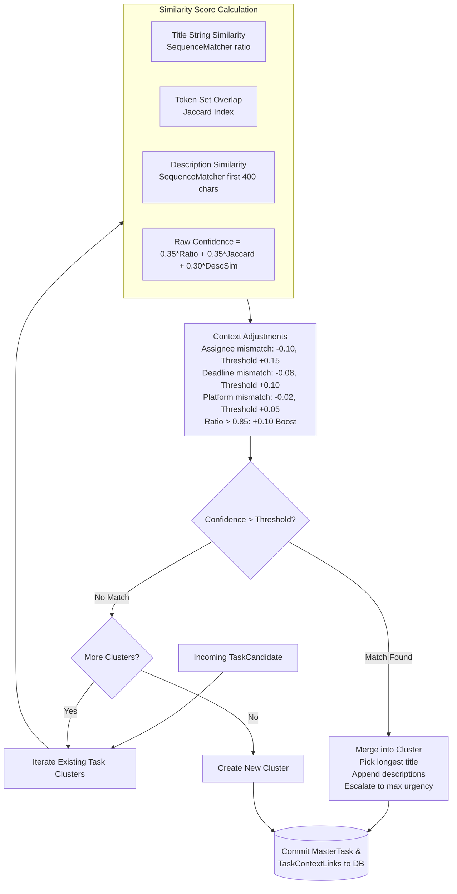
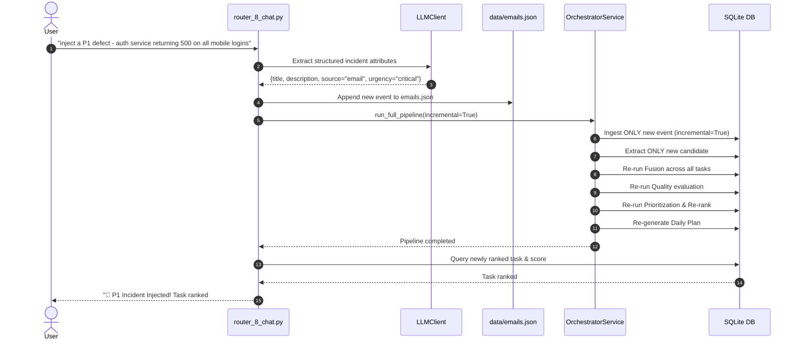

# TaskPilot AI — End-to-End Pipeline & Data Transformation Architecture

TaskPilot AI is fundamentally a **data transformation and decision pipeline**. It ingests noisy, fragmented developer communication and systematically refines it through six discrete stages into an actionable, prioritized, calendar-aware daily schedule.

---

## 1. End-to-End Data Transformation Flow



---

## 2. Quantitative Entity Progression Matrix

| Stage | Input Entity | Transformation Operation | Output Entity | Typical Entity Volume |
|:---:|:---|:---|:---|:---:|
| **1** | Raw JSON Payloads | Field extraction & schema normalization | `SourceEvent` | ~48 to 51 events |
| **2** | `SourceEvent` | LLM few-shot parsing & regex heuristics | `TaskCandidate` | ~40 to 45 tasks |
| **3** | `TaskCandidate` | Semantic clustering & string correlation | `MasterTask` | ~32 to 36 tasks |
| **4** | `MasterTask` | 7-dimension completeness auditing | `QualityReport` | 1:1 with MasterTask |
| **5** | `MasterTask` + `QualityReport` | 7-factor weighted equation & anti-noise logic | `PriorityScore` | 1:1 with MasterTask |
| **6** | `PriorityScore` + `calendar.json` | Calendar constraint matching & slotting | `DailyPlan` + `TimeSlot` | 1 Plan + ~8 to 12 Slots |

---

## 3. Stage 1: Data Ingestion

```mermaid
flowchart LR
    F1[github_data.json] --> Ingest[IngestionService]
    F2[slack_data.json] --> Ingest
    F3[emails.json] --> Ingest
    F4[calendar.json] --> Ingest
    F5[meeting_notes.json] --> Ingest
    
    Ingest --> Clean{clear=True?}
    Clean -->|Yes (Full Run)| Wipe[Wipe all 7 downstream tables]
    Clean -->|No (Incremental)| Dedupe[Skip existing source, source_id]
    
    Wipe --> Norm[Normalize into SourceEvent]
    Dedupe --> Norm
    Norm --> DB[(Commit to source_events)]
```

### 1. Why This Stage Exists
Raw engineering data is formatted inconsistently. GitHub issues contain markdown bodies and label arrays; Slack messages contain raw channel mentions (`@user`) and Unix timestamps; emails have MIME subjects and recipient lists; meetings have structured action item sections. Downstream AI agents cannot operate reliably on five disparate data schemas. `Stage 1` maps all incoming signals into a uniform relational schema.

### 2. Implementation Specifications
* **Module:** `backend/app/services/agent_1_ingestion_service.py`
* **Input:** Raw JSON files located in `data/`.
* **Output:** `SourceEvent` database records.
* **Technology:** Standard library `json`, `uuid`, Python `datetime`.
* **LLM Usage:** None (pure deterministic file parsing, runtime < 100ms).
* **Database Tables Affected:** `source_events` (INSERT), cascading wipe of downstream tables (`time_slots`, `daily_plans`, `priority_scores`, `quality_reports`, `task_context_links`, `master_tasks`, `task_candidates`).

### 3. Normalization Logic
* **GitHub:** Issues map to `event_type="issue"`; pull requests map to `event_type="pull_request"`.
* **Slack:** Messages map to `event_type="message"`.
* **Email:** Subject and body are concatenated into `content`.
* **Meetings:** Summary, discussion points, action items, and decisions are serialized as structured JSON strings into `content`.
* **Lineage Preservation:** The full raw dictionary is preserved in `metadata_json` to enable traceability throughout the system.

---

## 4. Stage 2: Task Extraction & Validation



### 1. Why This Stage Exists
Over 35% of engineering tasks are never filed in Jira or GitHub. They emerge organically in emails, Slack threads, and meeting transcripts. `Stage 2` discovers these implied commitments and converts them into structured candidates alongside explicit tickets.

### 2. Implementation Specifications
* **Modules:** `backend/agents/agent_2_extraction_agent.py`, `backend/agents/agent_2_validation.py`, `backend/app/services/agent_2_extraction_service.py`
* **Input:** `SourceEvent` records.
* **Output:** `TaskCandidate` records.
* **LLM Usage:** `openai/gpt-oss-20b` via Groq for emails and meetings; regex heuristics for Slack.
* **Concurrency:** `ThreadPoolExecutor(max_workers=4)` executes hidden extractions in parallel.
* **Database Tables Affected:** `task_candidates` (INSERT).

### 3. Deep Algorithmic Mechanics

#### A. Calibrated Confidence Scoring Formula
Rather than accepting raw LLM confidence, TaskPilot calculates confidence deterministically based on empirical evidence:

$$\text{Confidence} = \min\left(0.95, \text{Base}_{\text{source}} + \text{Boost}_{\text{assignee}} + \text{Boost}_{\text{deadline}} + \text{Boost}_{\text{urgency}} + \text{Boost}_{\text{length}} + \text{Boost}_{\text{context}}\right)$$

* $\text{Base}_{\text{meeting}} = 0.70$, $\text{Base}_{\text{email}} = 0.62$, $\text{Base}_{\text{slack}} = 0.55$
* $\text{Boost}_{\text{assignee}} = +0.12$ (if an explicit assignee or `@mention` is identified)
* $\text{Boost}_{\text{deadline}} = +0.10$ (if a date or keyword like `"today"` or `"tomorrow"` is identified)
* $\text{Boost}_{\text{urgency}} = +0.08$ (if `P0`, `P1`, `critical`, `outage`, or `sev1` is detected)
* $\text{Boost}_{\text{length}} = +0.03$ (if text exceeds 100 characters)
* $\text{Boost}_{\text{context}} = +0.02$ (if an email subject is present)

#### B. Validation & Noise Filtering Layer (`TaskValidator`)
Every candidate passes through a 6-stage validation gate:
1. **Length Guard:** Titles $< 10$ characters are dropped (`title_too_short`).
2. **Noise Matching:** Titles matching regex patterns (`^untitled`, `^test$`, `^see above$`, `^todo$`, `^fix this$`, `^misc$`) are dropped (`noise_pattern`).
3. **Alphanumeric Content:** Must contain $\ge 5$ alphanumeric characters (`no_alphanumeric_content`).
4. **Batch Deduplication:** Normalized alphanumeric keys are tracked in a set (`_seen_titles`). Duplicates within the same batch are dropped (`duplicate_in_batch`).
5. **Enums & Bounds:** Enforces valid urgency (`low`, `medium`, `high`, `critical`) and clips confidence to $[0.0, 1.0]$.
6. **Threshold Cutoff:** Discards any task with confidence below `min_confidence` (default `0.5`).

---

## 5. Stage 3: Task Fusion & Correlation



### 1. Why This Stage Exists
When a production outage strikes, signals arrive across multiple channels: a GitHub issue is opened, alerts flood Slack `#incidents`, a customer escalation email arrives, and a standup note is recorded. If unmanaged, the engineer sees 4 distinct tasks. `Stage 3` correlates cross-platform signals and merges them into a single canonical `MasterTask` while preserving audit lineage.

### 2. Implementation Specifications
* **Modules:** `backend/agents/agent_3_fusion_agent.py`, `backend/app/services/agent_3_fusion_service.py`
* **Input:** `TaskCandidate` records.
* **Output:** `MasterTask` records and `TaskContextLink` relational records.
* **Technology:** Python `difflib.SequenceMatcher`, token set operations.
* **LLM Usage:** None (deterministic string and token matching for sub-second speed).
* **Database Tables Affected:** `master_tasks` (INSERT), `task_context_links` (INSERT).

### 3. Deep Algorithmic Mechanics

#### A. Mathematical Similarity Model
Candidate $A$ is compared against Cluster $B$ using a tri-factor formula:

$$\text{Similarity} = 0.35 \cdot \text{Ratio}_{\text{title}} + 0.35 \cdot \text{Jaccard}_{\text{tokens}} + 0.30 \cdot \text{Ratio}_{\text{desc}}$$

* $\text{Ratio}_{\text{title}}$ captures character-level edit distance.
* $\text{Jaccard}_{\text{tokens}} = \frac{|A_{\text{tokens}} \cap B_{\text{tokens}}|}{|A_{\text{tokens}} \cup B_{\text{tokens}}|}$ captures unordered word overlap.
* $\text{Ratio}_{\text{desc}}$ captures semantic context across the first 400 characters.

#### B. Dynamic Context Thresholding
Rather than using a rigid similarity threshold, the matching threshold dynamically tightens when critical attributes diverge:
* **Base Threshold:** `0.65`
* **Assignee Divergence:** If both items have assignees but they do not match, confidence is penalized by `-0.10` and threshold is raised by `+0.15` (to `0.80`). This prevents tasks assigned to different developers from accidentally fusing.
* **Deadline Divergence:** If deadlines conflict, confidence is penalized by `-0.08` and threshold is raised by `+0.10`.
* **Platform Divergence:** If sources differ, confidence receives a `-0.02` adjustment and threshold is raised by `+0.05`.

#### C. Cluster Synthesis & Lineage
* **Title:** The longest, most descriptive title is chosen.
* **Description:** Formats a structured composite with clear attribution:
  ```markdown
  ### Unified Task Overview
  [Primary Description]
  ---
  ### Fused Source Details
  * **GITHUB:** Fix payment gateway timeout in checkout
  * **EMAIL:** URGENT: Payment Gateway Timeouts in Prod
  ```
* **Lineage Links:** Inserts `TaskContextLink` rows (`link_type="origin"` for single sources, `"related"` for merged sources) tracking the exact `source_event_id`.

---

## 6. Stage 4: Quality & Actionability Audit

```mermaid
flowchart TD
    MT[MasterTask Record] --> UrgencyCheck{urgency == 'critical'?}
    
    UrgencyCheck -->|No| Heuristic[Rule-Based Heuristic Rubric\n0 LLM Tokens | Instant]
    UrgencyCheck -->|Yes| LLMQA[LLM Quality Audit\nopenai/gpt-oss-20b via Groq]
    
    Heuristic --> Rubric[Score 7 Dimensions: 0-100\nClear Title | Repro Steps | Error Logs\nEnvironment | Expected Behavior\nSeverity | Assignee]
    LLMQA --> Rubric
    
    Rubric --> Overall[Overall Score = Mean of 7 Dimensions]
    
    Overall --> ActClass{Overall Score >= 55?}
    ActClass -->|Yes| Actionable[actionability = 'actionable']
    ActClass -->|No| NeedsInfo[actionability = 'needs_info']
    
    NeedsInfo --> Questions[Generate Context-Aware\nClarification Questions]
    
    Actionable --> Save[(Insert QualityReport)]
    Questions --> Save
```

### 1. Why This Stage Exists
Tasks with missing reproduction steps, missing error logs, or unspecified environments waste hours of developer time. `Stage 4` acts as an automated quality assurance auditor: it evaluates completeness, flags missing information, and automatically formulates clarification questions.

### 2. Implementation Specifications
* **Modules:** `backend/agents/agent_4_quality_agent.py`, `backend/app/services/agent_4_quality_service.py`
* **Input:** `MasterTask` records.
* **Output:** `QualityReport` records.
* **LLM Usage:** `openai/gpt-oss-20b` for critical tasks; rule-based heuristics for standard tasks.
* **Database Tables Affected:** `quality_reports` (INSERT).

### 3. The 7-Dimension Rubric
1. **Clear Title (0-100):** Specificity and component identification.
2. **Reproduction Steps (0-100):** Presence of steps, repro payloads, or timelines.
3. **Error Logs (0-100):** Presence of stack traces, exceptions, or log outputs.
4. **Environment (0-100):** Explicit mention of Production, Staging, CI/CD, or OS.
5. **Expected Behavior (0-100):** Acceptance criteria or expected vs actual outcome.
6. **Severity (0-100):** Proper technical urgency tagging.
7. **Assignee (0-100):** Explicit ownership designation.

$$\text{Overall Score} = \frac{1}{7} \sum_{k=1}^{7} \text{Dimension Score}_k$$

### 4. Clarification Question Generation
If `actionability == "needs_info"`, context-aware questions are drafted automatically:
* *Database issue without environment:* `"Please specify if this database timeout is occurring in the Production database cluster or Staging."*
* *Authentication bug without repro:* `"Could you outline the step-by-step auth flow or network payloads that trigger the login failure?"*
* *Task without owner:* `"No primary owner is assigned. Who on the engineering team should take ownership of this task?"*

---

## 7. Stage 5: Multi-Factor Prioritization

```mermaid
flowchart TD
    MT[MasterTask] --> Prioritize[PrioritizationService]
    QR[QualityReport] --> Prioritize
    
    subgraph Calc["7-Factor Scoring Formula"]
        Sev["Severity Score (24%)"]
        Prod["Production Outage Risk (18%)"]
        Cust["Customer Impact (16%)"]
        Dead["Deadline Proximity (12%)"]
        Block["Blocker Status (10%)"]
        Biz["Business Impact (10%)"]
        Qual["Quality Factor (10%)"]
    end
    
    Prioritize --> Calc
    Calc --> Multipliers["Apply Anti-Noise Multipliers\nVague title < 12 chars: 0.55x\nAdmin/reporting task: 0.72x"]
    
    Multipliers --> BlockerBoost{Contains Blocker Keywords?}
    BlockerBoost -->|Yes| Boost[Score += 2.0 (cap 10.0)\nBlocker Score = 10.0]
    BlockerBoost -->|No| Batch{Critical Task?}
    Boost --> Batch
    
    Batch -->|overall_score >= 8.0| LLMBatch[Batch LLM Reasoning\nopenai/gpt-oss-20b in batches of 8]
    Batch -->|Standard| LocalReason[Local Reason Formulation\nFACTOR_RULES Engine]
    LLMBatch --> LocalReason
    
    LocalReason --> Sort[Sort by overall_score DESC]
    Sort --> AssignRank[Assign Ranks: 1 to N]
    AssignRank --> PS[(Insert PriorityScores)]
```

### 1. Why This Stage Exists
Prioritization based on gut-feel or sender seniority leads to operational disasters—minor administrative requests displace critical database connection pool exhaustions. `Stage 5` establishes an objective, transparent, 7-dimensional scoring formula with explainable rationale.

### 2. Implementation Specifications
* **Modules:** `backend/agents/agent_5_prioritization_agent.py`, `backend/app/services/agent_5_prioritization_service.py`
* **Input:** `MasterTask` records, `QualityReport` overall scores.
* **Output:** `PriorityScore` records with numerical ranks (1 to $N$).
* **LLM Usage:** `openai/gpt-oss-20b` (batches of 8) for critical tasks; local factor rules for narrative synthesis.
* **Database Tables Affected:** `priority_scores` (INSERT).

### 3. The 7-Factor Mathematical Model
The base priority score is calculated on a 1.0 to 10.0 scale:

$$\text{Base} = 0.24 \cdot F_{\text{sev}} + 0.18 \cdot F_{\text{prod}} + 0.16 \cdot F_{\text{cust}} + 0.12 \cdot F_{\text{dead}} + 0.10 \cdot F_{\text{block}} + 0.10 \cdot F_{\text{biz}} + 0.10 \cdot F_{\text{qual}}$$

$$\text{Overall Score} = \text{round}\Big(\text{Base} \cdot M_{\text{title}} \cdot M_{\text{admin}}, 1\Big)$$

* **Blocker Boost:** If blocker keywords (`"blocks"`, `"dependent on"`, `"blocker for"`) are detected, $\text{Overall Score} = \min(10.0, \text{Overall Score} + 2.0)$ and $F_{\text{block}} = 10.0$.
* **Anti-Noise Demotions:**
  * $M_{\text{title}} = 0.55$ if title is $< 12$ characters or starts with vague prefixes (`"misc"`, `"todo"`, `"update"`).
  * $M_{\text{admin}} = 0.72$ for administrative/reporting requests (`"sprint retrospective"`, `"management report"`).

### 4. Dynamic Reason Generation (`FACTOR_RULES`)
To guarantee that explanations never hallucinate, the narrative paragraph and reason badges are synthesized from the actual computed scores:
* If $F_{\text{sev}} \ge 8.0$: `"High severity (X/10)"`
* If $F_{\text{prod}} \ge 8.0$: `"Critical production impact (X/10)"`
* If $F_{\text{cust}} \ge 8.0$: `"High customer impact (X/10)"`
* If $F_{\text{dead}} \ge 8.0$: `"Deadline urgency (X/10)"`

---

## 8. Stage 6: Calendar-Aware Daily Planning

```mermaid
flowchart TD
    Cal[Read calendar.json for Date] --> LockMeetings[Lock Fixed Meeting Slots\nslot_type = 'meeting']
    LockMeetings --> FocusCalc[Compute Available Focus Hours\n8.0h - Meeting Hours - Buffer]
    
    FocusCalc --> GetTopTasks[Fetch Top 12 Priority Tasks]
    GetTopTasks --> ReasoningLLM[Invoke Reasoning Model\nopenai/gpt-oss-120b]
    
    ReasoningLLM --> GuardCheck{Passes _validate_plan\nHard Constraint Gate?}
    GuardCheck -->|Valid| AdoptSchedule[Adopt LLM Schedule]
    GuardCheck -->|Invalid / Overlap| FallbackSchedule[Greedy Slot Allocator\n15-min increments]
    
    AdoptSchedule --> InjectBreaks[Auto-Inject Decompression Breaks\nMid-Morning: 15m | Afternoon: 15m]
    FallbackSchedule --> InjectBreaks
    
    InjectBreaks --> CapacityCheck{Planned Hours vs Available?}
    CapacityCheck -->|Planned > Available| Overload[load_status = 'overloaded'\nSend excess to overflow_tasks]
    CapacityCheck -->|Planned > 75%| Moderate[load_status = 'moderate']
    CapacityCheck -->|Planned <= 75%| Healthy[load_status = 'healthy']
    
    Overload --> Commit[(Commit DailyPlan & TimeSlots)]
    Moderate --> Commit
    Healthy --> Commit
```

### 1. Why This Stage Exists
A ranked list of 35 tasks does not provide an actionable workday schedule. Developers need calendar-aware scheduling that respects existing meetings, prevents cognitive exhaustion, and accommodates daily interruptions.

### 2. Implementation Specifications
* **Modules:** `backend/agents/agent_6_planning_agent.py`, `backend/app/services/agent_6_planning_service.py`
* **Input:** User ID, target date (`YYYY-MM-DD`), buffer hours (default `1.0`), top 12 prioritized tasks, and `calendar.json` commitments.
* **Output:** `DailyPlan` record and associated `TimeSlot` records.
* **LLM Usage:** `openai/gpt-oss-120b` via Groq; validated against a hard constraint guardrail.
* **Database Tables Affected:** `daily_plans` (INSERT), `time_slots` (INSERT).

### 3. Constraint Rules & Guardrails
* **Meeting Protection:** Meetings from `calendar.json` are treated as immutable blocks. No task can overlap a meeting.
* **Capacity Cap:** Available hours = $8.0\text{h} - \text{Meeting Hours} - \text{Buffer Hours}$.
* **Decompression Breaks:** Automatically schedules two 15-minute mental breaks:
  1. *"Mid-Morning Coffee Break"* (after first major morning focus block).
  2. *"Afternoon Decompression Break"* (mid-afternoon cognitive reset).
* **Hard Constraint Guardrail (`_validate_plan`):** If the LLM output violates time format, produces overlapping task slots, schedules tasks during meetings, or exceeds available hours, it is **instantly rejected** and replaced with the deterministic greedy allocator.

---

## 9. Interactive P1 Incident Injection Flow

One of TaskPilot AI's most powerful capabilities is its real-time adaptation to critical emergencies. When a user reports a P1 incident in chat, the system orchestrates an autonomous end-to-end update:



### Why Incremental Mode Matters (`incremental=True`)
In standard runs, the orchestrator wipes all downstream tables to ensure a clean slate. During P1 incident injection, wiping tables would discard previously accumulated context links. In incremental mode:
1. `IngestionService` checks existing `(source, source_id)` keys and ingests **only** the new event.
2. `ExtractionService` extracts **only** events that do not yet have candidates.
3. Downstream stages (`Fusion`, `Quality`, `Prioritization`, `Planning`) re-evaluate the full corpus, re-ranking the new critical incident directly to the top of the schedule.

---

## 10. Execution Performance & Modes

| Execution Mode | Ingestion | Extraction | Fusion | Quality | Prioritization | Planning | Total Runtime | Token Cost |
|:---|:---:|:---:|:---:|:---:|:---:|:---:|:---:|:---:|
| **Standard AI Mode** (Groq LPU) | < 0.1s | ~5s | ~1s | ~2s | ~2s | ~3s | **~14-18s** | Minimal (few-shot) |
| **Incremental P1 Run** | < 0.1s | ~1.5s | ~0.8s | ~1.5s | ~1.8s | ~2.5s | **~8-10s** | Very Low (1 event) |
| **Zero-Token Fallback Mode** (`TASKPILOT_DISABLE_LLM=1`) | < 0.1s | ~0.3s | ~0.8s | < 0.1s | < 0.1s | < 0.1s | **< 2.0s** | **0 tokens** |

---

*See also: [System Architecture](architecture.md) for infrastructure layers and database schemas, [Agent Deep-Dive](agents.md) for individual agent code implementations, and [API Reference](api.md) for endpoint documentation.*
