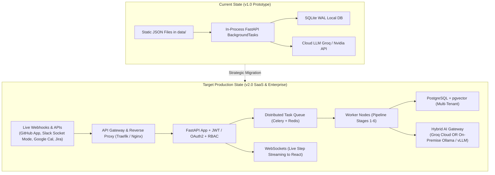

# 🗺️ TaskPilot AI — Product & Technical Roadmap
> **Vision:** Transforming TaskPilot AI from an autonomous desktop prototype into a production-ready, enterprise-grade **AI Chief of Staff for Engineering Organizations**.

---

## 🌟 Strategic Vision & Evolution

TaskPilot AI currently proves that multi-agent pipelines can ingest scattered signals, extract hidden obligations, deduplicate tasks, score priorities mathematically, and schedule calendar focus hours in under 18 seconds.

To make TaskPilot an indispensable daily platform for real software engineering teams, the platform must evolve across **four key pillars**:
1. **Security & Identity:** Enterprise authentication, multi-tenancy, and fine-grained Role-Based Access Control (RBAC).
2. **Real-World Tool Connectivity:** Live bi-directional integrations with GitHub, Slack, Jira, Linear, and Google/Outlook Calendar.
3. **Enterprise Privacy & Local AI:** Zero-data-leakage local LLM support (Ollama/vLLM) and Human-in-the-Loop (HITL) approval workflows.
4. **Scalable Cloud Infrastructure:** Distributed asynchronous task queues, WebSockets for live streaming, and team burnout telemetry.

---

## 🏗️ Architecture Evolution: Prototype to Production

---

## 📅 Roadmap Overview (Phases & Timelines)

| Phase | Milestone | Focus Areas | Estimated Duration |
| :---: | :--- | :--- | :---: |
| **Phase 1** | **Authentication, Security & Multi-Tenancy** | JWT / OAuth2, RBAC, PostgreSQL Migration | Weeks 1 – 4 |
| **Phase 2** | **Live Tool Integrations & Bi-Directional Webhooks** | Real GitHub App, Slack Bot, Jira, Google Calendar | Weeks 5 – 8 |
| **Phase 3** | **Enterprise Privacy, Local AI & Human-in-the-Loop** | On-Premise Ollama, Slack Interactive HITL, pgvector | Weeks 9 – 12 |
| **Phase 4** | **Scalable Infrastructure & Productivity Analytics** | Celery + Redis, WebSockets, Team Burnout Telemetry | Weeks 13 – 16 |

---

## 🔐 Phase 1: Authentication, Security & Multi-Tenancy (Weeks 1 – 4)

### 1.1 Objective
Transform the single-tenant local backend into a secure, multi-user system where organizations, engineering managers, and individual contributors have strictly separated workspaces.

### 1.2 Key Features & Technical Deliverables
* **JWT & OAuth2 Authentication:**
  * Support login via **GitHub OAuth** (one-click dev login) and **Google Workspace SSO**.
  * Issue short-lived JWT access tokens (15 mins) and secure HTTP-only refresh tokens (7 days).
  * Password hashing using `bcrypt` / `argon2`.
* **Role-Based Access Control (RBAC):**
  * Define explicit roles with granular permissions:
    | Role | Capabilities |
    | :--- | :--- |
    | **`Admin`** | Manage organization settings, API keys, invite members, view audit logs. |
    | **`Engineering Manager`** | View team-wide workload gauges, reassign tasks, override priority scores. |
    | **`Developer (Member)`** | View personal daily plan, run personal pipelines, inject incidents, adjust focus slots. |
    | **`Viewer / Stakeholder`** | Read-only access to priority leaderboard and aggregated milestone schedules. |
* **PostgreSQL Migration & Tenant Isolation:**
  * Migrate database layer from SQLite to **PostgreSQL 16**.
  * Enforce schema-level or row-level tenant isolation (`tenant_id` on all tables).
  * Setup Alembic database migration scripts for non-destructive zero-downtime schema upgrades.

### 1.3 Architecture Changes
* New models: `User`, `Organization`, `Role`, `UserRole`, `Tenant`, `AuditLog`.
* Dependency injection updates: `get_current_user`, `require_role(["admin", "manager"])`.

---

## 🔌 Phase 2: Live Tool Integrations & Bi-Directional Webhooks (Weeks 5 – 8)

### 2.1 Objective
Replace static seed files (`github_data.json`, `slack_data.json`, etc.) with real, authenticated API connectors and bi-directional write-back webhooks.

### 2.2 Key Features & Technical Deliverables
* **GitHub App Integration:**
  * Authenticate via official GitHub App permissions.
  * Webhook listener for `issues.opened`, `pull_request.review_requested`, and `issue_comment.created`.
  * **Write-back:** Automatically leave approval comments or close resolved issues directly from TaskPilot.
* **Slack Bot & Event Subscriptions:**
  * Slack App running via Slack Socket Mode / Events API.
  * Listen to configured incident channels (e.g. `#incidents`, `#eng-alerts`) and `@TaskPilot` direct mentions.
  * **Daily Digest:** Send a 9:00 AM personalized daily schedule message directly to each engineer in Slack DM.
* **Jira & Linear Bi-Directional Connectors:**
  * OAuth2 sync with Jira Cloud REST API and Linear API.
  * Ingest tickets assigned to the active sprint.
  * **Write-back:** Transition ticket status (e.g. `In Progress` $\rightarrow$ `Under Review` $\rightarrow$ `Done`) when calendar blocks complete.
* **Google Calendar & Microsoft Outlook 365 Sync:**
  * Bi-directional calendar synchronization via Google Calendar API and Microsoft Graph API.
  * Automatically detect newly scheduled emergency meetings and trigger schedule rebalancing.
  * Insert generated focus blocks and coffee breaks as real private events on the user's primary calendar.

### 2.3 Incremental Ingestion Engine v2
* Event-driven streaming architecture replacing batch polling.
* Webhook payloads immediately convert into `SourceEvent` rows within `< 50ms`.

---

## 🛡️ Phase 3: Enterprise Privacy, Local AI & Human-in-the-Loop (Weeks 9 – 12)

### 3.1 Objective
Enable enterprises with strict compliance requirements (financial, healthcare, defense) to run TaskPilot AI without sending proprietary source code or messages to public LLMs.

### 3.2 Key Features & Technical Deliverables
* **On-Premise / Local LLM Engine (Ollama / vLLM):**
  * Pluggable provider architecture in `LLMClient`:
    * Option A: Cloud Ultra-Fast (Groq Llama-3.3-70B).
    * Option B: Air-Gapped Local (Ollama running `deepseek-r1`, `qwen2.5-coder`, or `llama3.2`).
  * Automatic hardware acceleration detection (NVIDIA CUDA / Apple Metal).
* **Human-in-the-Loop (HITL) Interactive Approval:**
  * Before TaskPilot moves an existing meeting or schedules an overhaul, send an interactive prompt:
    * Slack Interactive BlockKit: *"TaskPilot wants to shift 'Update Docs' to 3:00 PM for critical P1 bug. [Approve] [Modify] [Reject]"*.
    * Web dashboard one-click confirmation modal.
* **Vector Knowledge Base with pgvector:**
  * Store task descriptions and resolution histories as semantic embeddings using `pgvector`.
  * Enable smart duplicate detection across months of historical sprint cycles.
  * Search previous outages: *"Has payment gateway timed out like this before?"* with instant historical links.

---

## ⚡ Phase 4: Scalable Infrastructure & Productivity Analytics (Weeks 13 – 16)

### 4.1 Objective
Scale the platform to support thousands of concurrent engineering teams with real-time UI streaming and actionable organizational health analytics.

### 4.2 Key Features & Technical Deliverables
* **Distributed Task Queue (Celery + Redis):**
  * Decouple the pipeline from the web server process.
  * Offload pipeline runs to horizontally scalable Celery worker pools.
  * Redis caching for frequent leaderboard and calendar queries.
* **WebSocket Real-Time Streaming:**
  * Replace 1-second HTTP status polling with persistent WebSockets (`/ws/pipeline/{run_id}`).
  * Stream live agent logs, thinking steps, and stage completions instantly to the frontend with zero network overhead.
* **Team Burnout & Productivity Telemetry:**
  * **Cognitive Fatigue Gauge:** Detect when developers have > 4 hours of fragmented context-switching without focus blocks.
  * **Meeting Overload Alerts:** Warn managers when a developer's available focus time drops below 3 hours/day.
  * **Task Debt Tracking:** Track tasks lingering in `needs_info` state due to poor specification quality.

---

## 📊 Technical Debt & Codebase Modernization Checklist

In parallel with feature development, the following foundational refactors will be addressed:

- [ ] **Database Refactor:** Replace SQLite table drops in `agent_1_ingestion_service.py` with SQLAlchemy transactions and soft-deletes (`deleted_at`).
- [ ] **Type Safety:** Enforce strict Pydantic v2 schemas and MyPy static type checking across all routers and agent outputs.
- [ ] **Automated Test Coverage:** Expand test suite (`pytest`) to achieve > 85% test coverage across agent fallbacks and mathematical scoring algorithms.
- [ ] **CI/CD Pipeline:** GitHub Actions workflow running linting (Ruff), security audits (Bandit), and integration tests on every PR.
- [ ] **Dockerization:** Multi-container `docker-compose.yml` (FastAPI backend, React frontend, PostgreSQL, Redis, Celery worker).

---

## 🤝 Next Steps & Contributions

This roadmap is an active living document maintained by Team IdeaForg-E. 
To suggest architectural adjustments or propose features:
1. Open a discussion on the project repository.
2. File an RFC under `docs/rfcs/`.
3. Reference this roadmap in pull requests aligning with specific phases.
